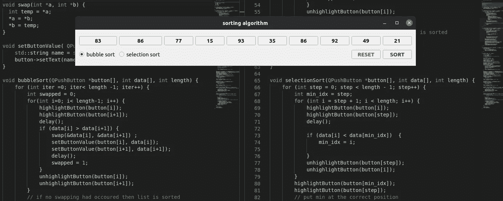

# 使用 C++介绍 QT

> 原文：<https://medium.com/geekculture/visualize-sorting-algorithm-with-qt-introduction-to-qt-using-c-fe49c6df4125?source=collection_archive---------17----------------------->

通过可视化排序算法来学习 Qt

> **一张图片抵得上** **一张** **千言万语**

Less than mediocre GUI using QT

最近开始学数据结构和算法。对于一个没有计算机科学背景的人，一个自学成才的程序员，我很难理解算法。所以我想为什么不把它形象化。我最初计划使用 react，后来我想在 python 中使用 PyQt，但是…