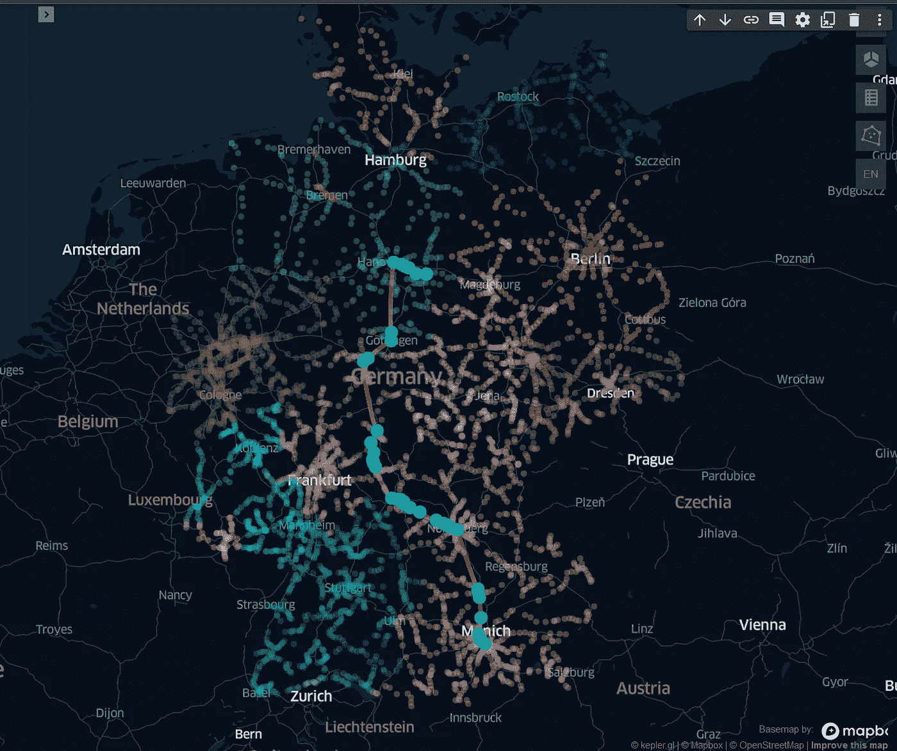

# 用 Kepler.gl 可视化德国铁路系统

> 原文：<https://medium.com/geekculture/visualize-the-german-railway-system-with-kepler-gl-91aea7f063a9?source=collection_archive---------3----------------------->

## 为 Jupyter 的车站和路线创建地图

Figure 1\. All German train stations in 2020 and the planned route between Braunschweig and Munich in Kepler.gl. Image by author.

回到过去，年轻的德国铁路更像是一个军事组织，而不是一个运输公司。火车很准时，工人们也很守纪律。如今，嘲笑德国铁路公司(DB)是一项全国性的运动。延误是经常的，取消也是经常的。这种鲜明的对比并不奇怪…