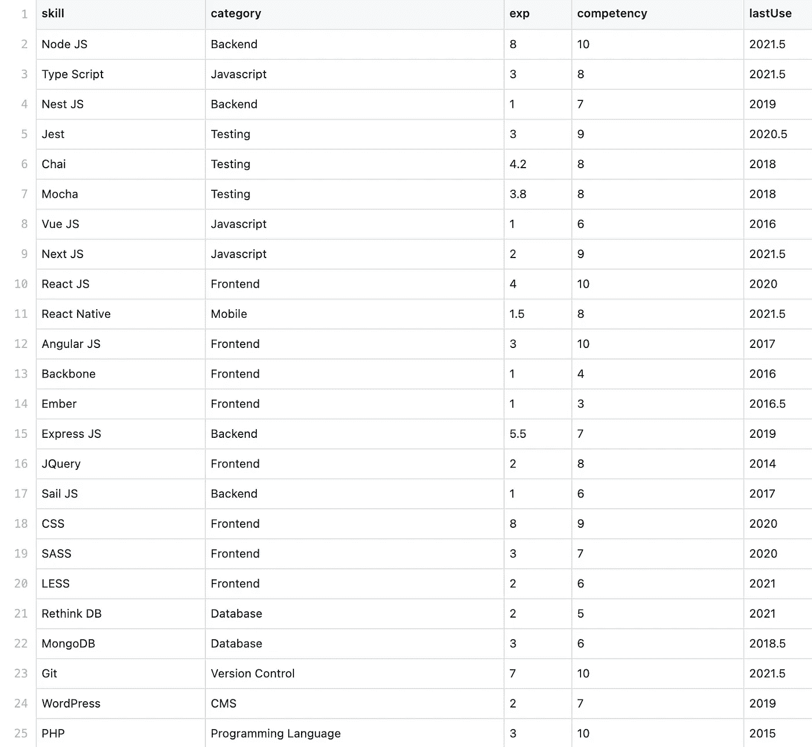

# 用 D3 可视化你的技能

> 原文：<https://medium.com/geekculture/visualize-your-skills-with-d3-e95e5aefff52?source=collection_archive---------21----------------------->

## 用 Javascript 和 CSS 创建气泡图


Photo by [Max Gotts](https://unsplash.com/@maxgotts?utm_source=unsplash&utm_medium=referral&utm_content=creditCopyText) on [Unsplash](https://unsplash.com/s/photos/diving-bubble?utm_source=unsplash&utm_medium=referral&utm_content=creditCopyText)

十年前，随着移动设备和互联网基础设施的进步，Web 2.0 的浪潮拥抱了创建 Web 和移动应用程序的新范式。它将我们的数字生活提升到了一个新的水平，我们所学习和使用的技能也是如此。

虽然技术不断快速发展，但数字公民在整个过程中积累了广泛的技能。在求职者和雇主之间匹配技能是一个挑战。几年前精通特定技能的候选人可能对投资 it 不感兴趣，而新的能力可能会带来更有吸引力的薪水和令人信服的要求。

确定技能的新近性和能力是至关重要的。今天，我们将演示在这种情况下，气泡图是如何帮助我们的。我们使用 web 开发人员技能作为例子，但是这种方法适用于任何技术或业务领域。对 HMTL、CSS 和 Javascript 的基本理解足以完成本教程。

# 什么是泡沫情节？

> 根据维基百科，气泡图/图表是一种显示三维数据的图表。(详见[详情](https://en.wikipedia.org/wiki/Bubble_chart))

访问[此处](https://ng-the-engineer.github.io/tutorial-skills-bubble-plot/index.html)查看最终产品。

X 轴和 Y 轴很容易理解。圆点大小描述了能力。点越大，越精通。

只需看一眼右边的部分，我们就可以立即识别出最熟练的技能，以及哪些节点、反应、Git 和 CSS 是核心能力。它们都被实践了五年以上，最近才被使用。

简单的想法和富有表现力的介绍，不是吗？

让我们转到下一部分来创建一个。

# 第 1 部分:读取数据

查看随后的数据集。`skill`是数据点的唯一标签。一个数据点有四个属性。`category`是对点数进行分类的唯一字符串属性。`exp`(经验年份)和`lastUse`(最近使用年份)属性在 X-Y 平面定位数据点。`competency`的高低体现在圈子的大小上。



D3 提供了一个`csv()`函数来加载 CSV(逗号分隔值)数据。我们将在回调函数中实现图表。

```
d3.csv(url, () => {
  ...
})
```

## 立正！！

> 事实上，2020 年，Chrome 等现代浏览器在 CORS 实施了更严格的控制。如果我们访问本地路径或有效 URL 中的文件，但未启用 CORS，将会遇到 CORS 策略错误。

```
Fetch API cannot load file:///PATH_TO_YOUR_FILE/data.csv. URL scheme must be "http" or "https" for CORS request.
```

为了避免这种麻烦，我们将在节点服务器上托管 CSV 数据，并允许在响应头中使用 CORS。

这是在本教程中为我们的气泡图提供服务的 API 端点。👉[技能 API](https://tutorial-node-api-k8s-ng-the-engineer.cloud.okteto.net/skills)

如果您想将 CSV 文件作为 API 公开并部署到免费的 Kubernetes 集群，请不要错过本教程。🔥[在 Kubernetes 上免费部署 API](/geekculture/deploy-api-on-kubernetes-for-free-ffe6889aad9d)🔥

# **第二节:制作气泡图**

## index.html

首先用下面的 HTML 创建`index.html`。有一个 id 为`skills_bubble_plot`的`<div>`作为图形的占位符。接下来我们导入 D3 [v4.13.0](https://cdnjs.com/libraries/d3/4.13.0) 和色标库( [d3-scale-chromatic](https://github.com/d3/d3-scale-chromatic) )。然后在我们今天要实现的地方导入`plot.js`和`plot.css`。

## plot.js

1.  定义页边距、宽度和高度(第 1 行到第 4 行)
2.  定位图表(第 12 行到第 17 行)
3.  在`d3.csv`的回调函数中实现气泡图(第 7 行)

接下来在`then`模块(第 7 行)中执行**气泡图**。

## x 轴(年)

我们使用`.domain()`创建一个年份范围，使用`.range()`定义绘图的宽度。

```
const x = d3.scaleLinear().domain([2013, 2022]).range([0, width]);
```

## y 轴(经验)

同样，y 轴也是以同样的方式创建的，但是请注意，range 参数以高度开始，然后为零。

```
const y = d3.scaleLinear().domain([0, 10]).range([height, 0]);
```

起初看起来很奇怪，但是当我们检查`.range()`的规格时

```
.range([closer_to_the_origin, further_from_the_origin])
```

并且认识到 HTML 坐标系的参考点在最左上角[0，0]。[详见](http://www.d3noob.org/2012/12/setting-scales-domains-and-ranges-in.html)。

## z 轴(能力)

```
const z = d3.scaleLinear().domain([0, 30]).range([4, 40]);
```

## 颜色

为了用[色标](https://github.com/d3/d3-scale-chromatic)按类别给数据点着色(第 4 行到第 11 行)，我们将在第 13 行使用`schemeSet2`并将库导入到`<head>`中。

```
<script src=”https://d3js.org/d3-scale-chromatic.v1.min.js"></script>
```

## 标签

Y 轴标签很棘手，因为它逆时针翻转了 90 度。

## 工具提示

为了说明一个基本的工具提示，首先我们在`skills_bubble_plot`元素上附加一个`div`，并为数据点创建一个圆角标签。

接下来，创建三个事件，分别用于显示、隐藏和移动。

## 绘制数据点

我们将通过定位在`d.lastUse`和`d.exp`来绘制每个数据点。该点的半径基于`d.competency ** 3 / 100`(该值的 3 次方除以 100)做出指数行为。然后我们根据它的类别给它上色。最后，我们绑定了`mouseover`、`mousemove`、`mouseleave`事件。

恭喜你！我们已经创建了一个四维气泡图来突出示例候选人的优势。

[完整的源代码](https://github.com/ng-the-engineer/tutorial-skills-bubble-plot)👈

感谢您的宝贵时间！希望你喜欢这个教程。

如果你想用 A4 格式的普通简历给招聘人员留下深刻印象，看看[增强你的简历第一部分](/geekculture/power-up-your-cv-with-css-part-1-7fa0510130de) & [第二部分](/geekculture/power-up-your-cv-with-css-part-2-ba27bae7c90b)。