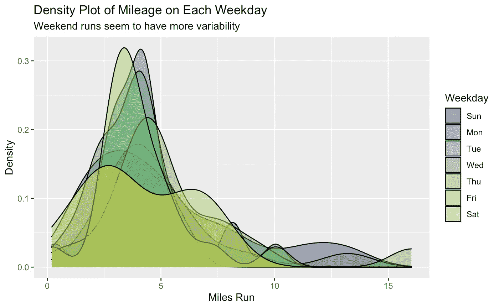

# 使用 R 可视化您的 Strava 数据

> 原文：<https://medium.com/geekculture/visualize-your-strava-data-using-r-2b4160604fbd?source=collection_archive---------2----------------------->

在本教程中，我将向您展示如何在 r 中可视化您的 Strava 数据。我们将使用 Flink 轻松下载我们的 Strava 数据(无需帐户)，然后在 r 中使用 ggplot 绘制我们的结果。此外，我们将学习如何可视化您的里程、速度、海拔增益和跑步频率。我会一步一步地告诉你这个过程，不到一个小时就可以完成。我们开始吧！