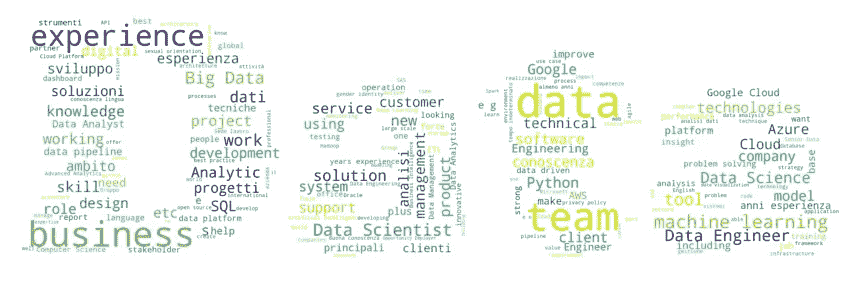

# 可视化和分析废弃的数据科学和数据工程作业

> 原文：<https://medium.com/geekculture/visualizing-and-analyzing-scraped-data-science-and-data-engineering-jobs-78ad52fdd7e6?source=collection_archive---------40----------------------->

## 我从 Linkedin 收集和可视化数据科学和数据工程工作中学到了什么

Image by Alessandro Artoni.

数据工程师是目前最受欢迎的工作之一。

但是实际上有多少份工作呢？真的是这样要求的吗？什么样的**公司**是…