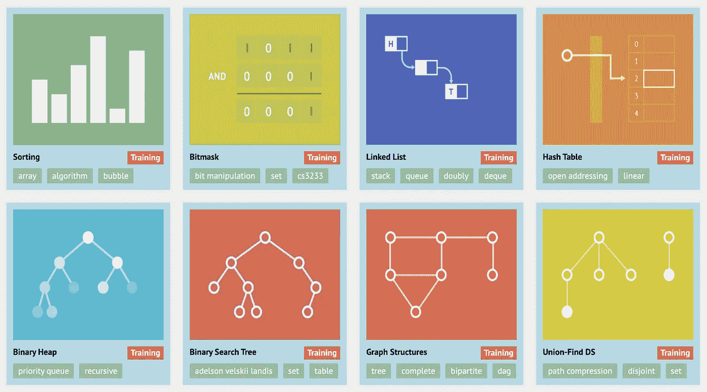

# 可视化常用算法

> 原文：<https://medium.com/geekculture/visualizing-common-algorithms-e2254d290a10?source=collection_archive---------21----------------------->

帮助理解数据结构和算法的直观工具

Source: [https://visualgo.net/en](https://visualgo.net/en)

最近，我大学时代的一个朋友发给我一个关于经典算法可视化的链接，名为 **VisuAlgo** 。它是由新加坡国立大学的 Steven Halim 博士创建的，作为帮助他的学生自学数据结构和算法的工具。