# 使用权重和偏差可视化 KerasTuner 的超参数调整结果

> 原文：<https://medium.com/geekculture/visualizing-hyperparameter-tuning-results-of-kerastuner-with-weights-biases-e9417055d96?source=collection_archive---------14----------------------->

我之前的博客解释了如何在 Keras/TensorFlow 2 中使用 KerasTuner 进行超参数调整。本文展示了如何使用[权重&偏差](https://wandb.ai/site) (W & B)工具可视化 KerasTuner 的超参数调整结果。***W&B 提供的交互式可视化效果非常棒，可以深入了解超参数的不同选择如何影响模型性能，以及它们如何相互比较&对比度*** 。现在我们知道了为什么 W & B 在这里很重要，让我们开始讨论如何实现它。

KerasTuner 和 W&B 可以无缝集成，实现交互式可视化。为了理解结构，让我们举一个我构建并解码的简单示例 Keras/TensorFlow 2 代码。这里是所有文件的 github 链接，其中有更多的示例代码，这些代码探索了 KerasTuner 和 W & B 中可用的其他选项。

# 主要步骤:

> I:创建模型-构建-功能
> 
> 二。为重新定义 run_trial()方法构建新的优化器类
> 
> **三。使用 wandb.init()和 WandbCallback()在 W & B 的仪表板上实时记录数据，实现惊人的可视化效果！**
> 
> 四。self.oracle.update_trial() **【重要一步！]**
> 
> 动词 （verb 的缩写）通过向其传递优化目标和优化算法(如 RandomSearch、Hyperband 和 BayesianOptimizaiton)来实例化新的调谐器类
> 
> 不及物动词通过调用 tuner.search()运行调谐器
> 
> **七。比较&使用 W & B 仪表板**上的平行坐标图和参数重要性图，用各种指标对比所有运行/超参数试验

# 主要步骤 I:创建模型构建功能

> 这个函数与我们在[上一篇关于 KerasTuner 的文章中学到的模型构建函数完全相同。](/swlh/hyperparameter-tuning-in-keras-tensorflow-2-with-keras-tuner-randomsearch-hyperband-3e212647778f)

# 主要步骤二:

> 为重新定义 run_trail()方法构建新的优化器类

> 为什么我们需要这一步？

这使我们能够控制每次进行超参数试验时会发生什么。

> 为什么在 tuner.search()执行调优任务时我们需要控制？

在这篇博客中，我们使用它将数据记录到 Weights & Biases 仪表板，以便可视化结果。我们还可以用这个控件做更多的事情！

> 如何实现新的调谐器类？

> 我们来解码上面的代码吧！

> run_trial()'和' kt。'调谐器'

我们需要对每次试运行进行控制，以便记录可视化数据。谁对每次试运行有控制权？答案是' run_trial()'方法。

run_trial()方法是在 kerastuner 中定义的。调谐器(kt。调谐器)类。因此，我们继承了它，并根据需要重新定义了 run_trial()方法。

> hp =试验.超参数

它具有**当前**超参数试验的值。

> model = self.hypermodel.build(惠普)

该方法利用“试验”提供的**当前**超参数值建立新的神经网络模型。当我们实例化新的调谐器类时，该方法提供了**建模函数**。*这将在第五步中阐明。*

> MyTuner 类中的更多代码在步骤 III 和 IV 中解释！

# 主要步骤三:可视化代码

> wandb.init()和 WandbCallback()

> run = wandb . init(project = " WandBAndKerasTuner "，config=hp.values)

**要让这行代码工作，我们需要做两件事，**

> 在笔记本中安装重量和偏差，使用:'！' pip 安装 wandb -qqq '
> 
> 在[权重&偏好网站](https://wandb.ai/site)上创建账户

**为什么我们需要有一个账户？答:惊人的可视化仪表板将在我们的网站账户上提供给我们。我们将使用这个仪表板来可视化我们的所有结果，并更深入地了解超参数。**

下面是在笔记本中调用之前需要**执行的两行代码:**

> 导入 wandb
> 
> ！wandb 登录

**’！“wandb 登录”将为您提供一个链接，用于登录您的 W & B 账户详情。**

*现在我们来解码 wandb.init()*

wandb.init()用于在 W&B 仪表板上不存在名称/项目时创建新项目，并初始化 W&B 仪表板上的运行。该项目记录所有使用相同项目名称的运行。 ***这里的运行次数等于超参数试验次数 run _ trial()被调用的次数。*** 然后，我们可以使用 W & B 仪表板上提供的可视化工具来比较&对比该项目中的所有运行。

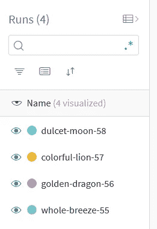

Four runs created with random names inside the project when wandb.init() is called 4 times by the code with same project name

*'config=hp.values'* 用于将当前运行与用于本次运行的唯一超参数值相关联。

> 总之，这里的 wandb.init()启动了一个独特的运行，并将其与该运行使用的当前超参数相关联。
> 
> 当执行 wandb.init()时，它将打印输出链接到仪表板，您可以在仪表板上查看由 model.fit()中的 WandbCallback()记录的实时数据

> history = model.fit(trainX，trainY，batch_size=batch_size，epochs=epochs，validation_split=0.1，callback =[WandbCallback()])

model.fit()将在当前超参数试验值上训练神经网络模型。在此过程中，它记录数据，如**损失(训练损失)、准确度(训练准确度)、val_loss(验证损失)、val_accuracy(验证准确度)，这些数据在“历史记录”中检索。**

> 只需在 model.fit()的回调中调用 WandbCallback()，就可以在 dashboard 上实时可视化所有数据
> 
> WandbCallback()使在 W&B dashboard 上实时记录和可视化所有数据变得很容易

> **如何查看仪表盘？**

***方法一*:可以点击执行 wandb.init()时打印出来的项目链接**

***方法二*:你可以登录你的 W & B 账号，在 wandb.init()** 中看到你提供的项目名称下的数据直播

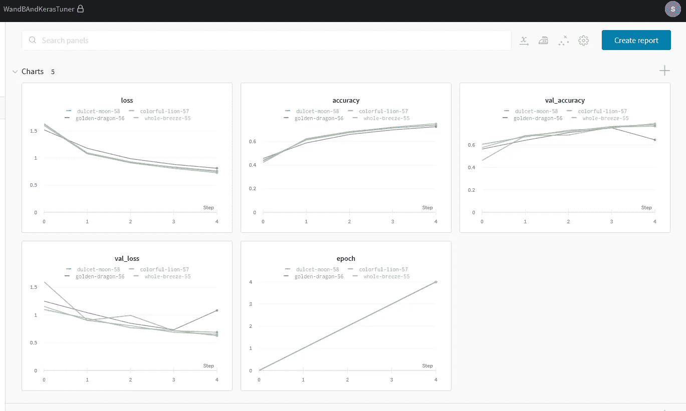

# 主要步骤四:【重要一步！]

> self.oracle.update_trial()

> self . Oracle . update _ trial(trial . trial _ id，{objective_name_str : val_acc})

调谐器的目标是在步骤 v 中实例化 MyTuner 类时设置的，对于本例，我们将目标设置为“val_accuracy ”,这是验证准确性。

这个目标被调整算法用作评估哪个超参数试验是最好的度量。

> 重要 1:此**目标值**必须在每次试验结束时提供给调整算法。这是使用 self.oracle.update_trial()完成的
> 
> 要点 2:实例化 MyTuner 类时给定的目标名必须与 self.oracle.update_trial()中的' objective_name_str '匹配，否则会出现错误

*因此，我创建了一个名为“objective”的变量，该变量在实例化时被传递给 MyTuner 类，还被传递给 tuner.search()，以便 run_trial()将相同的目标名称传递给 self.oracle.update_trial()*

对于每个超参数试验，试验标识是唯一的

> self.save_model(trial.trial_id，模型)

保存使用试验超参数训练的当前神经网络模型，并将其与唯一的 trial_id 相关联。

# 主要步骤 V:实例化新的调谐器类

在这里，我们实例化了我们的定制调优器类，并且**为它提供了调优算法、目标和建模函数。**关于调优算法的选择和其中参数的描述，请参考[我之前在 KerasTuner 上的博客。](/swlh/hyperparameter-tuning-in-keras-tensorflow-2-with-keras-tuner-randomsearch-hyperband-3e212647778f)

“build_model”是我们在步骤 I 中创建的模型构建函数。“build_model”被传递给“hypermodel”。当在 run_trial()中调用 self.hypermodel.build(hp)时，它执行这里传递的模型构建函数。

# 主要步骤六:

> tuner.search()

> tuner.search(trainX，trainY，batch_size=32，epochs=5，objective=objective)

**这将启动调谐过程。**因为完整的调优过程可能需要很长时间，所以我设置了 epochs=5 和 max_trial=4(在 MyTuner 类中),这样您就可以立即在笔记本上看到结果。您可以根据需要更改这些值。

> 传递给 tuner.search 的参数由 run_trial()直接接收。这给了我们修改 run_trial()的灵活性。

这里，我们利用这种灵活性向 model.fit()传递训练数据、batch_size(这可以是一个超参数，但为了简单起见，我们在这里固定该值)和时期

这里的' objective '变量用于维护传递给 **MyTuner 类**的目标名称与**self . Oracle . update _ trial()**中给出的目标名称的一致性

# 主要步骤七:

> 在调优过程中，我们可以在仪表板上实时观察调优过程
> 
> 现在，一旦调整完成，我们就可以比较和对比所有的超参数试验

> 如何比较和对比超参数试验？

单击“创建报告”按钮下方的+选项。此处用红色突出显示的是糟糕的绘图:)

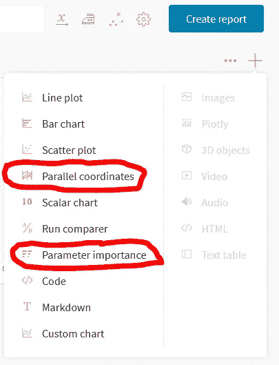

我们将在这里探索平行坐标图和参数重要性图。

> 平行坐标图:

单击平行坐标选项后，将出现如下所示的窗口

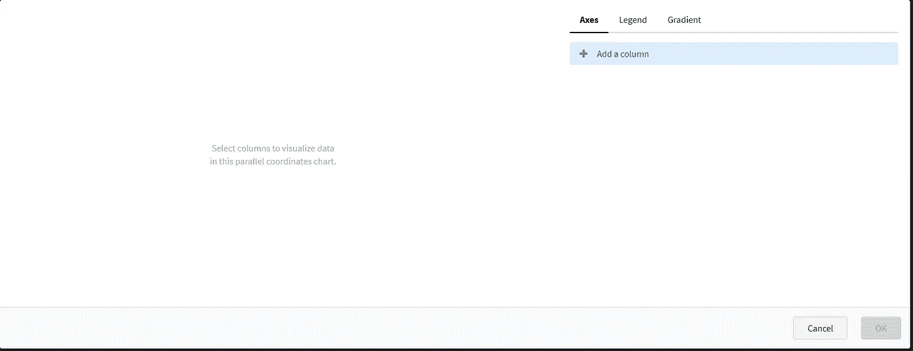

单击“添加列”以插入我们要可视化的轴。

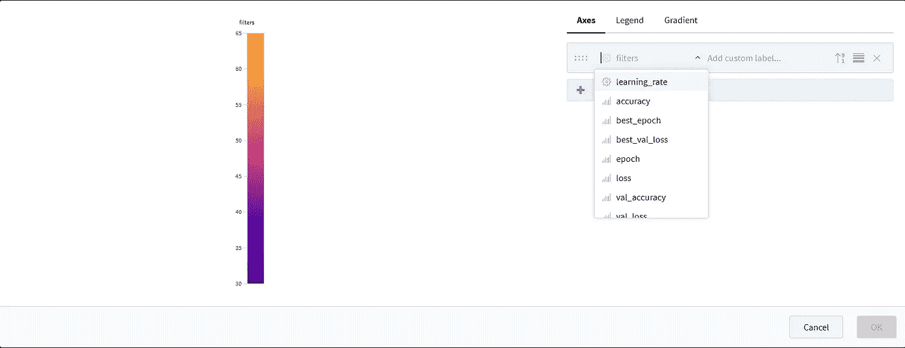

由于我们的代码具有第一层卷积滤波器和学习率作为超参数，我们选择它们并将其与“val_accuracy”的度量进行比较。该指标数据由 WandbCallback()从 model.fit()记录到仪表板中。

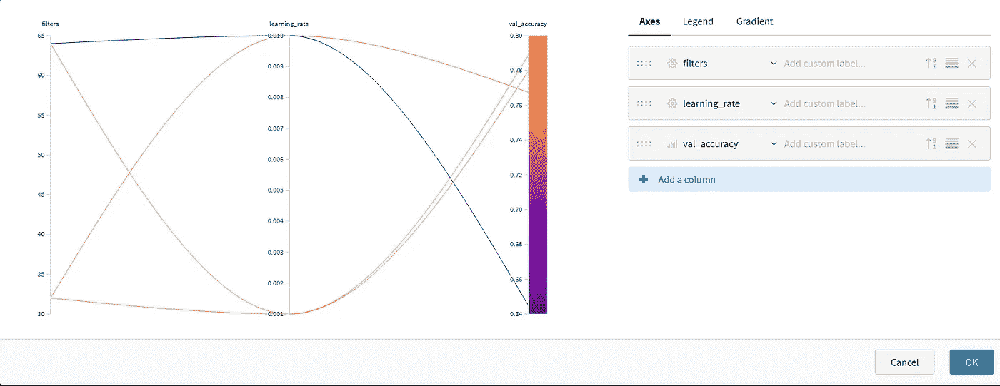

单击“确定”将此窗口添加到主仪表板面板。

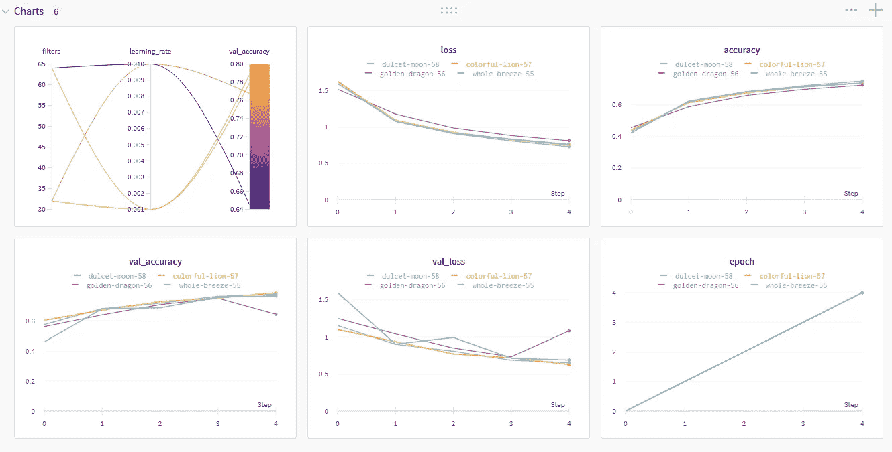

> 我们可以选择不同的指标来比较超参数选择的影响。下图显示了培训损失的对比。这可以通过简单地改变平行坐标图的最后一列来实现。

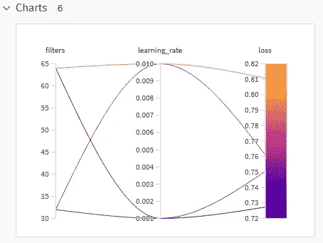

> 参数重要性图/图/数据:

> 一旦我们点击+,然后点击“参数重要性”,我们就可以根据我们选择的指标获得重要性数据

基于**验证准确性度量**，我们得到参数重要性如下

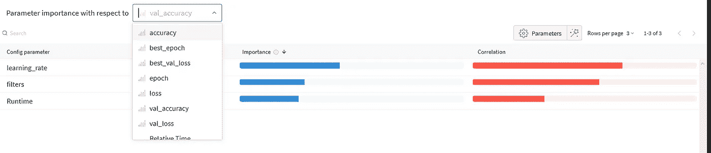

基于**训练损失度量**，我们得到参数重要性如下

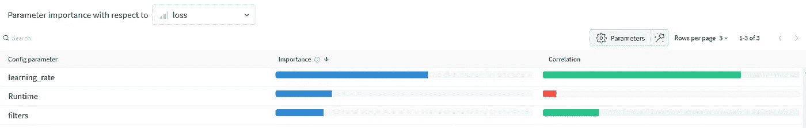

> **W&B 仪表板上的主面板:**

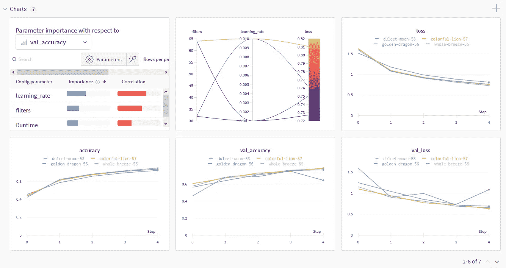

我希望这有助于您可视化从 KerasTuner 获得的调优结果，并让您开始使用 W&B 实现令人惊叹的交互式可视化。关于 W&B 中可用的其他工具的更多信息即将发布。

参考资料:

 [## 给自定训练循环的调音器分类

### kerastuner.engine.tuner.Tuner 中的 Tuner 类可以被子类化以支持高级用途，例如:自定义培训…

keras-team.github.io](https://keras-team.github.io/keras-tuner/tutorials/subclass-tuner/)  [## 调谐器

### 调谐器在这里做超参数搜索。您可以通过子类化创建自定义调谐器…

keras-team.github.io](https://keras-team.github.io/keras-tuner/documentation/tuners/#on_epoch_end-method)  [## 编写您自己的回调| TensorFlow 核心

### 回调是一个强大的工具，可以在训练、评估或推理过程中定制 Keras 模型的行为…

www.tensorflow.org](https://www.tensorflow.org/guide/keras/custom_callback)  [## 带 W&B 的 Keras 调谐器

### 将 wandb 与 keras-tuner 集成

wandb.ai](https://wandb.ai/arig23498/keras-tuner/reports/Keras-Tuner-with-W-B--Vmlldzo0MzQ1NzU)  [## 权重和偏好-ML 开发工具

### 权重和偏差-ML 实验跟踪、超参数优化、模型和数据集的开发工具…

wandb.ai](https://wandb.ai/site)