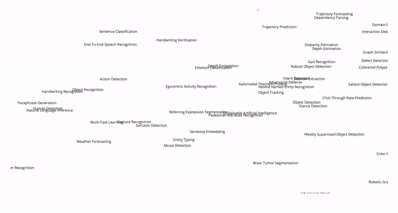
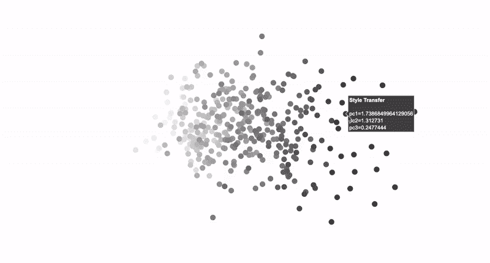
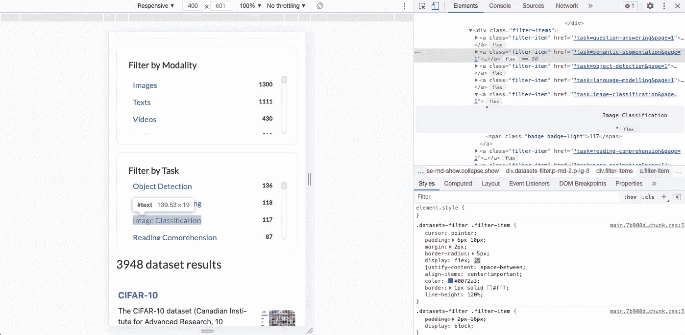

# 用单词嵌入可视化机器学习任务

> 原文：<https://medium.com/geekculture/visualizing-machine-learning-tasks-with-word-embeddings-c044fa5bb5aa?source=collection_archive---------42----------------------->

## 根据语义相似性在空间中组织 400 多个概念(使用 20 亿条推文中预先训练的手套模型)。



> 在第二次观看时，看起来吓人的情节揭示了有意义的空间关系(例如，探测仇恨言论、辱骂性语言和情绪的任务彼此紧密相连)。

机器学习正在为越来越多的行业带来价值。通常采用巧妙新颖的用例形式，利用其难以置信的横向应用潜力。与直觉相反，创新的背后往往是很好理解的任务，创造性的飞跃在于它们的识别和有效整合到手头独特问题的背景中。

# 概述

在这篇文章中，我们通过代码为的[论文(一个编译研究论文以及提供的代码和数据的惊人资源)，在机器学习研究数据集下对这些任务进行分类，从而窥视这些任务的前景。](https://paperswithcode.com/)

我们已经在网上搜集了**超过 400 个机器学习任务**和**将它们嵌入 **25 维空间**(基于对单词的语义理解)使用 [**手套**](https://nlp.stanford.edu/projects/glove/) (单词表示的全局向量)**模型，在 20 亿条推文中预先训练**。在使用 PCA(主成分分析)将维度从 25D 降低到 3D 和 2D 之后，我们已经能够以捕捉其空间相互关系中的意义的方式来可视化任务。**

例如，您可以探索所选任务的邻居，以发现其他语义相似的任务。



Fig. 1–3D Scatter plot with tasks and their principal component coordinates (by author).

# 履行

您可以在
[这个 Jupyter 笔记本](https://colab.research.google.com/drive/1pi2TMNjwLZakNuj9MYDk3KnRLyAWfXl8?usp=sharing)中浏览代码并亲自探索可视化效果📔！


Fig.2 — Jupyter Notebook (photo by [Pxhere](https://pxhere.com/en/photo/764684)).

## 网页抓取机学习任务



Fig.3 — Inspecting page elements (by author).

首先，我们在[文件中请求数据集网页，代码为](https://paperswithcode.com/datasets)。
<响应【200】>表示请求已经成功。

解析 Html 允许我们定位任务名称并掌握它们的封装结构。我们可以通过在 web 浏览器中检查页面元素来交互式地做同样的事情(图 3)。

下面的 *find_all* 函数让我们访问所需类的所有锚标签。
我们感兴趣的标签落在位置[39]和[538]之间。

```
print(soup.find_all('a', class_="filter-item")[39])
```

我们用那些锚标记后面的文本构造一个列表，同时清除任务名称前后多余的空格(使用正则表达式)。

现在我们已经有了数据，我们准备下载手套模型！👏

## 下载手套模型并准备输入

我们将使用 Radim Rehurek 的 [Gensim](https://radimrehurek.com/gensim/) 库来下载预训练模型:

并将我们的*任务列表*预处理成每个任务中包含的*单词列表*:

这是为了让我们能够单独处理任务中的单词，然后将它们平均到最终的任务嵌入中。

或者，如果我们要自己训练文本语料库(理想情况下，在与我们感兴趣的领域精确匹配的非结构化数据上)，我们可以利用嵌入多词短语的方法。下面看看 Moshe Hazoom 的文章，了解更多关于这种方法的信息。

[](https://towardsdatascience.com/word2vec-for-phrases-learning-embeddings-for-more-than-one-word-727b6cf723cf) [## Word2Vec For Phrases —学习多个单词的嵌入

### 如何使用 Word2Vec 在给定的无监督语料库中学习相似术语

towardsdatascience.com](https://towardsdatascience.com/word2vec-for-phrases-learning-embeddings-for-more-than-one-word-727b6cf723cf) 

## 将任务嵌入 25 维空间

一些机器学习任务包含预训练手套模型中不包含的单词。我们将用空列表来替换现有列表。

为了确保某种程度上的准确表示，我们将排除那些剩下少于两个单词的任务(在手套模型中有效):

下面通过模型运行有效单词，以获得每个单词的 25 维向量，并随后对多单词任务的结果进行平均。

这给我们每个任务留下了一个 25 维的向量🙏。
在我们开始降维之前，让我们快速为我们的新任务向量设置一个标签数据框架:

## 降低维度和绘制交互式可视化

我们将使用流行的库 [Scikit-learn](https://scikit-learn.org/stable/) 来执行 PCA(主成分分析)的降维，并绘制可视化图形，我们将使用 [Plotly Express](https://plotly.com/python/plotly-express/) 。

**Word 3D 散点图:**

Fig.4 — Interactive word 3D scatter plot (by author).

**三维散点图:**

Fig.5 — Interactive 3D scatter plot (by author).

**2D 散点图**

Fig.6 — Interactive 2D scatter plot (by author).

# 包扎

我们已经研究了如何利用单词嵌入的机器学习技术来探索和理解机器学习任务的前景。🙏

同时，我们还深入介绍了该方法的实用性，以便您可以在不同的环境中应用它来解决手头的有趣问题！👏

> 我对我们如何使用机器学习来解决使用其他方法无法解决的问题感到兴奋。*💭⚙️*
> 
> *查看*[***deep innovation***](http://www.deepinnovation.co.uk)*了解更多来自设计、创新和新颖深度学习的交叉使用案例！*

[](https://www.deepinnovation.co.uk/) [## 深度学习创新卡

### 数字卡-设计技巧-创新人工智能用例-深度学习概念。面向设计师和……

www.deepinnovation.co.uk](https://www.deepinnovation.co.uk/)