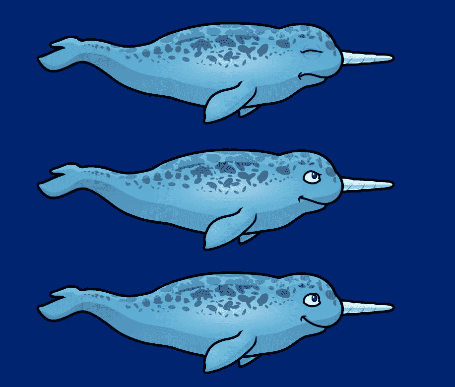

# 在 Unity 中使用精灵动画可视化玩家伤害

> 原文：<https://medium.com/geekculture/visualizing-player-damage-using-sprite-animation-in-unity-a6ef200b5b59?source=collection_archive---------14----------------------->

当谈到玩家沉浸感时，动画真的可以使游戏变得丰富。虽然我已经有一些用户界面图标来可视化我的玩家生活，但我还没有任何类型的动画来改变我的玩家被击中时的外观。我今天的目标是使用精灵动画，以及其他一些东西，来显示玩家何时受到伤害。