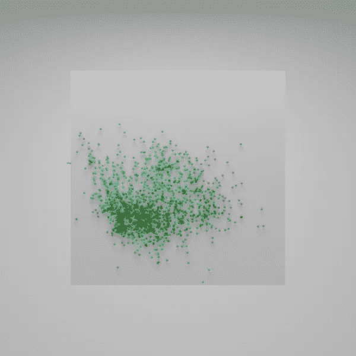

# 用 SkLearn 和 Blender 可视化分类器决策函数。

> 原文：<https://medium.com/geekculture/visualizing-the-classifier-decision-function-with-sklearn-and-blender-ba4e00f466bb?source=collection_archive---------20----------------------->

关于机器学习最常见的一个问题是，算法是如何做出决策的？在深度学习的情况下，这是一个热门的研究课题，然而，对于一些经典方法，可以显示关于算法如何做出决定的确定性观点。例如，让我们用葡萄酒质量数据集定义一个简单的二元分类问题。