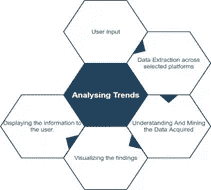
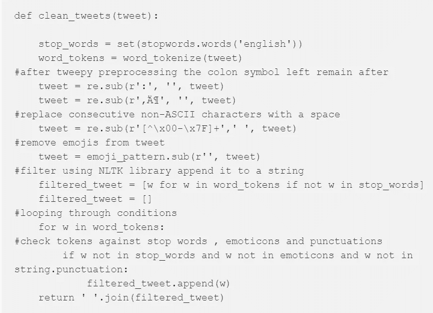
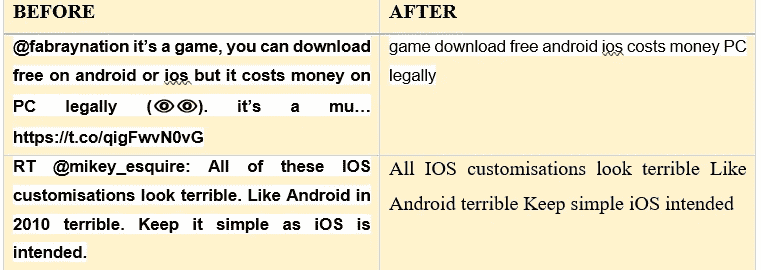
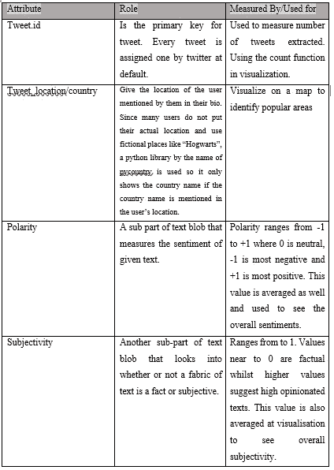
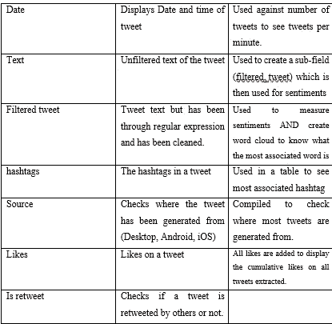
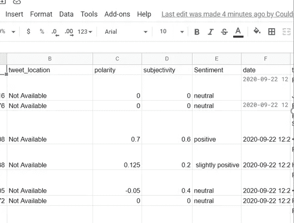
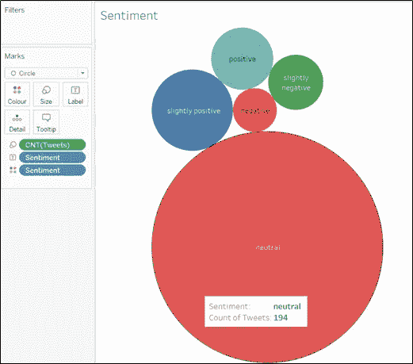
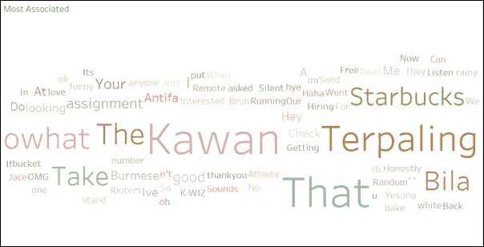
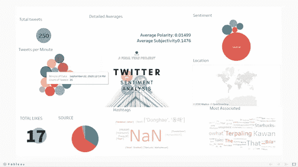

# 使用 Python 和 Tableau 在仪表板中感性地可视化推文。

> 原文：<https://medium.com/geekculture/visualizing-tweets-sentimentally-in-a-dashboard-using-python-tableau-79925ceb3564?source=collection_archive---------4----------------------->


Photo by [Stephen Dawson](https://unsplash.com/@srd844?utm_source=medium&utm_medium=referral) on [Unsplash](https://unsplash.com?utm_source=medium&utm_medium=referral)

一点背景知识，在这篇文章的开始，我们首先需要了解情感分析以及它们现在和将来对我们周围世界的影响。品牌如何使用我们周围的情感分析，以及社交媒体在这种情况下有多强大，更具体地说，Twitter。在这篇文章中，我们将探讨 twitter 上的热门话题如何影响一个特定的个人、一个品牌甚至一个行业。

本文主要关注 twitter 上的时事趋势，更具体地说，用户使用的某个关键词可能会对商业品牌产生影响，并实时分析关于所提及主题的推文以及人们对此的看法。这种分析将在最终产品的用户友好的仪表板，可能有助于一般公众，品牌等。



An Overview of the System

该系统旨在涵盖尽可能多的问题，这就是没有指定具体领域的原因。如下图所示，整个过程从用户键入他们想要的主题或搜索特定实体开始。然后从社交媒体(Twitter)中提取数据。这个过程是最长的(持续时间),因为很难获得数据。然后对数据进行挖掘和分析，以显示对该主题的观点模式。这个过程，情感分析，被用来分析互联网用户评论的文本形式。表情符号也被破译，因此显示了他们的情绪(像一个笑脸意味着快乐等。).

然后，所获取的数据被可视化并以这样的方式显示给用户，即每条信息都以用户能够理解的方式显示。

# 系统要求

Python IDE(为此使用了 py charm)
Google 帐户
Tableau 公共帐户

# 使用的库

在整个过程中使用了以下库:

```
import os
import string
#import stopwords as stopwords
import tweepy as tw
from tweepy import Stream
from tweepy import OAuthHandler
from tweepy.streaming import StreamListener
import gspread
from oauth2client.service_account import ServiceAccountCredentials
import pandas as pd
from tqdm import tqdm
import time
import re
import preprocessor as p
from nltk.tokenize import word_tokenize
from textblob import TextBlob
from nltk.corpus import stopwords
import pygsheets
from tkinter import *
from tkinter.ttk import *
import pycountry
from tkinter import messagebox
from tkinter import ttk
import webbrowser
```

## 十二岁

*Tweepy 是一个 python 模块，是这个项目不可或缺的一部分。Tweepy 充当 python 包装器，允许我们直接从 Twitter API 流式传输和使用数据。*

## PygSheets

*Pygsheets 是一个直观简单的 python 库，它使 Python 用户能够通过 google sheets API v4 访问他们的 Google Sheets。*

## 熊猫

Pandas 是一个基于 python 的快速、灵活的开源工具，用于数据分析和操作。我们将在这里使用它来创建数据帧。

## Tkinter

*Tkinter 据说是 Python 默认的 GUI 包。它预装在 python 中，因此您不必手动安装。它是 python 中最常用的 GUI。*

## 预处理器

*这是 python 中的一个库，专门用于预处理提取的 tweets。这个库很容易清理推文，并解析和标记提取的数据。*

## 文本 Blob

TextBlob 是 python 中的一个库，用于自动处理文本形式的数据。它为常见的自然语言处理任务(如词性标注、情感分析等)提供了一个通用的 API。在这个系统中，textblob 用于测量 tweet 的极性，以确定 tweet 的情绪，其范围从-1(负)到+1(正)。推文的主观性也是用 textblob 来衡量的。

## NLTK

*在这个系统中使用的最重要的库之一必须是他 nltk(自然语言工具包)。NLTK 库为开发人员提供了一种让他们的机器与人类语言数据交互的方法。nltk 流行的主要原因是它易于使用接口以及跨平台的通用性。NLTK 还提供了一些函数，可以帮助我们用 word_tokenize()之类的函数预处理数据，在这些函数中，单词被拆分成标记并进行情感分析。它还具有各种其他功能，以便开发人员可以通过他们的机器来交互和理解人类语言数据。*

## （舞台上由人扮的）静态画面

*Tableau 是一款交互式可视化软件，主要用于商业智能，以便更好地理解数据。在这个系统中，我们使用 tableau live 集成 tableau public 连接到 google sheets。因此，每当我们的系统对 google sheets 进行更改时，数据的变化也会自动反映在 Tableau 中。*

## 正则表达式

正则表达式是文本分析的重要组成部分。它主要用于自动算法中，因为它的主要规范是匹配一个字符串或一组预先指定的字符串。

## 其他人

*其他库如 time 和 pycountry 用于系统的高效性能。使用时间库，因为系统在若干情况下被设置为睡眠，以便平滑并发。Pycountry 用于确定可视化位置。*

# 主要代码

在我们开始之前，你需要成为一名 twitter 开发者，并获得一些证书。这是一个简单的过程。我将在这里链接 Shivani Dandir 的文章，所以只需遵循最初的几个步骤，直到您获得您的消费者密钥和访问密钥。

[使用 Python 从 Twitter 提取数据| Shiva ni Dandir |走向数据科学](https://towardsdatascience.com/extracting-data-from-twitter-using-python-5ab67bff553a#:~:text=Using%20Tweepy%20to%20extract%20tweets%20from%20Twitter&text=For%20using%20the%20Twitter%20API,us%20retrieve%20data%20from%20Twitter.)

## 使用 Tweepy 访问 Twitter API:

```
#Twitter credentials for the app
consumer_key = 'consumer_key'
consumer_secret = 'consumer_secret'
access_key= 'access_key'
access_secret = 'access_secret'

#pass twitter credentials to tweepy
auth = tw.OAuthHandler(consumer_key, consumer_secret)
auth.set_access_token(access_key, access_secret)
api = tw.API(auth)
```

这段代码将从您的 twitter API 中获取您的消费者密钥，并提取 tweets。

## 定义所有表情符号来帮助我们清理数据

由于数据是实时提取的，因此不存在异常值等因素，因为不存在任何数据范围。缺少的数据(位置/标签)通常被更改为不可用，因为 twitter 用户不需要输入这些数据字段。虽然这么说，但有大量不一致的数据。

特别是自从表情符号的引入，人们会认为基于表情符号识别的情感分析会更容易，事实上情况正好相反。大多数社交媒体用户使用表情符号是出于讽刺的目的，或者是为了讽刺挫败表情分析的目的。

```
#HappyEmoticons
emoticons_happy = set([
    ':-)', ':)', ';)', ':o)', ':]', ':3', ':c)', ':>', '=]', '8)', '=)', ':}',
   ':^)', ':-D', ':D', '8-D', '8D', 'x-D', 'xD', 'X-D', 'XD', '=-D', '=D',
    '=-3', '=3', ':-))', ":'-)", ":')", ':*', ':^*', '>:P', ':-P', ':P', 'X-P',
    'x-p', 'xp', 'XP', ':-p', ':p', '=p', ':-b', ':b', '>:)', '>;)', '>:-)',
    '<3'
    ])

# Sad Emoticons
emoticons_sad = set([
    ':L', ':-/', '>:/', ':S', '>:[', ':@', ':-(', ':[', ':-||', '=L', ':<',
    ':-[', ':-<', '=\\', '=/', '>:(', ':(', '>.<', ":'-(", ":'(", ':\\', ':-c',
    ':c', ':{', '>:\\', ';('
    ])

#Emoji patterns
emoji_pattern = re.compile("["
         u"\U0001F600-\U0001F64F"  # emoticons
         u"\U0001F300-\U0001F5FF"  # symbols & pictographs
         u"\U0001F680-\U0001F6FF"  # transport & map symbols
         u"\U0001F1E0-\U0001F1FF"  # flags (iOS)
         u"\U00002702-\U000027B0"
         u"\U000024C2-\U0001F251"
         "]+", flags=re.UNICODE)

#combine sad and happy emoticons
emoticons = emoticons_happy.union(emoticons_sad)
```

这段代码编译了 tweets 中使用的所有基本表情符号，稍后我们将从文本中删除它们，以获得文本形式的更清晰的数据。

## 清理数据

我们将使用下面的代码来清理所有的表情符号和停用词，所有不必要的标点符号等数据。

通过各种包清理我们从 tweet 上得到的文本。因为从 tweet 中提取的文本数据存在许多异常。早先开发者删除表情符号的代码被显示。正如前面在库部分提到的，Python 自带 tweet-pre-processor 库，这个库会自动清理文本。此外，开发人员也使用手动清洗过程。最初，停用词被初始化并移除，随后移除表情符号，然后对整个剩余文本进行标记。Re 和 nltk.tokenize 也用于去掉标点符号。我使用了姆维卡里·穆奥基的文章作为参考，您可以在下面找到:
[非洲影响者:推特用户细分|由姆维卡里·穆奥基| Medium](https://mwi-kali.medium.com/african-influencers-twitter-users-segmentation-e52aba7a5bec)

特别是，这组代码应该可以工作:



A Sample of the code (Taken from the article linked above).

一旦实现了这段代码，文本就会被清除。例如，文本字符串“这个水瓶……。“对我来说:D 看起来很亮”将被简化为“水瓶很亮”，这有助于系统多愁善感地分析它。其他一些例子:



Before and After of Data Cleaning

## 一个简单的图形用户界面来配合这个系统

一个没有 GUI 的程序什么都不是，所以对于这个系统，你将做一个非常简单的 GUI，我们将使用 Tkinter 使它非常容易实现。

```
#Start of GUI
window = Tk()
#Title of Gui
window.title("Sentiment Analysis")
#multiple tabs
tab_control = ttk.Notebook(window)

tab1 = ttk.Frame(tab_control)

tab2 = ttk.Frame(tab_control)

tab_control.add(tab1, text='System')

tab_control.add(tab2, text='About')
#GUI window size
window.geometry('1000x700')
heading = Label(tab1, text="Welcome To Sentiment Analysis of tweets", font=("Arial Bold", 25))
#GUI fields position
heading.grid(column=1, row=0)
lbl = Label(tab1, text="Please enter your keyword", font=("Times New Roman", 20))
lbl.grid(column=1, row=10)
txt = Entry(tab1,width=10)

txt.grid(column=2, row=10)
prgbar = Label(tab1, text="Current status: Awaiting input from user", font=("Times New Roman", 10))
prgbar.grid(column=3,row =12)
#tab2
abt = Label(tab2,text="Welcome To Sentiment Analysis of tweets", font=("Arial Bold", 25))
abt.grid(column=1, row=0)
abt2 = Label(tab2,text="Good Day", font=("Times New Roman", 15))
abt2.grid(column=1, row=1)
abt3 = Label(tab2,text="This program takes an input of a keyword from user and extracts latest 200-250 tweets relating to the keyword.", font=("Times New Roman", 15))
abt3.grid(column=1, row=2)
abt4 = Label(tab2,text="After extraction these tweets are analyzed exploratory and sentimentally before being presented visually", font=("Times New Roman", 15))
abt4.grid(column=1, row=3)
abt5 = Label(tab2,text="For more information please contact: Name", font=("Times New Roman", 15))
abt5.grid(column=1, row=4)
abt6 = Label(tab2,text="Email: ", font=("Times New Roman", 10))
abt6.grid(column=1, row=5)

#process once the button is clicked
def clicked():
    messagebox.showinfo('Message', 'The analysis has begun')

    prgbar.configure(text="Current status: extracting tweets")
```

选项卡在 GUI 中创建了 2 个选项卡，其余的是我们使用过的标签和文本框。这将使系统看起来像这样:


The Sample of What the GUI will look like

## 使用来自用户的关键词提取推文。

这段代码将帮助我们首先从用户那里提取关键字，并使用该关键字提取 250 条最新推文。

```
#extract keyword from user
    search_words = txt.get()

# Collect tweets
    tweets = tw.Cursor(api.search,
              q=  search_words,
              lang="en").items(250)
#print extraction of tweets
    tweets_copy = []
    for tweet in tqdm(tweets):
        tweets_copy.append(tweet)
        print(f"new tweets retrieved: {len(tweets_copy)}")
        prgbar.configure(text=f"Current status: Tweets extracted, {len(tweets_copy)}" )
```

## 创建熊猫数据框架

数据框架是非常关键的一步，因为在这里我们将放置所有的推文，存储它们，并对它们进行情感排序。以下是您将需要的代码:

```
#creation of dataframe
polarity = []
subjectivity = []
Sentiment = []
filtered_tweet = []
clean_text = []
country = []
fltr_1 = []
index = []
Sentiment_rating = []

tweets_df = pd.DataFrame()
for tweet in tqdm(tweets_copy):
    clean_text = p.clean(tweet.text)
    filtered_tweet = clean_tweets(clean_text)
    blob = TextBlob(filtered_tweet)
    Sentiment_rating = blob.sentiment
    polarity = Sentiment_rating.polarity
    #splitting 1st word
    #fltr_1 = filtered_tweet.split()[0]
    #sentiment in text output
    subjectivity = Sentiment_rating.subjectivity
    if polarity >= 0.1 and polarity <= 0.3:
        Sentiment = " slightly positive"
    elif polarity < -0.1 and polarity > -0.3:
        Sentiment = "slightly negative"
    elif polarity >= 0.3:
        Sentiment = "positive"
    elif polarity < -0.3:
        Sentiment = "negative"
    else:
        Sentiment = "neutral"
        #country name (where applicable)
    for country in pycountry.countries:
        if country.name in tweet.user.location:
            country = country.name
        else:
            country = "Not Available"
            #hashtags (where applicalble)
    hashtags = []
    try:
        for hashtag in tweet.entities["hashtags"]:
            hashtags.append(hashtag["text"])
    except:
        pass
    tweets_df = tweets_df.append(pd.DataFrame({'tweet_id': tweet.id,
                                           'tweet_location': country,
                                           'polarity': polarity,
                                           'subjectivity': subjectivity,
                                           'Sentiment': Sentiment,
                                           'date': tweet.created_at,
                                           'text': tweet.text,
                                           #'filtered_tweet': fltr_1,
                                            'filtered_tweet': filtered_tweet,
                                           'hashtags': [hashtags if hashtags else None],
                                           'source': tweet.source,
                                           'likes': tweet.favorite_count,
                                           'is_retweet': tweet.retweeted}, index=[0]))
    tweets_df.head()
```

我知道，我甚至知道这是什么代码，让我解释一下所有的单独属性:



Individual Attributes of Dataframe

## 将数据框架导出到 GoogleSheets

此外，你还需要知道如何将数据帧插入谷歌工作表，不用担心！这将需要一些时间来完成，只需点击下面的链接就可以看到梅尔文·费尔南德斯的文章，这篇文章对此有很好的解释。

[使用 Python 将您的熊猫数据框推送到 Google Sheets |作者 Melvynn Fernandez |走向数据科学](https://towardsdatascience.com/using-python-to-push-your-pandas-dataframe-to-google-sheets-de69422508f)

现在我们这样做是因为我们想使用 tableau，为了使整个过程实时，我们将数据帧导出到 Google Sheets 中，等待 tableau 自动调整为新数据。

还记得之前您学习如何从 google sheets 获取服务文件并将其实现到 python 中吗？我们现在将使用它:

```
#EXPORTING DATAFRAME ONTO GOOGLESHEETS
    client= pygsheets.authorize(service_file='***filepath***')
    lbl.configure(text="Authorized")

    sheet = client.open("fyp_tw")
    prgbar.configure(text="Current status: Sheet opened")

    wks = sheet[0]
    prgbar.configure(text="Current status: First sheet Accessed")

    wks.set_dataframe(tweets_df,(1,1))
    prgbar.configure(text="Current status: Data Updated")
```

您在 Google Sheets 中的数据将如下所示:



## （舞台上由人扮的）静态画面

要制作一个仪表板，下载 Tableau public 并创建你自己的仪表板，你可以把它连接到 Google Sheets。您可以使用我的仪表板作为示例:

```
[https://public.tableau.com/views/FYPdash_16004530851980/FYPDashboard?:language=en&:display_count=y&publish=yes&:origin=viz_share_link](https://public.tableau.com/views/FYPdash_16004530851980/FYPDashboard?:language=en&:display_count=y&publish=yes&:origin=viz_share_link)
```

如果你在连接 google sheets 或制作仪表盘时遇到问题，我会附上一些简单易懂的资源:

[将 Google Sheets 连接到 Tableau &连接数据— Tableau 教程 P.1 — YouTube](https://www.youtube.com/watch?v=O8j7FeA9J_U)

[数据科学和数据可视化 Tableau 速成教程— YouTube](https://www.youtube.com/watch?v=TPMlZxRRaBQ)

以下是一些您可以使用的可视化示例:



Bubbles of Sentiments



Word Cloud for most associated word

## 最后

只需使用下面的代码来关闭整个系统，并使其工作

```
webbrowser.open("your public tableau link")

btn = Button(tab1, text="Click Me to start Analysis", command=clicked)

btn.grid(column=3, row=10)
tab_control.pack(expand=1, fill='both')

window.mainloop() 
```



A sample Output

这就对了。如果您遇到任何问题，请随时联系我们！

我希望这篇文章有所帮助！