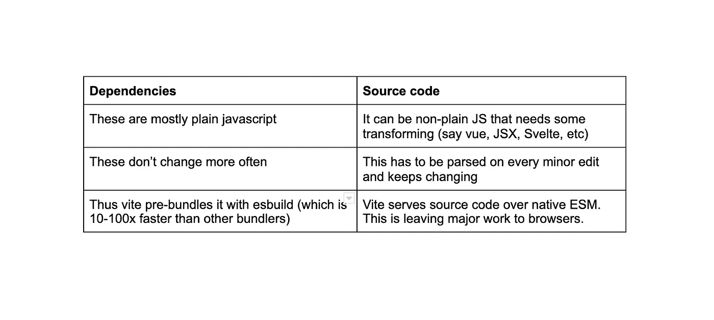
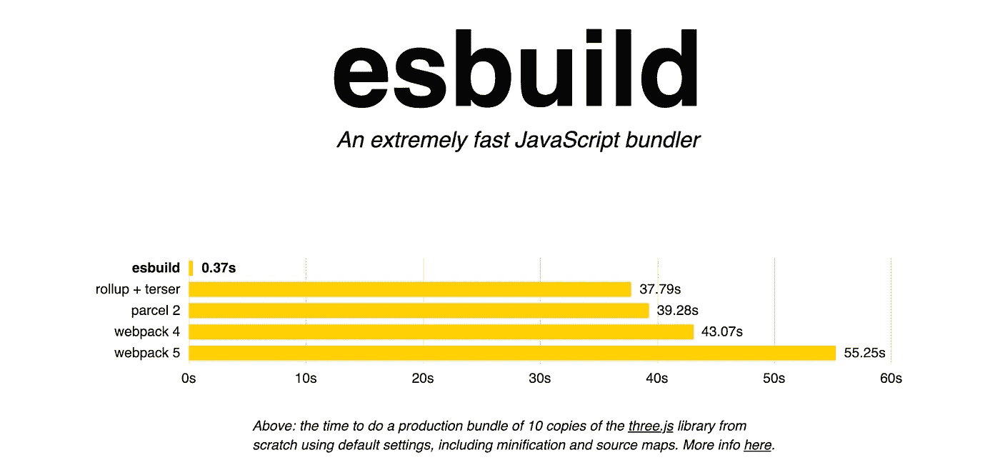
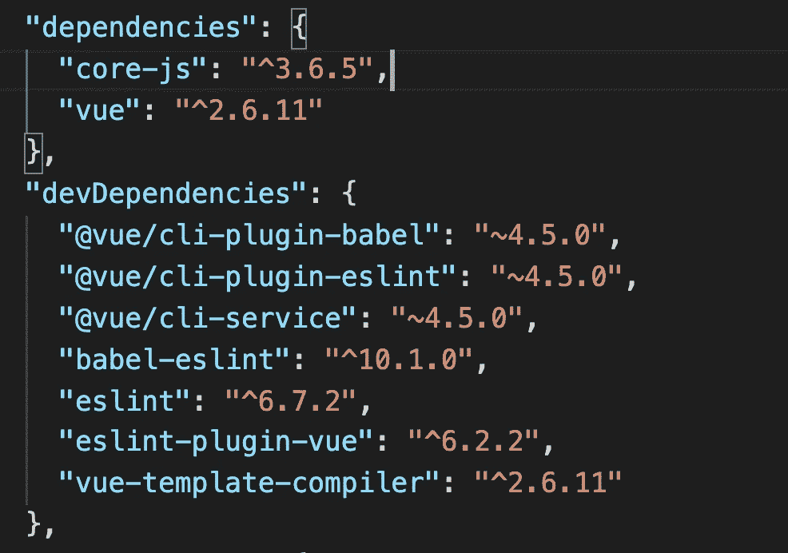
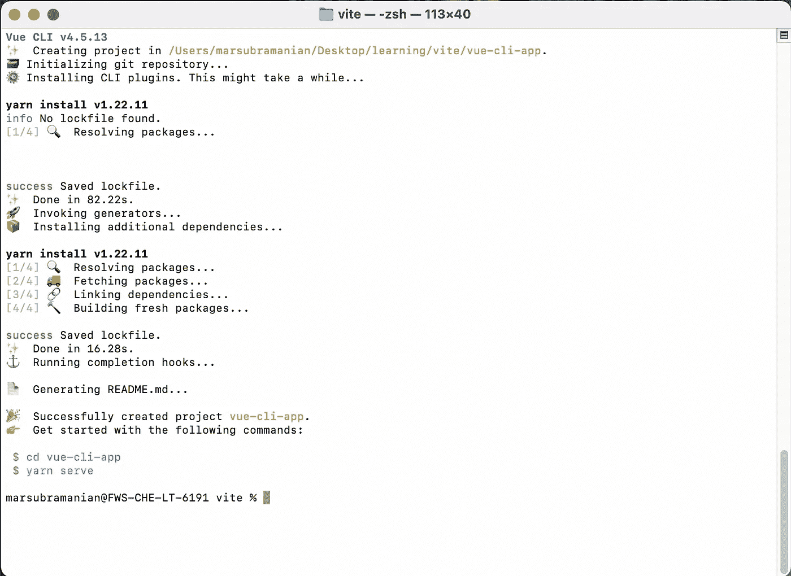
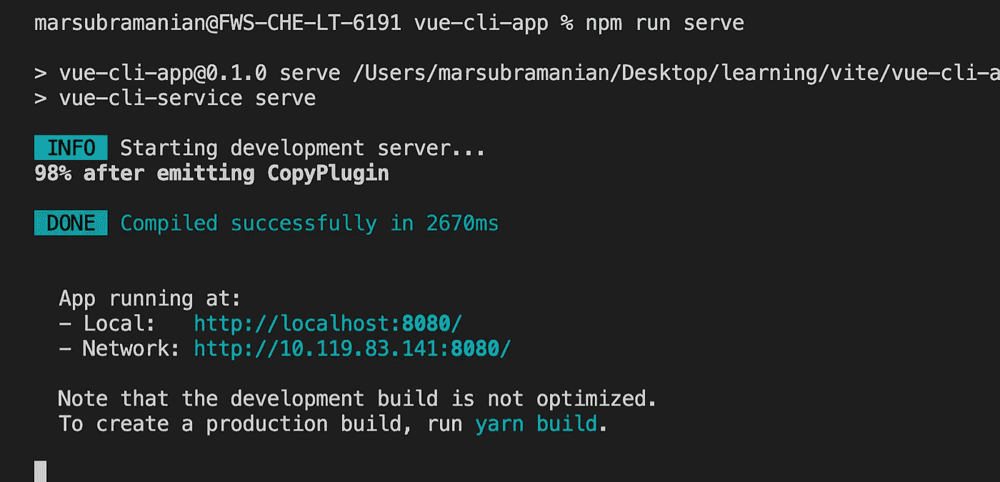
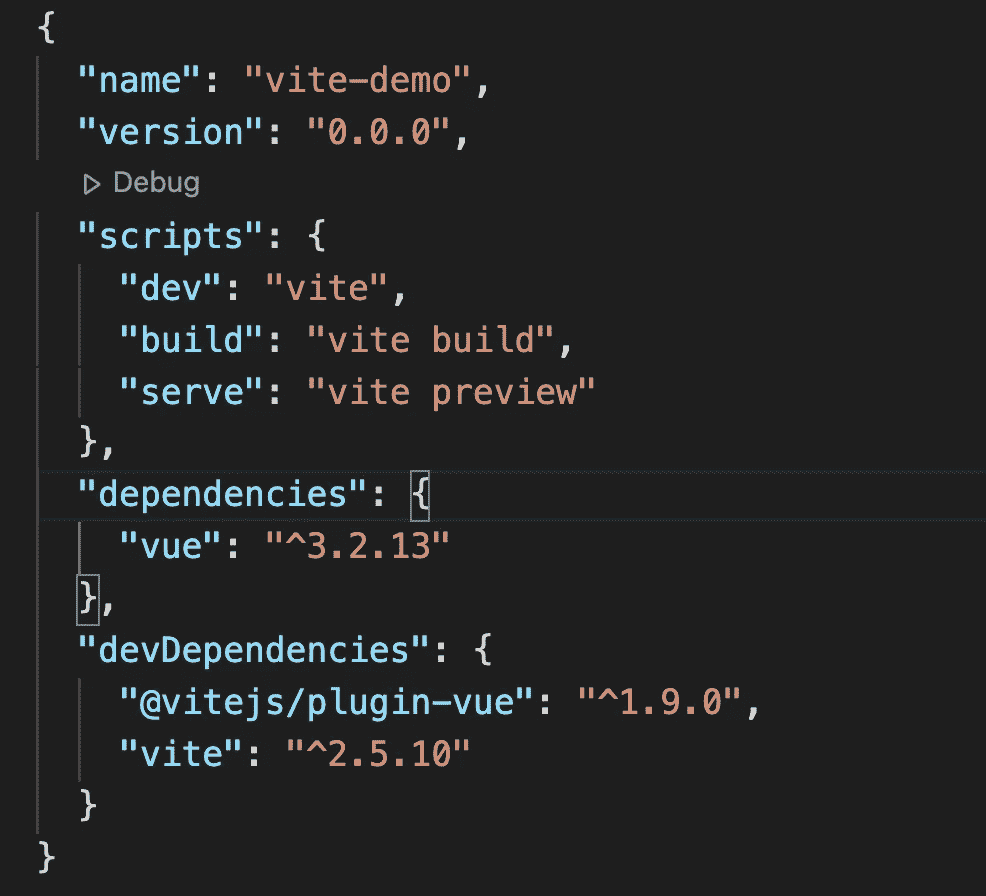
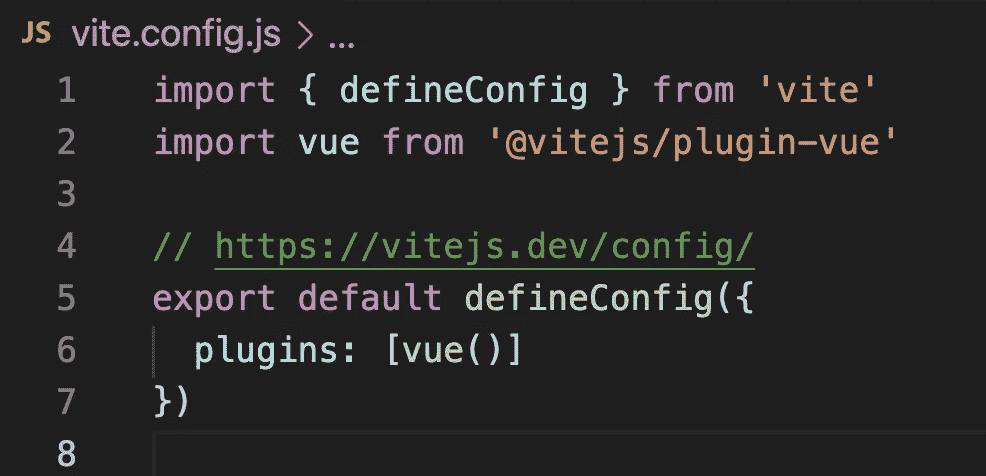
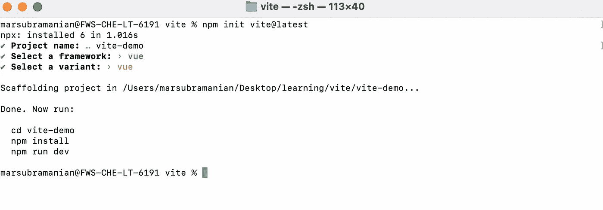

# 见证下一代前端工具(第一部分)

> 原文：<https://medium.com/geekculture/vite-witnessing-the-next-gen-frontend-tooling-part-1-a157f4033c33?source=collection_archive---------3----------------------->

围绕 web 应用程序的性能和用户体验有一种巨大的幸福感。但是，我们真的关心开发者的体验和生产力吗？它对可交付成果没有重大影响吗？当然，它有，但我们错过了见证变得舒适&习惯于遗留的工具。


我已经从 react end 上的探索开始了我的前端之旅。我不了解像 webpack 这样的构建工具，如果我没有错的话，我也不需要开始使用 react。和每个人一样，从一个流行的 youtube 系列开始，用 [create-react-app](https://create-react-app.dev/docs/getting-started/) 包做模板。

我不太喜欢最初的步骤，原因有两个，

*   它太长了(在那个阶段没有一个高性能的单圈，而且那个时候套件本身也很慢)
*   安装了太多的依赖项，而且大多数没有任何意义，为什么我需要在一个简单的样板应用程序中安装它们

但是，在没有从头开始使用 create-react-app 包的情况下，我没有太多关于如何搭建的知识。而且，我碰巧创建了多个用于学习的样板文件，每次都要花几分钟来整理。对于一个试图自己探索新事物的初学者来说，这听起来是不是有点让人泄气。我厌倦了，开始重复使用相同的样板文件，来回删除和添加文件。


后来，我开始了新的冒险，在几个项目中，我碰巧探索了 vue.js 和 nuxt.js。所以我密切关注 Vue 社区，觉得它很有前途。当时是 4 月底——**[](https://twitter.com/youyuxi)**尤雨溪发了这条推文，提高了整个社区的期望。****

****有趣的事实是，埃文并没有那么认真，这只是他的另一条推文中反映的一个实验。****

****但是，现在如果你尝试 vite，你永远不会后悔使用它，它不再是一个实验。我怎么会错过分享这条一夜之间在🥳疯传的微博呢****

****好吧，我表现如何？不会太无聊吧🙄。现在让我们进入正题，🧐****

# ******Vite —下一代前端工具******

****实际上`/vit/` 读起来像“veet”——这是一个法语单词，意思是“快”。它只是现代应用程序的一个构建工具。像任何其他工具一样，它附带了一个开发服务器，并将您的代码打包用于生产。如果你来自 Vue 背景，你也可以把它看作是 Vue-CLI 的松散等价物(更宽松更快)。****

> ****Vite 2 最近发布了许多有趣的进展。如需了解更多详情，请点击查看[。](https://vitejs.dev/blog/announcing-vite2.html)****

## ****为什么要 vite？****

****为什么我们的项目需要像[package](https://parceljs.org/)/[web pack](https://webpack.js.org/)这样的捆扎机？模块化代码使开发人员的生活变得更加容易，抽象以其自己的方式变得美丽。****

****JS 模块—[https://developer . Mozilla . org/en-US/docs/Web/JavaScript/Guide/Modules](https://developer.mozilla.org/en-US/docs/Web/JavaScript/Guide/Modules)****

****在过去，没有办法在浏览器中本地支持 ES 模块。因此我们采用了前端工具，如 [webpack](https://webpack.js.org/) 、[package](https://parceljs.org/)或 [Rollup](https://rollupjs.org/guide/en/) 。但是，现在大多数现代浏览器都提供了开箱即用的支持。随着我们开始构建越来越多的雄心勃勃的应用程序，很明显所涉及的 JS 数量超出了预期(因此严重地成为了性能瓶颈)。****

## ****服务器启动缓慢****

****当冷启动 dev-server 时，传统的基于 bundler 的设置必须在提供服务之前根据需求急切地抓取和构建整个应用程序。另一方面，vite 对此有不同的处理方式。它通过将应用程序分为两类来大大缩短启动时间:**依赖项**和**源代码。******

********

## ****缓慢更新****

****在正常的基于捆绑器的设置中，即使是很小的编辑，它也会重建整个捆绑，从而降低更新速度。这就是为什么引入了[](https://webpack.js.org/concepts/hot-module-replacement/)**(它允许一个模块“热替换”自己，而不影响页面的其余部分)。然而，经过实践，我们发现随着应用程序的不断增长，即使是 HMR 也存在性能瓶颈。******

******这就是为什么 vite 的处理方式不同，HMR 是在本地 ESM 上执行的。听起来很困惑？别急，我们来进一步解码。******

******当一个文件被编辑时，所有的 vite 需求是精确地使被编辑的模块和它最近的 HMR 边界之间的链无效，使得 HMR 更新更快，而不管应用程序的大小。因为它只关心特定的边界状态，所以再次捆绑整个应用程序没有太大的压力。呜哇！******

******如果浏览器本身就能处理大部分问题，我们真的需要这么麻烦吗？******

******这就是 vite 适合的地方。******

## ******那有什么条件呢？******

*   ******Vite 承诺我们将把大部分代码作为本地 es 模块来编写******
*   ******如果你有大量的依赖项，vite 会用 [ESbuild](https://esbuild.github.io/) ( *一个极快的 JavaScript 捆绑器)*预捆绑它们******

## ******让我们来谈谈 ESbuild！******

*   ******[Esbuild](https://esbuild.github.io/) 是一个速度极快的 JS 捆绑器。与任何其他使用 JS 构建的传统捆绑器不同( [JIT](https://en.wikipedia.org/wiki/Just-in-time_compilation) 在命令行接口方面并不友好)，esbuild 是用 [Go](https://golang.org/) 编写的，它可以编译成本机代码，因此速度极快。******
*   ******它是由 Figma 的 CTO &联合创始人[Evan Wallace创建的。](https://github.com/evanw)******

******这里有一个来自官方网站的有趣的图表，可以让你了解它与其他构建工具的比较。******

************

## ******如何使用 vite？******

******现在就来写点代码，体验一下 vite 的神奇吧。值得一提的是，vite 是框架不可知的，不是 vue 特有的。你甚至可以将它与 vanilla JS 无缝地结合使用&制作你想要的任何东西。******

******现在，让我们试着使用 vite，熟悉 vite 提供的一些开箱即用的功能。******

******不仅仅是用 vite 搭建一个项目，让我们在一个简单的样板项目上分析一下它与 create-react-app 和 Vue-CLI 的比较。有道理，对吧？******

******首先，让我们使用 Vue-CLI 创建一个简单的 vue.js 样板文件******

```
****vue create vue-cli-demo****
```

********注意:**假设您已经安装了 Vue-CLI。******

****让我们看一下 **package.json** (我们主要关心依赖部分)****

********

****下面是在高性能 mac 上搭建 Vue-CLI 样板所用时间的截图。总共大概是**~ 82.22s**+**~ 16.28s**(还不错😕)****

********

****并且，启动开发服务器花费了大约**~ 2670 毫秒**。****

********

****在小编辑上，它花费了大约**~ 196 毫秒**，而生产构建花费了大约**~ 3943 毫秒******

****现在让我们看看 vite 项目脚手架统计数据，****

****首先，我们来看一下包文件。你会惊讶极少量的维生素是如何烘烤它的。****

********

****它只是添加了 vue 作为唯一的依赖项和两个支持 dev 的依赖项。你还需要一个名为 **vite.config.js** 的基本最小配置，作为模板本身的一部分(如果在设置中选择了 vue)****

******注意:**我将在本文的下一部分详细介绍项目设置和工作。****

********

> ******注:** Vite 要求 [Node.js](https://nodejs.org/en/) 版本> =12.0.0。****

```
**$ npm init vite@latest (or) $ yarn create vite**
```

********

****嗯，它的速度非常快——脚手架在**~ 1.016 秒**🚀****

```
**$ npm install (or) yarn install**
```

****Vite 要求你单独安装这个步骤后的依赖项，它的美不像 **Vue-CLI** 和 **CRA** 那么沉重。对于我来说，第一次运行，仅仅用了 **~14.948ms** 。****

****使用命令 **npm run dev，**启动开发服务器，它在**到**505 毫秒内为我准备好。****

****等等，但是除了这些数据之外，还有很多关于 vite 的信息需要了解。让我在本文的下一部分中介绍这些方面。这里不要错过阅读[。](/@mariappan/vite-witnessing-the-next-gen-frontend-tooling-part-2-558b233d6b1c)****

****如果您有任何建议、需要帮助/疑问，或者希望就此话题进行更多讨论，请给我写信，地址:[、mariappangameo@gmail.com、T21](mailto:mariappangameo@gmail.com)。我也很乐意在 Linkedin 上和大家联系。****