# LitmusChaos 的 VMware 虚拟机断电实验

> 原文：<https://medium.com/geekculture/vmware-vm-poweroff-experiment-for-litmuschaos-70d59b854880?source=collection_archive---------17----------------------->

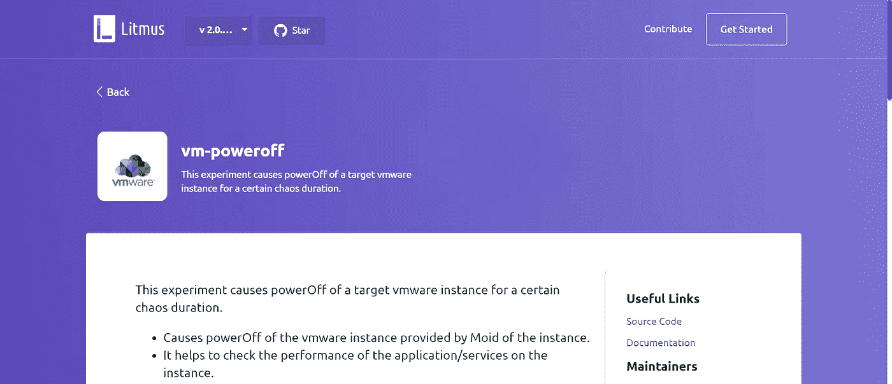

在这篇博客中，我们将讨论 LitmusChaos 的 VMware 虚拟机断电混沌实验。

LitmusChaos 是一个开源的混沌工程平台，通过以可控的方式引入混沌测试，使团队能够识别基础设施中的弱点和潜在的中断。如果你是 LitmusChaos 或混沌工程的新手，我建议你先浏览一下[这个](https://www.cncf.io/blog/2020/08/28/introduction-to-litmuschaos/)博客。

VMware 虚拟机断电实验是 LitmusChaos 的非 Kubernetes 实验之一。基本上，这个实验关闭在 vSphere 中运行的虚拟机一段指定的混乱持续时间，然后再打开虚拟机。该实验使用 VMware API 来启动/停止目标虚拟机。它有助于检查 VMware 服务器上运行的应用程序/进程的性能。在开始实验之前，我们先来讨论一下 vSphere 的体系结构。

VMware vSphere 是 VMware 服务器虚拟化产品的名称。它以前被称为 VMware Infrastructure，由 ESXi、vCenter Server 和 vSphere Client 等其他一些重要功能组成。

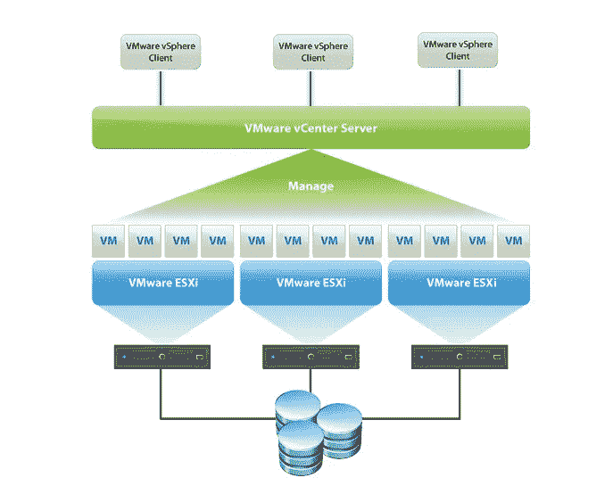

# **ESXi**

Esxi 是第 1 类虚拟机管理程序。它是 vSphere 产品套件的核心。ESXi 提供虚拟化层，将物理主机的 CPU、存储、内存和网络资源抽象为多个虚拟机。

# **vCenter Server**

Center Server 是一个应用程序，使我们能够从一个集中的位置管理我们的 vSphere 基础架构。它充当 ESXi 主机及其各自虚拟机的中央管理点。

# **vSphere Client**

vSphere Client 是一个基于 HTML5 的界面，允许用户远程连接到 vCenter。

# **先决条件**

在进入实验之前。确保检查先决条件:

1.  6.5 或更高版本的 vSphere
2.  安装了 Litmus 2.0 的 Kubernetes 集群。

***我们开始吧！***

## **第一步:创建秘密**

首先，我们必须创建 k8s secret 并提供 vCenter 的 IP 地址、用户名和密码。

```
kubectl apply -f secret.yaml -n litmus
```

## **第二步:创建工作流**

创建密码后，我们将从门户创建工作流。

单击“工作流”页面上的“安排工作流”按钮，然后选择“现在使用自助代理”,并单击“下一步”。

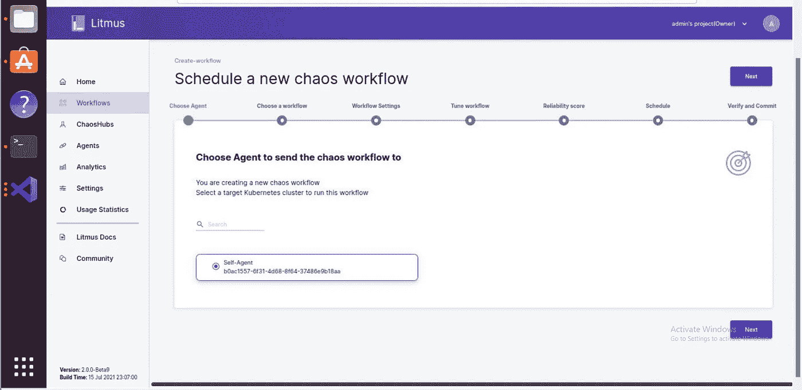

选择代理后，我们必须选择一个工作流，因此我们将选择默认中心，即 chaos Hub，然后单击下一步。


现在，我们在工作流设置页面上，在这里我们必须提供工作流名称和描述，然后单击下一步。

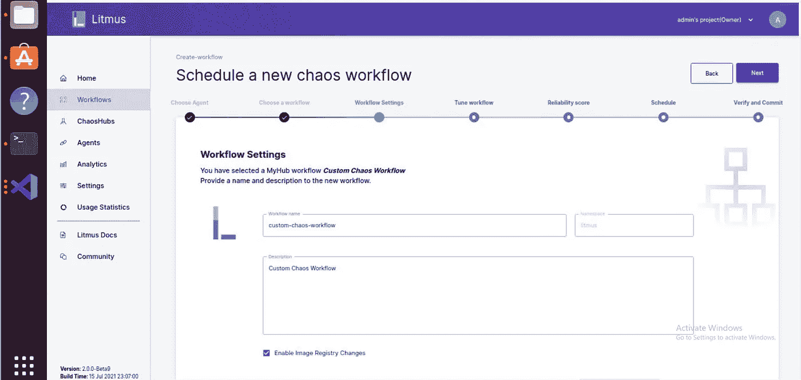

这是重要的部分，在这里我们将调整我们的工作流程。首先点击添加新实验

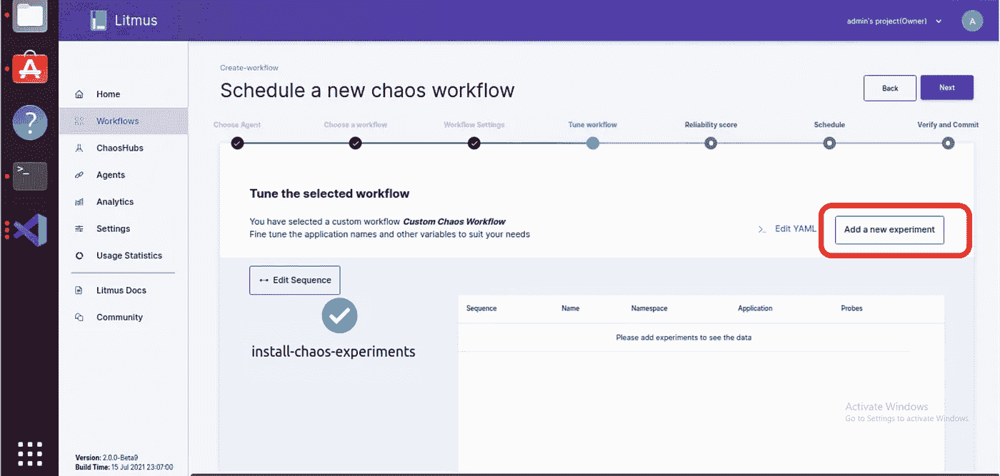

然后，搜索 VMware/vm-poweroff 并选择实验 vmware/vm-poweroff，然后单击 Done。

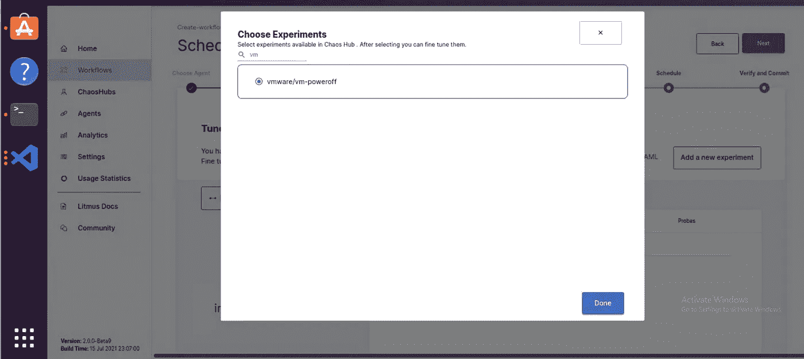

选择实验后，实验已经被添加到工作流中，你可以从实验图中看到图表。

现在，我们必须对实验清单进行一些更改，以指定一些必需的实验资源细节。点击编辑 YAML。

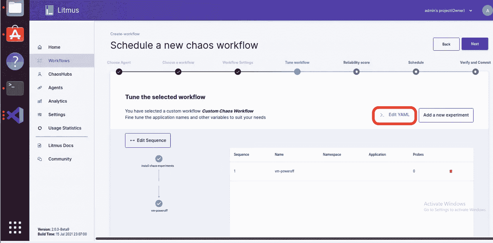

单击编辑 YAML 后，只需滚动到实验部分，您可以看到我们在秘密中提供的 vCenter 凭据在实验部分中作为 env 传递。

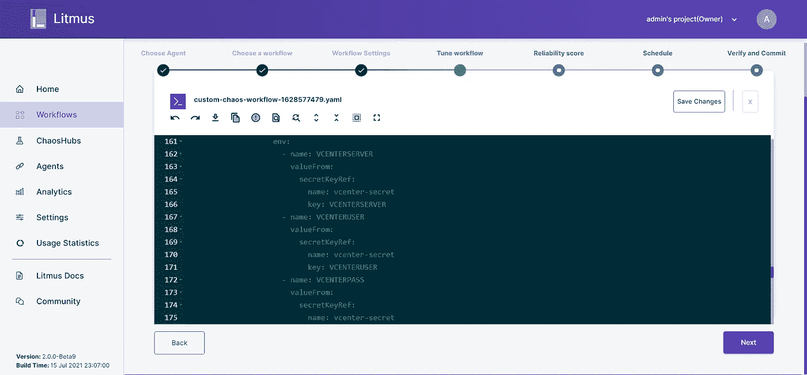

再次滚动到引擎部分，在引擎部分，我们必须提供两件事，这是总 _ 混沌 _ 持续时间和应用 _ 虚拟机 _MOID。

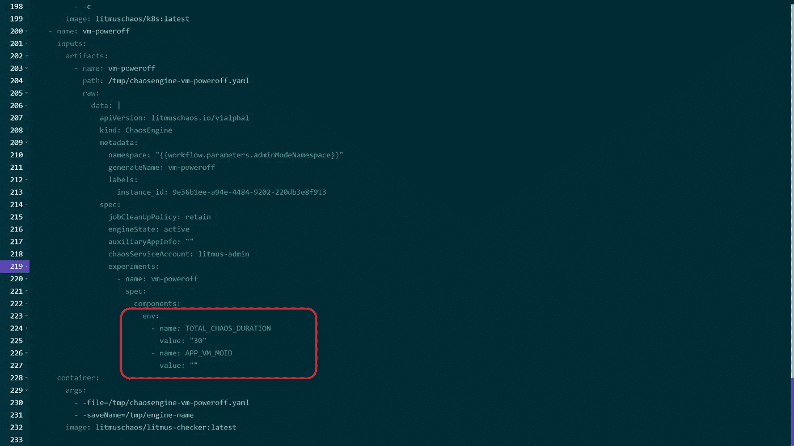

TOTAL_CHAOS_DURATION 是混沌实验的持续时间，即您希望关闭虚拟机的秒数。现在，我们将关闭虚拟机 30 秒钟。

应用虚拟机 MOID 是由 vCenter 本身提供的虚拟机 MOID，用于唯一标识其实例。您可以从 URL 本身找到 VM_MOID。单击虚拟机并查看 vCenter 的 URL，您将获得 vm-x 形式的 MOID。现在，我们将针对最少的虚拟机，您可以看到该虚拟机的 MOID 是 vm-17。

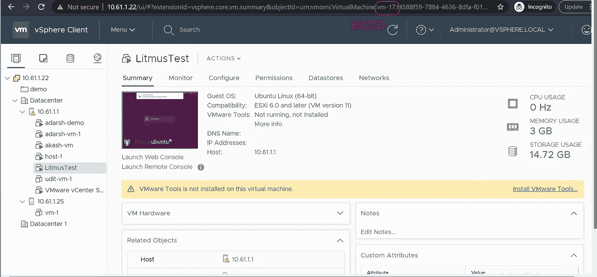

现在我们需要在工作流的引擎部分提供这些细节。

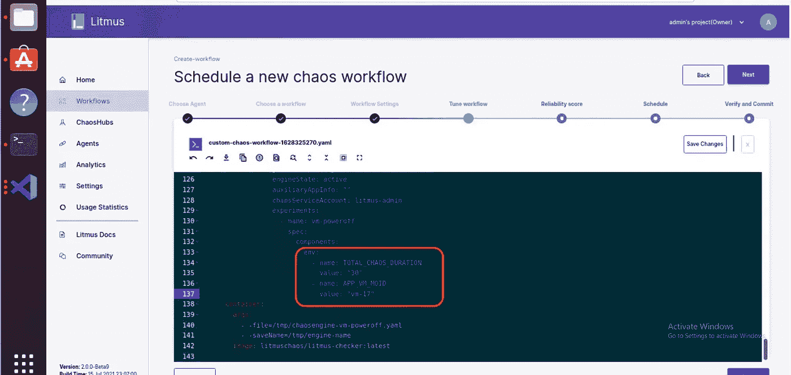

配置工作流后，单击保存更改，然后单击下一步。

在“可靠性得分”页面中，我们现在将为实验赋予最大权重，即 10，然后单击“下一步”。

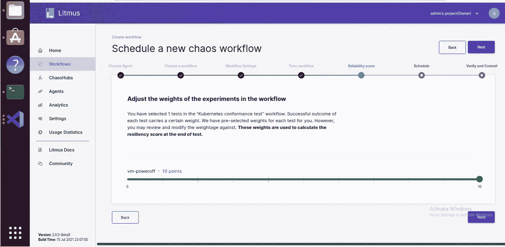

在“计划”中，我们将只计划现在的工作流，因此选择“立即计划”并单击“下一步”。

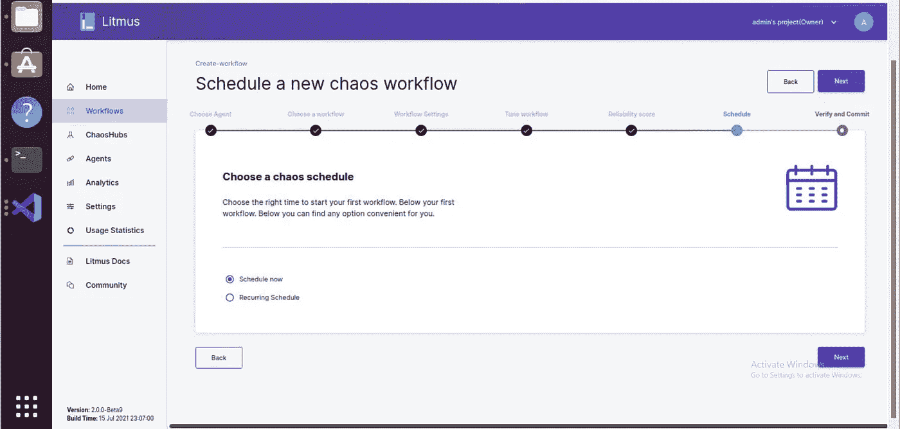

现在我们处于创建工作流的最后一页，在这里您可以验证您已配置的全部内容。

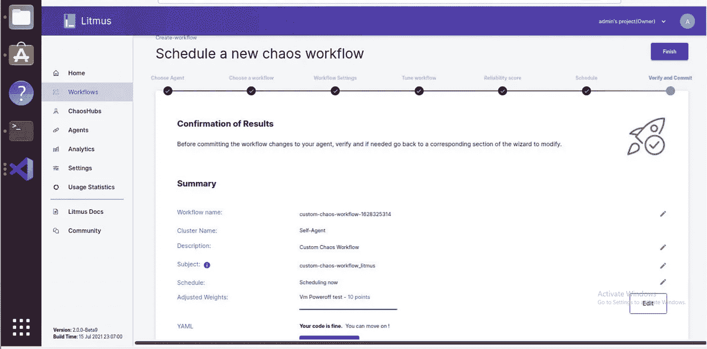

验证所有详细信息后，单击 Finish。您可以看到我们已经成功创建了工作流。

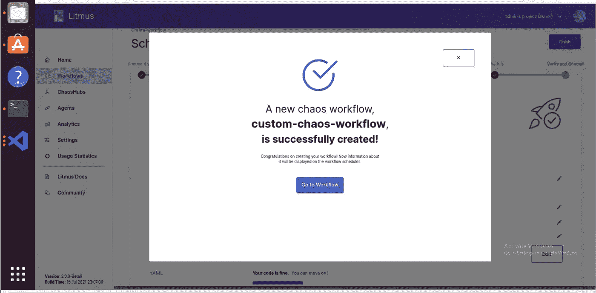

现在，在工作流页面上，我们可以看到我们新创建的工作流处于运行状态。

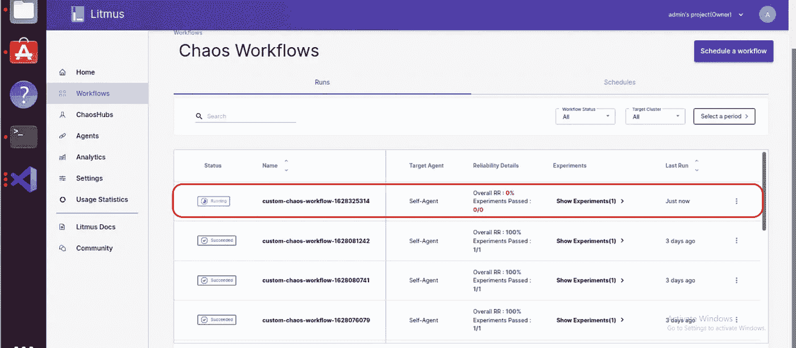

## **第三步:观察混沌**

只需点击工作流名称，在这里我们可以图形化地观察工作流的步骤，从安装混沌实验、注入混沌到混沌回复。

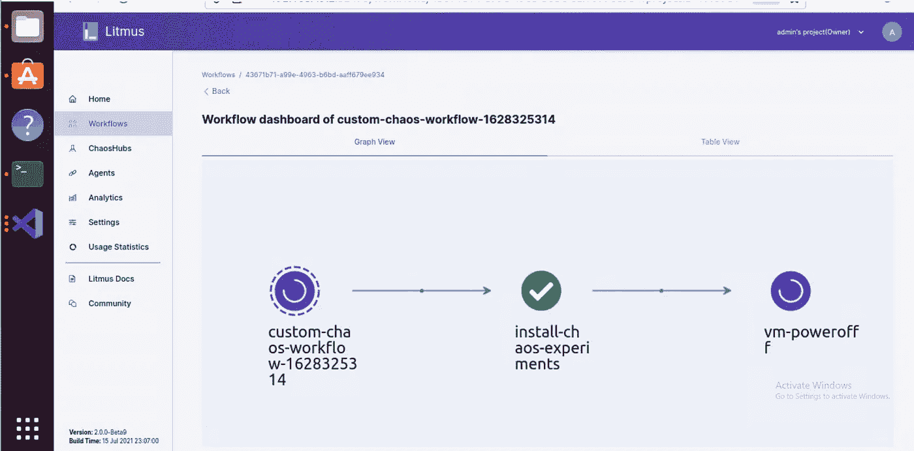

正如我们在工作流图中看到的，混沌注入已经开始。我们可以从 vCenter 本身验证虚拟机的状态。

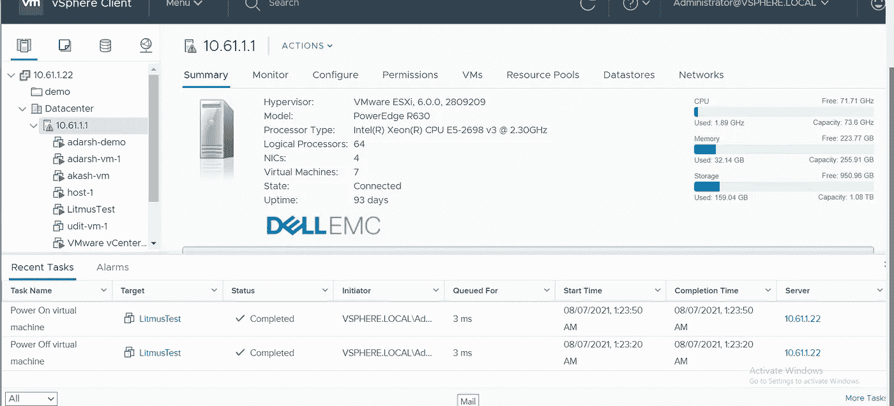

在这里，我们可以看到 LitmusTest 虚拟机已关闭，30 秒后它再次打开。

一段时间后，我们可以看到工作流的所有步骤都已执行，工作流已成功完成。

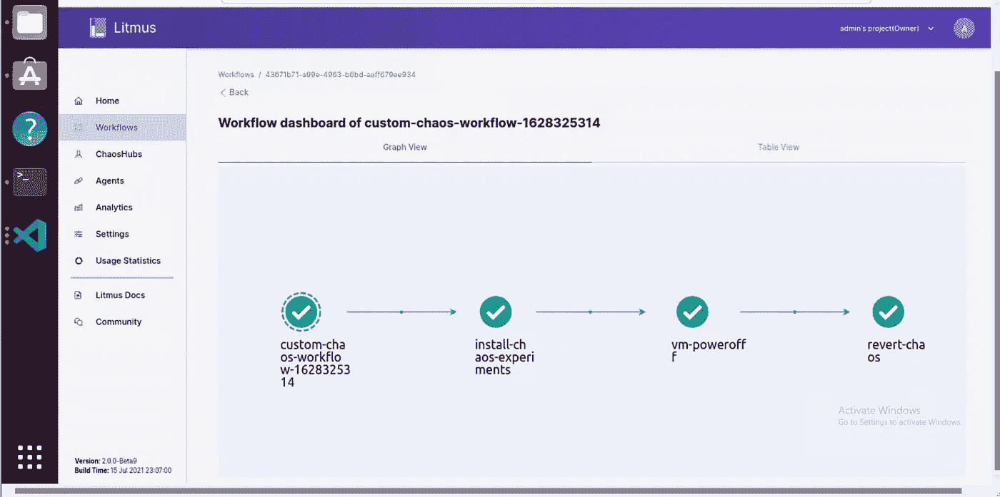

现在我们还可以检查日志和混沌结果，在混沌结果中，我们可以找到实验的结论和成功率。

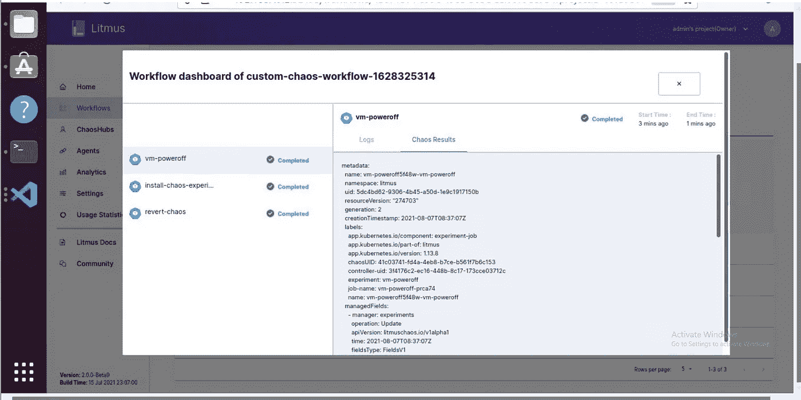

## **第四步:分析混乱**

现在，我们可以检查工作流的分析，以便更好地理解。

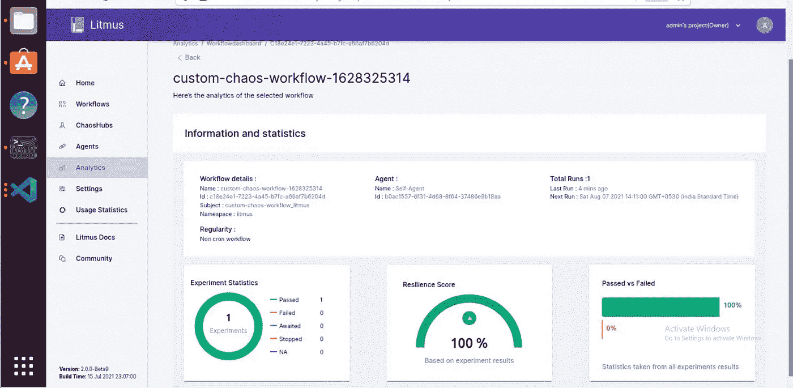

在这里，您可以看到有关工作流的所有详细信息，工作流名称、工作流 id、工作流在哪个命名空间和哪个代理上运行、工作流的总运行次数等等。

你还可以看到实验的弹性分数、通过与失败的百分比以及统计数据。

在我们的例子中，我们只运行了一个实验，它是成功的，它的弹性分数是 100%,通过与失败的百分比也是 100%。

# **结论**

因此，在这篇博客中，我们看到了如何使用 LitmusChaos 2.0 执行 VMware 虚拟机断电混沌实验。

LitmusChaos 2.0 使得混沌工程对个人和团队来说都更加有效，并且特别支持可伸缩性。创建、管理和监控混乱需要云原生的方法。该平台本身作为一组微服务运行，并使用 Kubernetes 自定义资源来定义混沌意图以及稳态假设。

如果你对 LitmusChaos 或者混沌工程有任何疑问，加入 slack 上的 Litmus 社区。

要加入社区，请遵循以下步骤:

**步骤 1:** 使用以下链接加入 Kubernetes slack】

**第二步:**加入 Kubernetes slack 上的`#litmus`频道或在加入 Kubernetes slack 后使用此链接:`[https://slack.litmuschaos.io/](https://slack.litmuschaos.io/)`

查看 LitmusChaos GitHub 库。要了解更多关于 LitmusChaos 的信息，请查阅 [LitmusChaos 文档](https://docs.litmuschaos.io/)。

谢谢大家！