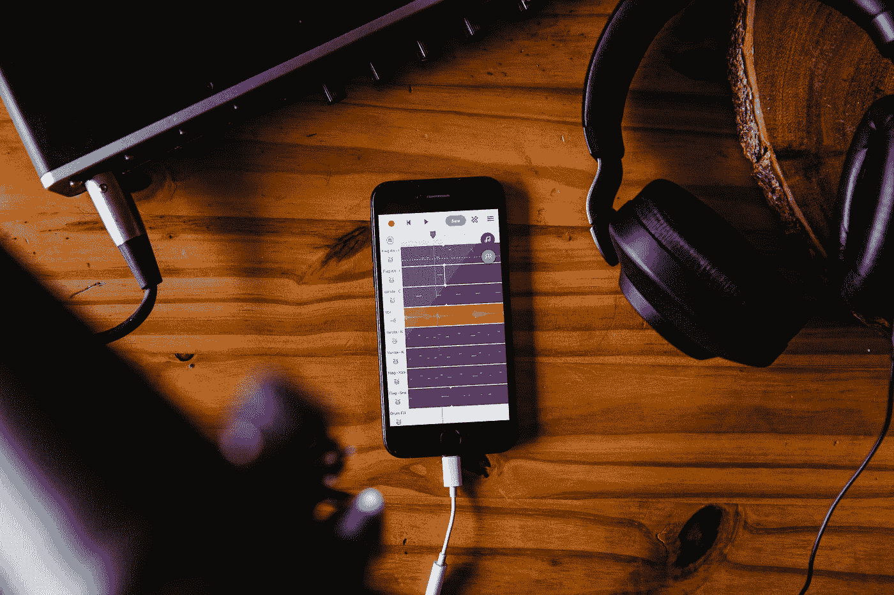

# 语音助手时间线

> 原文：<https://medium.com/geekculture/voice-assistant-timeline-50b3b07b48f7?source=collection_archive---------2----------------------->

## 声音革命简史

Photo by [Soundtrap](https://unsplash.com/@soundtrap?utm_source=medium&utm_medium=referral) on [Unsplash](https://unsplash.com?utm_source=medium&utm_medium=referral)

在语音革命让人机交互和人工智能对话成为我们日常生活的一部分之前，机器必须学习如何听到、识别和处理人类语音。

如今使用的语音助手技术(如 *Siri* 或 *Alexa* )已经发展了一个多世纪。它已经走过了漫长的道路从第一…