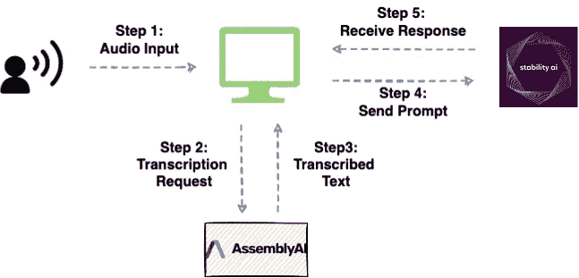
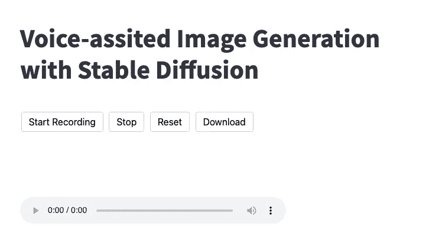
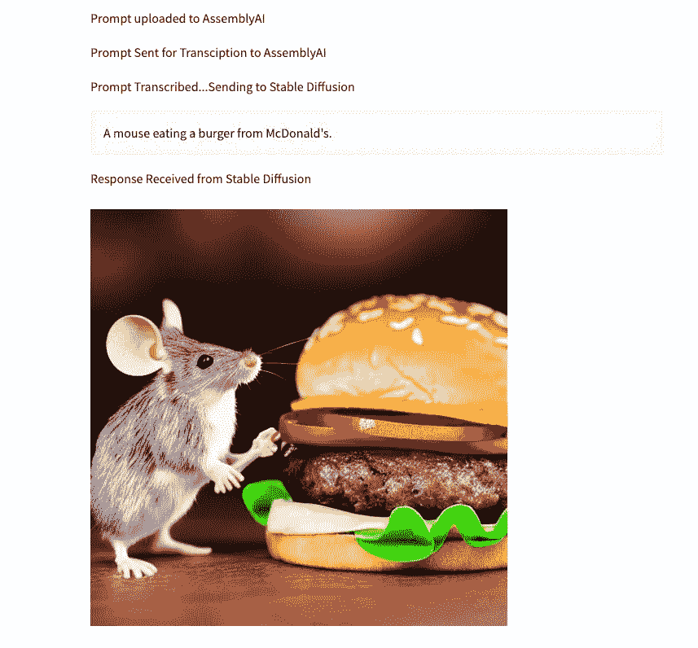

# 具有稳定扩散的语音辅助图像生成

> 原文：<https://medium.com/geekculture/voice-assisted-image-generation-with-stable-diffusion-66b7facd8fc4?source=collection_archive---------6----------------------->

## 一个语音辅助应用程序，从语音中生成图像


Photo by [russn_fckr](https://unsplash.com/@russn_fckr?utm_source=medium&utm_medium=referral) on [Unsplash](https://unsplash.com?utm_source=medium&utm_medium=referral)

自从 DALL-E、DALL-E2 和 Google Imagen 等文本到图像模型通过仅从文本提示生成令人惊讶和逼真的图像而显示出突破性进展以来，用户越来越有兴趣亲自测试这些模型。

几个月前， [Stable Diffusion](https://replicate.com/stability-ai/stable-diffusion) 实现了这一愿望，并开源了一些模型检查点，可以使用 GUI 或 API 访问。

现在，虽然该社区构建的大多数现有应用程序都是由文本提示驱动的，但是集成语音以生成图像仍然是相对未开发的。

因此，在这篇博客中，我们将构建一个 Streamlit 应用程序，它接受来自用户的基于语音的输入，并生成一个图像。

更具体地说，我们将首先记录输入。接下来，我们将利用文本到语音模型来转录音频输入。最后，我们将使用其 [API](https://replicate.com/stability-ai/stable-diffusion) 将获得的文本传递给稳定扩散模型。

文章的亮点如下:

[**App 工作流程**](#818f)[**先决条件**](#6ddf)[**构建细流 App**](#f4ae)[**执行应用**](#0490) **[**结论**](#1525)**

你可以在这里找到这篇文章的代码。

# 应用程序工作流程

如上所述，稳定扩散模型期望文本提示作为输入。然而，如果我们从语音开始，我们首先需要将语音转换为文本，然后将转录的文本作为输入馈送到稳定扩散模型。

为了生成音频转录，我将使用 AssemblyAI 的语音到文本转录 API。

下图展示了该应用程序的高级工作流程:



A high-level workflow of the application (Image by author)

首先，用户将提供语音输入，这将被记录。接下来，我们将把音频文件发送到 AssemblyAI 进行转录。一旦转录的文本准备好并从 AssemblyAI 的服务器中检索，我们将使用 Replicate API 将其作为输入提供给稳定的扩散模型。

# 先决条件

下面列出了创建可与稳定扩散互动的基于语音的应用程序的一些要求:

## 排名第一的安装简化版

首先，当我们使用 streamlit 创建这个应用程序时，我们应该使用以下命令安装 Streamlit 库:

## #2 安装复制

接下来，要使用稳定扩散模型，我们应该安装复制库，如下所示:

## #3 导入依赖关系

接下来，我们导入将在这个项目中使用的 python 库。

## #4 获取 AssemblyAI API 令牌

为了利用 AssemblyAI 的转录服务，您应该从 [AssemblyAI](https://app.assemblyai.com/signup) 网站获得一个 API 访问令牌。让我们为我们的 Streamlit 应用程序命名为`assembly_auth_key`。

## #5 获取稳定的扩散 API 密钥

最后，您应该获得一个 API 键来调用图像生成模型。你可以在这里获得你的 API 密匙[。](https://replicate.com/account)

获得密钥后，在终端中运行以下命令:

# 构建 Streamlit 应用程序

一旦我们满足了应用程序的所有先决条件，我们就可以继续构建应用程序了。

为此，我们将定义五个不同的函数。这些是:

1.  `**record_audio(file_name)**`:顾名思义，这将允许用户向应用程序提供口头输入。该功能将收集音频并以`file_name`的名称存储在本地的音频文件中。我已经引用了[这个](https://github.com/stefanrmmr/streamlit_audio_recorder)代码来将这个方法集成到应用程序中。
2.  `**upload_to_assemblyai(file_name)**`:该函数将获取音频文件，上传到 AssemblyAI 的服务器，并将文件的 URL 返回为`upload_url`。
3.  `**transcribe(upload_url)**`:一旦`upload_url`可用，我们将创建一个 POST 请求来转录音频文件。这将返回`transcription_id`，它将用于从 AssemblyAI 中获取转录结果。
4.  `**get_transcription_result(transcription_id)**`:为了检索转录的文本，我们将使用从`transcribe()`方法获得的`transcription_id`执行 GET 请求。该函数将返回转录的文本，我们将把它存储为一个`prompt`变量。
5.  `**call_stable_diffusion(prompt)**`:最后，该函数将传递来自用户的提示，并从稳定扩散模型中检索输出。

# 方法 2:将音频文件上传到 AssemblyAI

一旦音频文件准备好并保存在本地，我们将把这个文件上传到 AssemblyAI 并获得它的 URL。

然而，在上传文件之前，我们应该声明 AssemblyAI 的头和转录端点。

在上面的代码块中:

1.  `upload_endpoint`指定 AssemblyAI 的上传服务。
2.  上传文件后，我们将使用`transcription_endpoint`转录音频文件。

`upload_to_assemblyai()`方法实现如下:

我们用`upload_endpoint`、`headers`和音频文件的路径(`file_path`)向 AssemblyAI 发出 post 请求。我们从收到的 JSON 响应中收集并返回`upload_url`。

## 方法 3:转录音频文件

接下来，我们将定义`transcribe()`方法。

与 upload_to_assemblyai()方法中的 POST 请求相反，在这里，我们调用`transcription_endpoint`，因为目标是转录文件。

该方法为我们的 POST 请求返回`transcription_id`，我们可以用它来获取转录结果。

## 方法 4:获取转录结果

这个列表中的第四步是使用 GET 请求从 AssemblyAI 获取转录结果。

为了获取与我们的特定请求相对应的结果，我们应该在 GET 请求中提供从 AssemblyAI 接收到的惟一标识符(`transcription_id`)。`get_transcription_result()`方法实现如下:

转录运行时间将根据输入音频的持续时间而变化。因此，我们应该重复发出 GET 请求，以检查我们请求的状态，并在状态变为`completed`或指示为`error`时获取结果。这里，我们返回转录文本(`prompt`)。

## 方法 5:向稳定扩散发送提示

最终的方法将使用 Replicate API 将提示作为输入发送到稳定扩散模型。

## 集成主方法中的功能

作为 Streamlit 应用程序的最后一步，我们将上面定义的函数集成到`main()`方法中。

# 执行应用程序

现在我们已经构建了整个应用程序，是时候运行它了。

打开一个新的终端会话，并导航到工作目录。在这里，执行以下命令:

```
streamlit run file-name.py
```

> *用你的 app 文件名替换* `*file-name.py*` *。*



## 演示演练

接下来，让我们快速浏览一下支持 Streamlit 语音的稳定扩散应用程序。

正如我们在上面看到的，应用程序要求说出提示。在下面的演练中，我对稳定扩散给出了如下提示:“*一只老鼠在吃麦当劳的汉堡。*”



该应用程序记录音频并将其保存到本地文件中。接下来，它将文件发送到 AssemblyAI 进行转录。最后，转录的文本被发送到稳定扩散，其响应显示在应用程序上。

# 结论

总之，在这篇文章中，我们使用 AssemblyAI API 和 Streamlit 构建了一个基于语音的交互工具，以促进语音的稳定传播。

具体来说，我演示了如何获取语音输入，使用 AssemblyAI 将其转换为文本，然后将其作为稳定扩散的提示发送出去。

你可以在这里找到这篇文章的代码。

感谢阅读！

[🚀**订阅数据科学每日剂量。在这里，我分享关于数据科学的优雅技巧和诀窍，一天一个技巧。每天在你的收件箱里收到这些提示。**](https://avichawla.substack.com/)

[**获取机器学习领域排名前 1%的研究论文、新闻、开源报道和推文的每周摘要。**](https://alphasignal.ai/?referrer=Chawla)

[🧑‍💻**成为数据科学专家！获取包含 450 多个熊猫、NumPy 和 SQL 问题的免费数据科学掌握工具包。**](https://subscribepage.io/450q)

我喜欢探索、实验和撰写关于数据科学概念和工具的文章。你可以在 [LinkedIn](https://www.linkedin.com/in/avi-chawla/) 上和我联系。