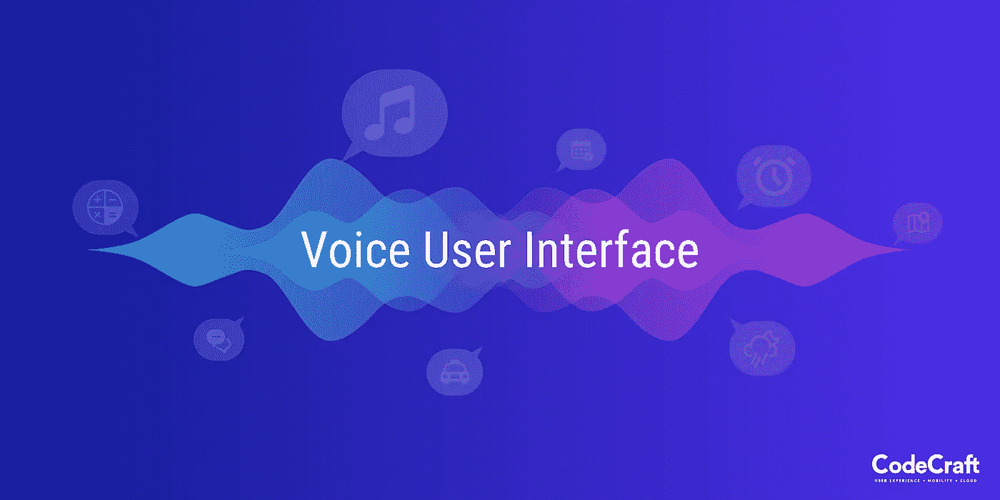
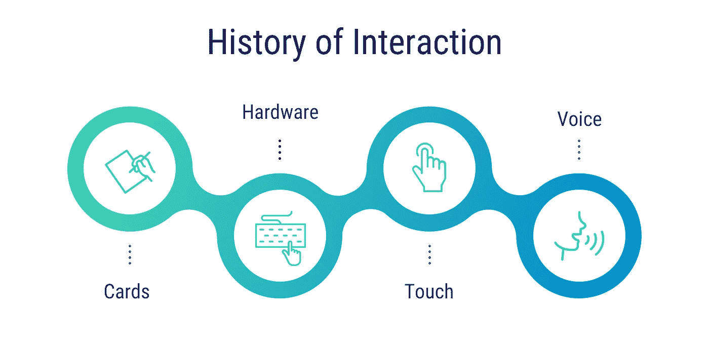

# VUI 机器人

> 原文：<https://medium.com/geekculture/voice-user-interface-bots-ca0ce1f40e95?source=collection_archive---------0----------------------->

我们如何与他人交谈，传达我们的想法和观点，在很大程度上影响着我们的生活质量。在不同的文化和地域中，基于语音的交流是最有效的表达方式。你的声音是你的一部分，它是与世界最亲密的接触方式。没有其他形式的交流可以像我们的声音一样传达情感和个性。有人可能会赞成触觉输入，如触觉、头部运动、手势等同样有效。但是与基于触摸的通信相比，语音通信的范围要广泛得多。

当涉及到与外部系统的交互时，就像所有事情一样，事情已经发生了变化。原始生物使用一切东西，从细羽毛、鸽子、火和烟。印刷术的出现也许是整个人类最伟大的成就。然后，我们从打字系统、打印机发展到现代电子设备，再发展到现在这一代硬件驱动的输入/输出设备，如显示器、键盘、跟踪板、鼠标等。随着移动性的发展，焦点已经转移到通过触摸和手势进行个人形式的输入。

基于语音的系统交互仍处于起步阶段，并逐渐流行起来。但是有许多应用和例子表明，语音用户界面不是一种时尚，而是未来的技术。以亚马逊的 Alexa、谷歌助手或微软 Cortana 为例。这些公司提供基于语音输入的服务。科技巨头，即五大巨头(苹果、脸书、谷歌、微软和亚马逊)，在这一领域投入了大量资金。这应该给一个商业领袖关于这项技术的发展方向和下一个最好的事情的思考。这项技术还处于起步阶段，但对用户和企业的潜在好处是巨大的。预计聊天机器人将在未来十年为公司节省数十亿美元。根据 Gartner 的报告，聊天机器人将很快处理不少于 25%的客户服务互动。

[https://www . Gartner . com/en/news room/press-releases/2018-02-19-Gartner-says-25%的客户服务运营将在 2020 年前使用虚拟客户助理](https://www.gartner.com/en/newsroom/press-releases/2018-02-19-gartner-says-25-percent-of-customer-service-operations-will-use-virtual-customer-assistants-by-2020)

让我们来看一个有基于语音的功能和没有基于语音的功能的例子。考虑一家服务公司，它围绕特定产品提供一整套服务。提供金融服务的银行。假设一个客户登录到该公司的网站，搜索一个贷款产品。然后深入服务列表(即时、短期、个人、商业贷款)，放大一个(短期个人贷款)，检查功能等。然后，客户可能会回去，通过评估产品的利弊来接听电话。想象一下同样的场景，银行有 VUI。客户将登录并询问聊天助手，“*给我看看你最好的短期贷款。*“问问题花的时间比打同一句话少。

考虑另一个例子。太受欢迎的拼车服务；优步。要预订出租车，乘客必须分享他的当前位置、目的地、上车地点、指定单独出行或共享出行、检查选项并确认。通过基于语音的输入，用户可以简单地说，“*在共享的基础上，与优步常客一起为我预订从这条街到那条街的出租车。*

这种系统的好处是显而易见的。VUI 不仅仅是具有*的特征。它直接、易用、快速且相关。VUI 还有一个额外的优势，那就是它是希望使用复杂系统的残障人士的最佳互动形式。但是，建造一个 VUI 是不是一帆风顺、简单易行呢？为什么这项技术到今天还没有蓬勃发展？*

# *声音和环境以及随之而来的挑战*

*基于语音的通信是上下文驱动的。人际交往有一种特质，因性别、文化、年龄等而异。*

***例如，***

*试着理解下列语句中的上下文*

****【数字低】****

****时代在变****

****我们所知道的是一滴水，我们所不知道的是一片海洋****

*现在考虑一下重新表述第一句话的方法。*

*“助理，我要对我们的销售数字做一个声明。” ***销售数字低！！！*** ”。*

*除非你有机器人的性格，否则很难想象有人会有那样的反应。这种上下文驱动的对话是自然语言的表达。再加上一般的文化参考、俚语，即使是一个人也很难理解对话的内容。更别说机器了。*

****穆罕默德·阿里是 G.O.A.T.*** ”*

*一个非拳击迷认为这个人在取笑这位传奇拳击手是情有可原的。尽管如此，一个狂热的体育迷或拳击迷会知道，这个人承认穆罕默德·阿里是有史以来最伟大的人！*

# ***品牌、业务和声音***

*企业总是在寻找下一个最好的东西来提升他们的品牌。让它无法抗拒。客户服务从来不是任何领导计划的“一部分”。相反，它始终是提供所有服务和产品的中枢。一个品牌受顾客喜爱的部分原因是该品牌为顾客提供的体验。VUI 和 VUI 机器人可以改变这方面的游戏规则。*

*聊天机器人由新生的人工智能(截至今天)支持，它可以或试图通过网站等数字媒体，用自然语言与用户/客户进行对话。由于基于人工智能的后端驱动它，机器人学习得越多，它就变得越好。聊天机器人将人与人之间的互动扩展到了涉及人和机器的互动。这是关键。为顾客提供不同的个性化体验。*

*聊天机器人或语音用户界面用自然语言回答顾客提出的问题。例如，想象一家保险公司用 VUI 机器人帮助客户搜索产品、检查索赔状态、提出索赔、查询产品等。通过简化客户体验，转化率得以提高，购买变得更加容易，而不是遍历产品目录的大量部分、子部分。*

## ***它们是如何工作的***

**

*构建聊天机器人最重要的是理解客户的意图。通过提供可用服务的样本空间，这可以变得更简单。这使得机器人能够快速理解输入。用户的意图越清晰，机器人的反应就越好。有了明确的意图，一个机器人的反应可以很容易地从多个地方。它可以来自*

*   **预定义响应的数据库，例如，在对查询的响应中，你什么时候关门？或者你的工作时间。这些是固定响应**
*   **基于人工智能学习的回复**
*   **被框定为问题的回复，以澄清用户的原始查询**
*   **通过与第三方服务交互检索响应，例如，外面天气如何等**

# ***为 VUI 设计***

*一个[设计师](https://www.codecrafttech.com/ui-ux-design-company-usa.html)在构建交互模型时最常用的框架是设计思维。*

*[***设计思维***](/@CodeCraft/design-thinking-a5a4ee66032b) *涉及:**

*   ***感同身受***
*   ***定义***
*   ***想法***
*   ***原型&测试***

*但是，当设计者的目标是构建语音用户界面时，这些原则适用吗？除了研究用户，[开发](https://www.codecrafttech.com/)用例，并对他们的需求感同身受，VUI 还有一些设计师应该牢记的特殊要求。*

## ***交互模型***

*交互模型是设计师构建一个吸引人的 VUI 的第一步。*

*关于你的产品或服务， ***用户会如何使用？****

*在与系统的交互中，固定和变化的参数是什么？以这种方式构建的交互模型有助于定义系统的边界。确定您的系统提供和不提供的服务。*

## ***分类意图***

*一旦定义了系统边界，确定用户将如何与之交互。例如，用户可能要求一个音乐流媒体服务， ***“给我放点蓝调音乐。”*** 这样表达的一个意图，很容易归类和回应。明确的意图是特定的意图。但同样的意图可以表述为 ***“给我放点 B.B. King 的经典。”*** 设计师必须以尽可能好的方式对表达的意图进行分类。交互模型有助于捕捉相似意图中的这种差异。带有视觉提示的语音交互有助于抵消与不可理解的意图相关的任何负面体验。*

***为 e . x .为闪烁的红灯***

## ***相关选项***

*由于自然语言处理中的潜在困难，当意图不明确时，VUI 应该考虑相关信息的反馈。如果没有视觉提示，用户将很难确认他们的输入是否被理解。应该避免给用户提供过多不相关的信息。*

# ***结论***

*几十年前，当万维网诞生时，它被视为未来。当时，它被称为 Web 1.0。切到现在，互联网已经成为我们生活中不可或缺的一部分。同样，VUI 发现自己即将成为主流并被广泛采用。VUI 具有前所未有的改变沟通实体之间动态的潜力。不管是人类和机器还是人类和系统。VUI 肯定会留在这里*