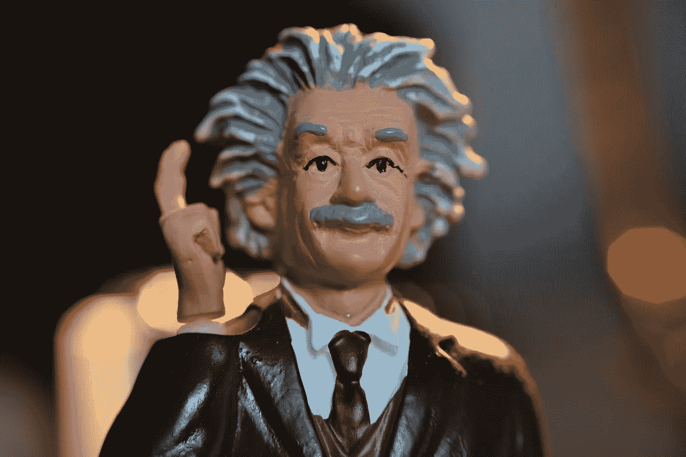

# 大众宣布将量子计算机引入汽车工厂

> 原文：<https://medium.com/geekculture/volkswagen-announces-bringing-quantum-computers-to-automotive-factories-ecb57d955758?source=collection_archive---------13----------------------->

## 自 2016 年以来，大众汽车集团一直致力于成为量子计算机领域的领导者，现在他们的目标是离开研究阶段，开始制造

Photo by [Andrew George](https://unsplash.com/@andrewjoegeorge?utm_source=unsplash&utm_medium=referral&utm_content=creditCopyText) on [Unsplash](https://unsplash.com/s/photos/quantum?utm_source=unsplash&utm_medium=referral&utm_content=creditCopyText)

从我很小的时候起，量子计算就是一个科幻小说的想法；我读过…