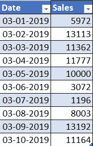
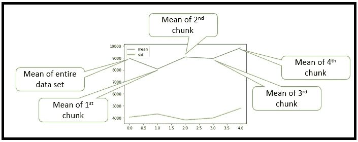
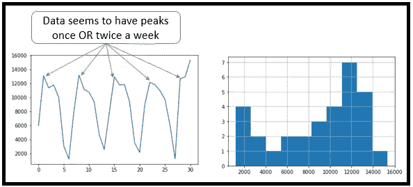
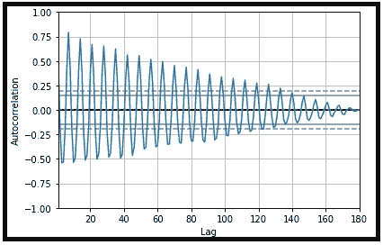
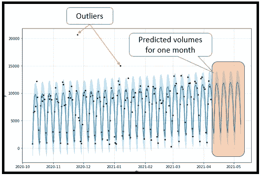
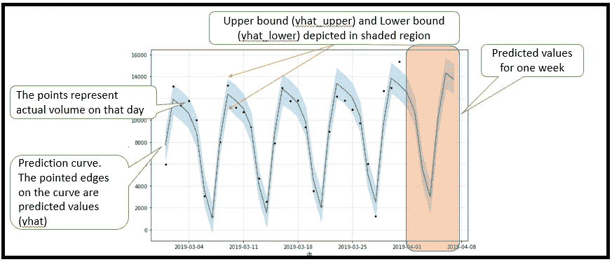
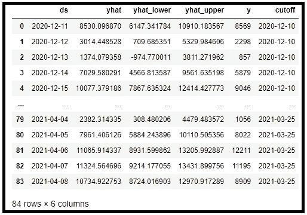

# 使用 Fbprophet 进行流量预测和异常检测

> 原文：<https://medium.com/geekculture/volume-forecasting-and-anomaly-detection-using-fbprophet-c1b64992730?source=collection_archive---------7----------------------->

使用 facebook 的开源库 fbprophet 实现时间序列分析


这篇文章是我之前的一篇文章[时间序列分析——初学者指南](https://srinivas-kulkarni.medium.com/time-series-analysis-a-beginners-guide-81fc2f398784)的续篇。如果您不熟悉时序，我强烈建议您在阅读这个实现示例之前通读那篇文章。

# 安装 fbprophet

我总是喜欢为每个项目套件设置不同的环境。因此，继续使用下面的命令来设置一个新的环境，并通过 anaconda 提示符安装软件。一旦软件安装完毕，打开 jupyter 笔记本，我们就可以开始了。

```
conda create -n time-series python==3.6.9conda activate time-seriespip install jupyterpip install pandas
pip install matplotlib
pip install seaborn### Installing fbprophet
pip install pystan
conda install -c conda-forge fbprophet### open jupyter notebook
jupyter notebook
```

# 数据集

数据集由过去 6 个月的销售数据组成。给定这个数据集，我们的任务是预测下一个月的销售额。我不分享数据集。但是我相信创建一个或者从 Kaggle.com 下载是非常简单的。以下是样本数据集:



Sales Data Set

# 加载数据集和 EDA

创建一个新的 python 3 笔记本并导入所需的库。

```
import pandas as pd
from pandas.plotting import autocorrelation_plot
from fbprophet import Prophet
import numpy as np
import matplotlib.pyplot as plt
%matplotlib inline#NOTE: Once you execute for the first time, you might get warning related to ploty, but execute again and the warning will disappear.
```

下一步是加载数据集并进行探索性数据分析(EDA)以修复数据中的任何问题。请注意，我有意采用了一个干净的数据集，所以我不必做太多的修改。因为，EDA 不是这篇文章的主要意图。

```
df = pd.read_csv('sales-data.csv')# The Date column is not sorted in my case
df.head()#Plot the sales data to visualize 
df.plot()# Date column needs to be explicitly defined as datetime
df.columns# No null values detected
df.isnull().sum()df['Date'] = pd.to_datetime(df['Date'])
df.sort_values('Date', inplace=True)#reset the index values post sorting
df.reset_index(drop=True, inplace=True)
```

# 白噪声检测

既然我们已经清理了数据集，下一步就是找出数据集是否适合时间序列分析。如果有白噪音，肯定最好就此打住。你可以参考文章[白噪声-时间序列-python](https://machinelearningmastery.com/white-noise-time-series-python/) 来了解更多关于如何检测白噪声。下面的代码行显示了我检测白噪音的步骤

```
### WHITE NOISE DETECTION# check the data set stats
df.describe()#Split the data set into 4 chunks, create a different data frame with mean and standard deviation of each data frame. Now plot to see if the is difference in mean and std.df_split = np.array_split(df, 4)
### We can see that mean is not constant and its fluctuating
df_stats = pd.DataFrame(np.array([[df['Sales'].mean(), df['Sales'].std()],
                                  [df_split[0]['Sales'].mean(), df_split[0]['Sales'].std()], 
                                  [df_split[1]['Sales'].mean(), df_split[1]['Sales'].std()],
                                  [df_split[2]['Sales'].mean(), df_split[2]['Sales'].std()],
                                  [df_split[3]['Sales'].mean(), df_split[3]['Sales'].std()]]),
                    columns=['mean', 'std'])df_stats.plot()
```

下图显示了平均值不是常数。



Mean and Standard deviation

现在让我们用一些图来确定分布是否是随机的。我们也可以绘制一个直方图来确定它的分布是否是高斯分布。

```
# Plotting it just for 1st month as I see similar pattern across. Avoids clutter
df['Sales'][:30].plot()
df['Sales'][:30].hist()
```

下面是两个图表。



看起来一周中有几天交易量很高。此外，周末的交易量似乎要低得多。直方图没有显示高斯分布。到目前为止我们都很好。

下一步是找出自相关。如果自相关表明，以前的数据影响第二天的数据，我们可以继续。

```
autocorrelation_plot(df['Sales'])
```

下面是显示这种关系的相关图。如您所见，该分布确实表明与之前的数据存在相关性。像本例中看到的正弦波是数据集中季节性的强烈标志。



Auto-Correlation

有了这些信息，我们现在可以继续了，因为我们的数据不是白噪音。注意，我们不需要担心数据是静态的，fbprophet 可以处理这种数据。

# 系统模型化

数据建模是一个重要的步骤。涉及的不同阶段是:

1.  列重命名— fbprophet 希望列名为“ds”和“y”
2.  初始化模型
3.  创建未来日期
4.  做预测

完成这一切的代码如下:

```
df.columns=['ds', 'y']# Initialize the model. fbprophet automatically detects its weekly seasonal. Note that model initialization may take time depending on data set size.model = Prophet()
model.fit(df)#Run the below statement to know more on seasonality, period and mode.
model.seasonalities# Create future dates of 30 days
future_dates = model.make_future_dataframe(periods=30)#predict for future dates
prediction=model.predict(future_dates)
prediction.head()
prediction[['ds', 'yhat', 'yhat_lower', 'yhat_upper']]# plot predicted projection
model.plot(prediction)
```

在预测中，您将得到多个列。但是我们主要对其中的三种感兴趣

1.  yhat —该日期的预测值
2.  yhat _ upper 上限值。我们预计那一天的最大销售量
3.  yhat_lower —下限值。我们预计那一天的最低销售量

理解上一条语句中的预测也很重要。其解释如下。第一个显示了完整的数据集。下一个，是较小的日期范围，我用来清楚地显示如何阅读这个图表。



Cut down version of the data set

如您所见，大多数点位于 yhat_lower 和 yhat_upper 的范围内。肯定有一些异常值，但对于大多数数据集来说，预测似乎是令人满意的。

# 异常检测

数据集中的异常值告诉我们，在那些日子里有些事情是不对的。这些都是我们应该担心的数据点。一旦预测就绪，我们就可以使用 yhat_upper 和 yhat_lower 的预测值作为未来销售的上限值和下限值。如果任何一天的数值都不在这个范围内，这是一个警告信号，表明有些事情不对劲。

需要注意的是，虽然**异常的**数据可能表示软件问题、严重事故等。这也可能是潜在的机会，例如消费者行为的改变。因此，任何偏差都需要仔细研究，每个案例的结果都不同。

# 交互效度分析

时间序列中的交叉验证略有不同。交叉验证是使用历史数据来衡量预测误差。交叉验证的输入是我们建立的模型和下面的重要参数

1.  初始-出于交叉验证的目的，培训需要考虑多少天的数据
2.  周期—截止日期之间的间隔
3.  范围—预测范围。

默认情况下，初始训练周期设置为三倍范围，每半个范围进行一次截止。

下面，我们进行交叉验证，在 14 天的时间范围内测量预测性能，从第一个截止日期的 42 天训练数据开始，然后每隔 21 天进行预测。这将产生 6 个总预测。

```
from fbprophet.diagnostics import cross_validationdf_cv = cross_validation(model, initial='42 days', period='21 days', horizon = '14 days')df_cv
```



Cross Validation Data

正如你所看到的，大多数时候，y 的实际值在上下界之间，很多情况下，预测值更接近实际值。

我们还可以看到性能指标，并绘制它们来了解我们的模型如何执行。

```
from fbprophet.diagnostics import performance_metrics
df_p = performance_metrics(df_cv)
df_p.head()#plot the root mean squared error metrics
from fbprophet.plot import plot_cross_validation_metric
fig = plot_cross_validation_metric(df_cv, metric='rmse')
```

我发现这个库非常有用，而且比其他预测库简单得多。一定要看看这个，让我知道你的想法。该文件是由 facebook 共享的，也很有用。你可以参考这个链接[https://facebook.github.io/prophet/docs/quick_start.html](https://facebook.github.io/prophet/docs/quick_start.html)。