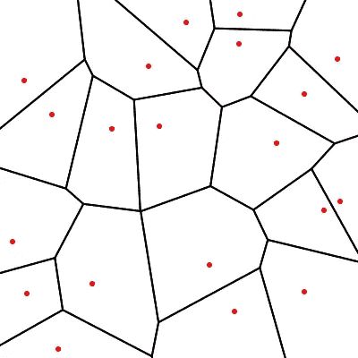

# 带 SciPy 的 Voronoi 图

> 原文：<https://medium.com/geekculture/voronoi-diagrams-with-scipy-d91671ac825d?source=collection_archive---------33----------------------->

在本文中，我们将看到如何使用 Scipy 和 [generativepy](https://pythoninformer.com/generative-art/generativepy/) 在 Python 中创建 Voronoi 图。

# 什么是 Voronoi 图？

这张图片显示了一组*种子点*。我们已经随机地放置了种子点，但是如果你喜欢的话，你可以根据一些模式来放置种子点。