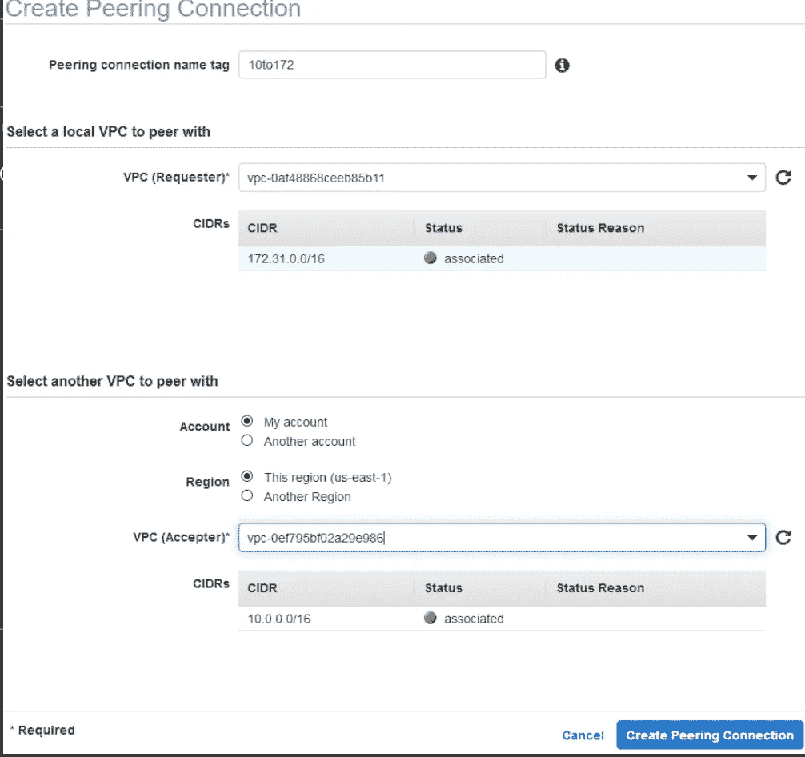
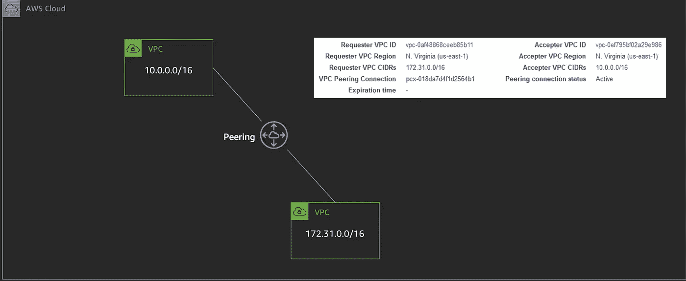
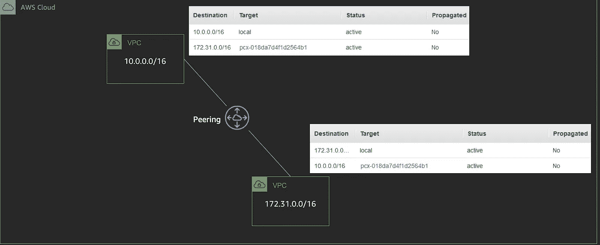
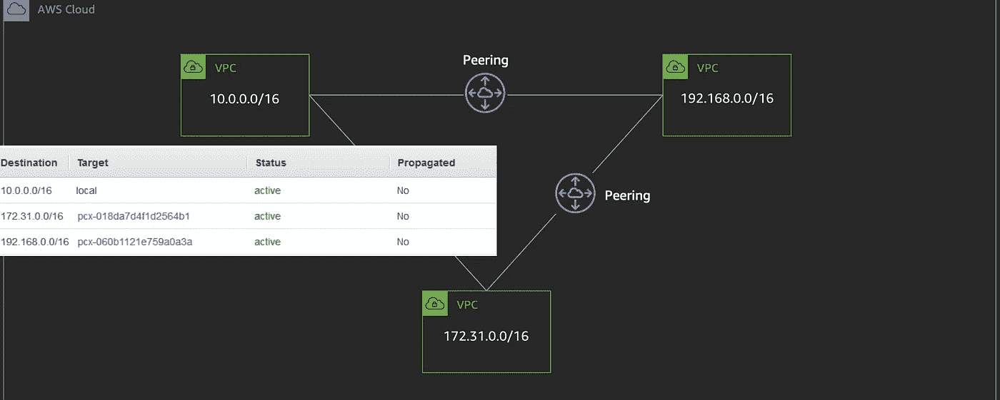

# VPC 连接—同一地区

> 原文：<https://medium.com/geekculture/vpc-connection-same-region-57e985f94b69?source=collection_archive---------43----------------------->

Photo by [Thomas Jensen](https://unsplash.com/@thomasjsn?utm_source=unsplash&utm_medium=referral&utm_content=creditCopyText) on [Unsplash](https://unsplash.com/s/photos/connectivity?utm_source=unsplash&utm_medium=referral&utm_content=creditCopyText)

通常，AWS 中虚拟网络(VPC)的一个逻辑组想要与另一个进行交互。AWS 提供了在同一地区和不同地区的 VPC 之间进行连接的选项。

VPC 对等是由 AWS 提供的连接两个 VPC 的网络连接。VPC 可以来自相同或不同的帐户。由于 VPC 是一个基于区域的实体，VPC 对等也可以在同一账户中来自不同区域的 VPC 之间建立。一旦建立了对等关系，任一 VPC 中的实例就可以相互连接，就好像它们在同一个帐户中一样。

要创建对等连接，请转到 VPC 仪表板并点击`Create Peering Connection`。向导看起来如下。我们需要提供我们感兴趣的当地 VPC 及其 CIDR 区块。如果我们在同一个帐户中连接到同一个地区，那么我们可以选择`My Account`和`This region`，并提供要连接到的 VPC 及其 CIDR。

Create Peering Connection — AWS Console

创建后，对等连接如下图所示，对等连接状态显示为`Active`。

Peering Connection Config

创建 VPC 对等连接后的下一步是更新两个 VPC 中子网的路由表。

Peering Connection — Route Table

VPC 对等是 VPC 之间的一对一连接。因此，要连接到另一个 VPC，必须创建另一个对等连接并更新路由表。

Peering Connection -Multiple VPCs

如果 VPC A 与 VPC B 和 VPC C 有连接，这并不意味着 VPC B 和 VPC C 之间的对等连接自动可用。必须创建另一个对等连接来建立这种关系。

VPC Peering — No Automatic Connection

# 需要知道的事情

*   VPC 对等允许从同一区域的对等 VPC 引用安全组。
*   支持 DNS 主机名解析以返回私有 IP 地址。
*   支持 IPv4 和 IPv6 地址的对等。
*   VPC 不能有重叠的 IP 地址。
*   在相同的 VPC 之间不能建立冗余的对等连接。仅支持一个对等连接。

# 你能回答以下问题吗？

1.  VPC 之间可以访问 NACL 吗？
2.  如何对 VPC 对等连接进行健康检查？

【https://www.pradheepa.com】最初发表于**。**