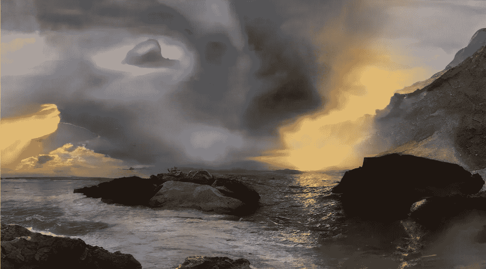

# VQ-甘解释道

> 原文：<https://medium.com/geekculture/vq-gan-explained-4827599b7cf2?source=collection_archive---------2----------------------->

简单介绍*矢量量化生成对抗网络*

Image generated with VQ-GAN, from the [original paper](https://arxiv.org/pdf/2012.09841.pdf).

几天前，我试图理解一个全新的架构， [MaskGit](https://arxiv.org/abs/2202.04200) ，一个基于 VQ-甘的蒙面生成图像转换器。因此，我在 Medium 上搜索了一个关于这个主题的简短总结，但是，很明显，VQ-甘只被讨论到作为产生艺术的强大工具的剪辑，这很有趣，但没有给出一个精确的想法…