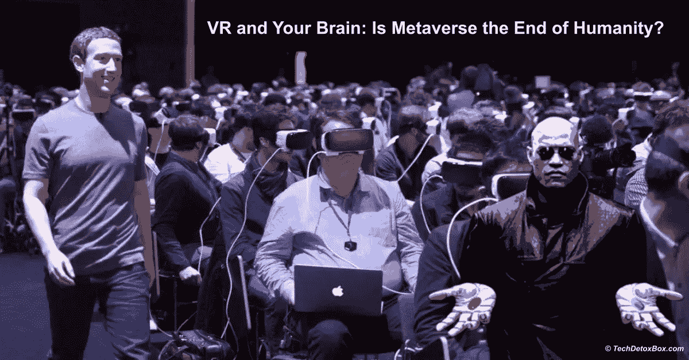
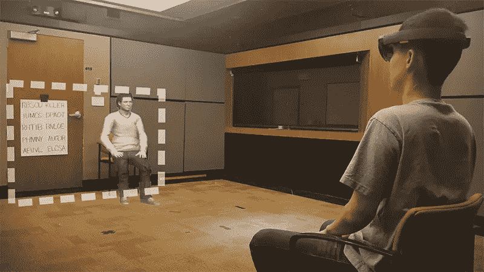
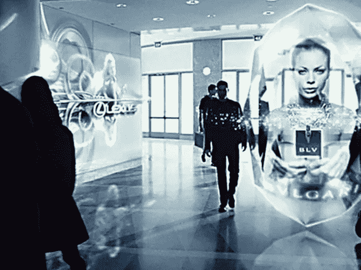
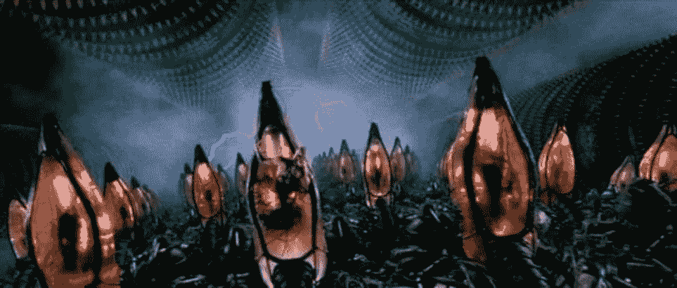
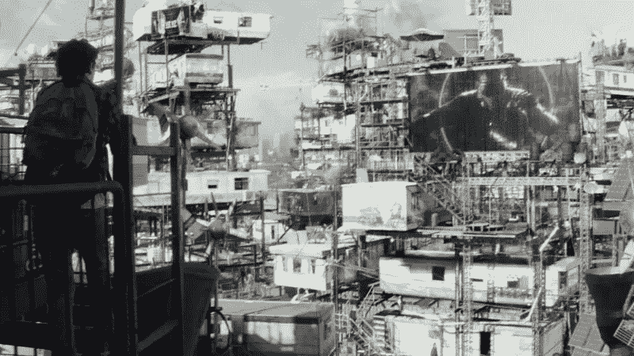
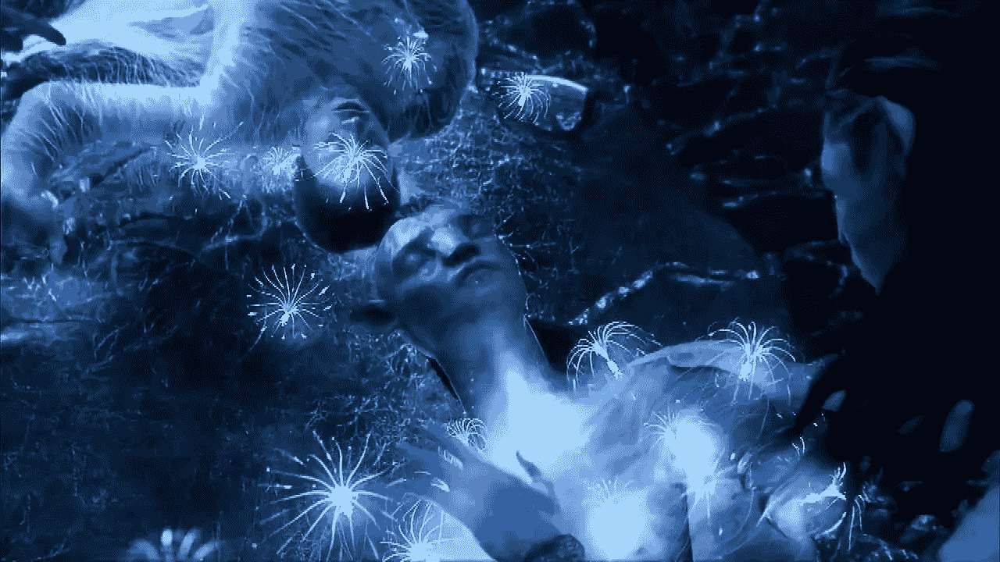

# 虚拟现实和你的大脑:元宇宙是人类的末日吗？

> 原文：<https://medium.com/geekculture/vr-and-your-brain-is-metaverse-the-end-of-humanity-c460af6332b5?source=collection_archive---------15----------------------->

脸书的首席执行官马克·扎克伯格希望我们所有人都离开现实，搬到元宇宙——一个虚拟现实世界，在那里我们将作为数字化身幸福地生活下去。他说会很棒。

> 你认为我们可以信任他吗？

“**”和“**阿凡达**”这两个词是[尼尔·斯蒂芬森](https://en.wikipedia.org/wiki/Neal_Stephenson)的发明，他在他的**著名科幻小说《冰雪奇缘**中创造了这些术语，故事发生在一个**高科技、反乌托邦、暴力、无法无天的未来世界，这个世界不是由政府管理，而是由强大的私营公司管理。**在动作过程中，许多角色死于一场壮观的图形死亡，而主角从一种破坏人们大脑的数字药物中拯救了世界。斯蒂芬森在 1991 年写了这本书。**

> **振作起来。元宇宙即将取代现实。**

# **比吗啡好**

**华盛顿大学医学中心进行了一项有趣的研究。在伤口护理过程中——这是一个痛苦的过程，甚至吗啡也无法缓解疼痛——烧伤患者配备了虚拟现实设备。在里面，他们会向企鹅扔雪球。结果是惊人的:患者报告说使用虚拟现实比不使用虚拟现实时疼痛明显减轻。**

**虚拟现实比吗啡更能减轻战伤患者的疼痛。怎么会？**

> **你需要注意力来处理疼痛。如果你的注意力转移到别处，你会感觉不到疼痛。让虚拟现实在疼痛管理方面优于阿片类药物的是[分心](https://www.techdetoxbox.com/screen-time-problems/distracted/)。**

**吗啡是一种极其强效的药物，具有严重的成瘾性和危险的副作用。它只给处于严重危及生命的疼痛中的人，或快死的人。过量的吗啡意味着死亡。**

> **如果 VR 在缓解身体疼痛方面比吗啡更厉害，那么在缓解日常生活的痛苦方面能厉害多少？**

**到了我们选择完全脱离生活的地步？**

# **副作用警告**

**和吗啡一样，VR 也有副作用。如果你花时间阅读[脸书的 Oculus VR 官方安全警告](https://www.oculus.com/legal/health-and-safety-warnings/)，这听起来就像是一种极其危险的非法街头毒品:**

*   ***“长时间使用的影响可能会增加你在现实世界中从事正常活动时受伤的风险。在您从任何影响中完全恢复之前，不要驾驶、操作机器或从事其他可能导致伤害或财产损失的活动，这些活动需要未受损的平衡和手眼协调能力。”***
*   ***“虚拟现实暴露的症状会持续存在，并在使用几小时后变得更加明显。”***
*   ***症状包括:***

***癫痫发作
失去知觉
眼疲劳
眼睛或肌肉抽搐
不自主运动
改变、模糊或重影
头晕
定向障碍
平衡受损
手眼协调受损
流汗过多
流涎增多
恶心
头晕
困倦
疲劳***

**大多数警告集中在从楼梯上摔下来，与墙壁相撞，或踩到宠物。但是当谈到虚拟现实时，物理安全是我们最关心的问题吗？**

> **我们不仅会失去平衡，还会失去人性。**

# **人类，虚拟改造**

***“虚拟现实是身临其境的，可以是激烈的。令人恐惧、暴力或引发焦虑的内容会让你的身体产生仿佛真实存在的反应。”* ( [Oculus VR 官方安全警告](https://www.oculus.com/legal/health-and-safety-warnings/))。**

**最近，关于神经可塑性——大脑通过生长和重组而改变的能力——有很多令人兴奋的事情。想象一下——你可以在任何年龄学习，培养新习惯，成为一个更好的人！**

> **因为我们的大脑会根据环境改变自己。**

**这与达尔文的进化论是一致的: ***环境的变化将一个物种送向新的方向。*****

## **这就引出了一个问题——在元宇宙，从有形的现实到生活的巨大转变会给人类带来什么样的突变？**

**这种调整可能是好的，也可能是坏的，大脑的可塑性是双向的。当复杂的人工智能塑造我们操作的环境时，大脑和行为会发生什么变化？**

**科学家已经知道了。**虚拟现实重新连接了大脑中的回路。大脑并不在乎这种经历是否真实——它无论如何都会从中学习。****

**[斯坦福大学的虚拟人类交互实验室](https://stanfordvr.com/)，由杰里米·贝伦森教授领导，研究虚拟现实和增强现实(AR)的心理和行为效应。在一项实验中，他们计算出，如果操作虚拟角色的四肢颠倒过来，那么[需要 4 分钟来切换手臂和腿的使用。在另一项研究中，研究人员发现](https://stanfordvr.com/mm/2014/won-jcmc-homuncular.pdf)[在人们体验了增强现实后，他们在现实世界中的互动也发生了变化](https://stanfordvr.com/news/2019/vhil-research-examines-how-augmented-reality-affects-peoples-behavior/)。他们似乎受虚拟人的影响和真人一样多。*“我们发现，使用增强现实技术可以改变你走路的位置，你转头的方式，你完成任务的方式，以及你与房间里其他物理人的社交方式，”【Bailenson 说。***

****

**Image from Stanford University’s Virtual Human Interaction lab**

> **简而言之，该实验室在多个环境中证明，在虚拟现实中度过时间会改变我们在实际现实中的感知和行为。**

**VR 的后遗症看起来很像[游戏转移现象](https://en.wikipedia.org/wiki/Tetris_effect#Game_transfer_phenomena)，最初被称为俄罗斯方块效应，被多项研究记录在案。当人们开始到处看到视频游戏的元素时，如果他们玩游戏的时间足够长，就会发生这种情况。整个世界开始看起来像俄罗斯方块。**基本都是幻觉。****

> **在元宇宙待久了，现实看起来就不再真实了。**

**国家地理节目大脑游戏的杰森·席尔瓦曾经做过一个实验，他们给参与者戴上特殊的眼镜，扭曲他们的视野。毫不奇怪，人们不能抓住面前的物体，把食物弄得一团糟。更令人着迷的是，当摘下眼镜，恢复正常视野后，受试者就无法活动了。一个家伙打碎了一整塔香槟酒杯。这很壮观，也很能说明问题。**

**在短短几分钟内，人们的大脑被重新布线，当他们回到现实世界时，他们无法在其中操作。**

**这只是一副时髦的眼镜，而不是虚拟现实设备。如果几分钟的感知受损可以让大脑重新布线，以至于你不能给自己倒一杯饮料，想象一下在虚拟现实中一天几个小时可以做什么。尤其是在一个孩子不成熟的成长大脑中。**

# **儿童发展，已取消**

**有一次在科学博物馆，我让我 6 岁的儿子尝试虚拟现实设备(这是我被误导的一个例子)。这是一次两分钟的与僵尸战斗的经历。他真的很投入，但表现得完全不知所措和不舒服，说他不想再做了，因为这感觉真实而可怕。**

> **成年人的大脑无法区分虚拟现实和现实世界。孩子们没有机会。**

**虚拟现实对他们来说是真实的。我可以从个人经历中证明，即使是普通的视频游戏也能做到这一点。同一个孩子有一次在我们的工具房里发现了一把真的鹤嘴锄，我们抓到他用它在院子里挖洞。他说他在玩《我的世界》，有什么大不了的，为什么父母会抓狂？**

**虚拟现实设置警告有很多关于孩子的话要说——我怀疑不是自愿的:**

**Oculus Quest:**

*   ***“本产品不是玩具，不应该让 13 岁以下的儿童使用。”***
*   ***“应该避免 13 岁以上的儿童长时间使用，因为这可能会对手眼协调、平衡和多任务处理能力产生负面影响。”***
*   ***“成人应在 13 岁以上儿童使用耳机期间和之后对其进行监控。”***
*   ***“确保儿童使用适当的内容。”***
*   ***“限制孩子使用耳机的时间。”***

**三星 Gear VR:*13 岁以下儿童不宜使用 Gear VR。*
Google Daydream View:*13 岁以下儿童不宜使用 Daydream View。*
索尼 PlayStation VR:*VR 耳机不适合 12 岁以下儿童使用。*
HTC Vive: *幼儿不宜使用本产品。***

**为了遵守一项名为 [COPPA(儿童在线隐私保护法案)](https://www.ftc.gov/enforcement/rules/rulemaking-regulatory-reform-proceedings/childrens-online-privacy-protection-rule)，**的微弱立法，虚拟现实经销商不得不承认他们的产品对儿童是危险的。但是他们告诉你的仅仅是保护自己不被起诉。****

> **他们永远不会告诉你，在没有规则的虚拟现实世界中漫游的孤身儿童会发生什么，他们穿着隐藏年龄的虚拟服装。**

**以下是一些可能性:**

*   **变得如此沉迷于过度刺激，以至于他们放弃了所有现实世界的追求——教育、职业、人际关系和基本卫生**
*   **在花时间扮演美丽的化身后，厌恶真实的自己**
*   ***被虚拟恋童癖者训练进行性交易***
*   ***暴露在现实的图形暴力中，患上创伤后应激障碍，或者——变得麻木不仁，以至于成为现实世界的射击运动员***
*   ***失去任何社会规范感，变成把真人当 VR 对象的神经病***
*   ***忘记物理定律，在现实中伤害或杀死自己***
*   ***通过体验未经过滤的虚拟现实色情作品来破坏他们新兴的性欲***

**即使后果不会如此灾难性，至少孩子们会损害他们的想象力和创造力。我的女儿曾经说过:*“当我听音乐的时候，我的脑海里会播放思维电影——我的想象力被点亮了！”。***

**在元宇宙，一切都已经为他们设想好了。**

# **VR，Pornified**

**据说，每一项新技术都是先商业化，然后大众化。色情行业是 VR 发展的大投资者。哦，他们很感兴趣。想象一下这种可能性——你可以花钱与最美丽的化身发生任何形式的性关系，这些化身会满足你最疯狂的幻想。**

**会感觉很真实。而且这是合法的——没有真人参与。**

**谁还会需要真正的性呢？更正— **在超现实的虚拟现实“体验”之后，谁还会有能力进行真正的性爱呢**？谁会为真正不完美的配偶而烦恼，并不厌其烦地创建传统家庭来抚养孩子呢？**

**人口过剩的问题会自行解决。人类会自然消亡。**

# **你的化身和傀儡主人**

**人工智能运行着元宇宙，悄悄地操纵着数十亿人作为化身四处游荡——这就是我们正在走向的未来。人工智能是元宇宙之神，除了编写其代码的专有技术圣职之外，不对任何人负责。想想这些可能性，当我们每个人都像虚拟的巫毒娃娃一样被少数科技精英控制。**

**今天，[我们被智能手机跟踪着](https://www.techdetoxbox.com/weapons-of-digital-manipulation/how-attention-economy-works/)——这仅仅是个开始。很快，生物传感器将跟踪你的身体，构建你的独特身份，以识别你在现实世界和元宇宙。你的身体成为你的生物护照。**

**在元宇宙，这些生物追踪器很容易成为低俗的虚拟二手车推销员的目标:*“X 先生，你的胆固醇值刚刚变了。除非你现在就买我们的药，否则你会死的！”***

**想象一下，人工智能可以读取你一整天的所有动作，就像它读取视频游戏化身的动作一样。在游戏中，角色的每个动作都需要被算法跟踪，以确定下一步该轻推他们去哪里。**

> **人工智能将能够在元宇宙和现实生活中轻推你到它想要你去的方向。**

**这已经在一个非常受欢迎的 Pokémon Go 增强现实游戏中实现了，该游戏让用户到商店和餐馆寻找 Pokémons，这些商店和餐馆向游戏创作者支付特权。当全神贯注的游戏玩家顺从地去算法告诉他们去的地方时，他们还没有意识到他们已经成为定向行为广告的受害者。**

**几十年来，埃隆·马斯克一直在警告世界领导人人工智能的危险，但没有人听。[他在 Joe Rogan](https://www.youtube.com/watch?v=Ra3fv8gl6NE) 的采访中说，通常从技术引进到法律强制执行伴随该技术的安全特性会有大约 10 年的延迟。想想汽车和安全带——在安全带成为标准功能之前，很多人都死了。当人工智能失去控制时，仅仅十年的延迟是行不通的——那就太晚了。**

**因此，马斯克先生决定，对人类来说更安全的策略是与人工智能融合，并开始了他的 [Neuralink](https://en.wikipedia.org/wiki/Neuralink) 项目，旨在在我们的大脑中植入一根电线——顺便说一下，**这个想法也源自反乌托邦小说《冰雪奇缘》**。**

> **如果发生这种情况，你将不知道现实在哪里结束，元宇宙在哪里开始。**
> 
> **你也不知道你的哪些想法是人工智能产生的。**

**还没有反对数字精神控制的法律，所以你成为负责人工智能算法的傀儡大师的傀儡的唯一障碍是他们的良心。他们的是非观压倒了他们对金钱的欲望。**

**现在成为 Meta 的脸书的表现如何？**

**你认为理想主义战胜利己主义的可能性有多大？通过虚拟现实算法操纵用户获利的诱惑太大了。**

****哪个头脑正常的企业会自愿放弃** [**完全可编程客户的好处**](https://www.techdetoxbox.com/weapons-of-digital-manipulation/how-attention-economy-works/) **？****

# **无路可逃**

**你在元宇宙度过的每一分钟都在它的创造者的掌握之中，他们会像脸书一样操纵你来谋利——只不过更好。一旦你拔掉插头，元宇宙就会跟随你进入现实。**

**在我们的家中出于商业目的滥用 VR、AR 和 AI 的可能性是无限的。**

**普通生活可以变成一个游戏，我们都被我们的“智能”家居物品跟踪——物联网——并因刷牙或捡垃圾而获得积分。或者点击广告——科幻电影已经充斥着早餐时用广告骚扰人们的麦片盒子的图像。**

**在电影**少数派报告**中，每个表面都会扫描人们的眼睛，并立即用广告瞄准他们，叫他们的名字，无论他们去哪里都跟着他们。**

****

**[除非你让你的家“哑口无言”](https://www.techdetoxbox.com/digital-wellbeing/keep-your-home-dumb-the-trojan-horse-of-surveillance/)，否则无路可逃。**

# **欢迎来到你的反乌托邦未来**

**看一些科幻电影有助于想象即将发生的事情。**

**在**《黑客帝国**》中，人类被插入到矩阵中，让他们永远处于虚拟现实中，并把他们作为能量来源。人们有一种模糊的感觉，觉得这个世界有些不对劲，但又不知道是什么不对劲。他们是机器的奴隶，但完全不知道这一点。**

****

**在 **Ready Player One** 中，现实世界是丑陋的、反乌托邦的。人们住在叠起来的拖车里。生活条件令人震惊。唯一真正重要的世界是绿洲——元宇宙，在这里每个人都以虚拟形象生活，看起来一点也不像真实的自己。人们花光了所有的收入或虚拟装备。**

****

**在**阿凡达**中，主角最终放弃了自己脆弱的人类躯体，将自己的良知永久移入强大而美丽的外星人体内，离开了人类世界。**

****

# **现实，过时了**

**就像这些电影中的角色一样，我们会被拉进元宇宙，远离现实。我们的大脑会被过度刺激、不断回报、快速移动、明亮美丽的虚拟世界所吸引。没有人会愿意回到缓慢而无聊的真实存在。**

> **问题是，我们的大脑经过数百万年的进化，只为现实世界而设计。**

**失去了它的输入，我们会慢慢变疯。我们将不再区分真实和想象。我们的大脑会变得无所适从，我们的理智会成为元宇宙不真实的附带损害。想想 [**社交媒体对人类心理健康的影响已经**](https://www.techdetoxbox.com/screen-time-problems/always-on/) **。现在把它放大许多倍。****

*   ***我们选择退出管理文明行为的社会规范——在元宇宙，你可以成为任何人，做任何事***
*   ***我们选择脱离支配现实的物理定律***
*   ***我们选择不动我们的身体，健康的营养，睡眠，面对面的关系***
*   ***我们选择不用大脑做决定，人工智能替我们做决定***
*   **我们选择不关心现实世界的问题**

**虚拟现实版的珊瑚礁会令人眼花缭乱，没有任何真实浮潜的不适——它不潮湿，不寒冷，没有盐水进入你的眼睛。谁在乎珊瑚是否在真正的海洋中死去？**

# **自由意志，消失了**

**我们再也没有时间去关注什么是真实的了。我们仍然只有一天 24 小时，我们的虚拟优先事项将接管-元宇宙的创造者将确保这一点。我们醒着的时候会被吸进去，睡觉的时候也会被吸进去。**

**同样的[黑暗心理让我们粘在我们的智能手机上](https://www.techdetoxbox.com/how-notifications-hack-our-brain/)今天将被增压。今天的点击诱饵看起来像是石器时代的武器。有说服力的虚拟现实设计将是一颗核弹。这是不可抗拒的。我们人类的弱点将被克服。**

**有了元宇宙提供的奇妙经历，我们再也不会感到无聊了。永远不会。我们的想象力会萎缩。因为无聊和静止是人类想象力诞生的地方。如果你被那些唾手可得的宏伟的虚拟世界分散了太多的注意力，那就没什么可想象的了。**

**我们会失去我们剩下的自由意志，我们甚至不会注意到。伪装成我们朋友的漂亮头像实际上是广告机器人，说服我们购买或投票或做任何有人付费的事情。他们会抓住你在大量数据档案中发现的每个痛点，操纵你做出任何行为。相比之下，今天的定向在线广告就显得苍白无力了。**

> **最好的部分——你会认为把你所有的加密货币都花在虚拟大厦上是你一直以来的想法！**

# **上瘾作为一种生活方式的选择**

**事实上，今天我们有一群人给了我们一个预览，看看那些选择脱离现实的人会发生什么——沉迷于电子游戏的年轻人。他们从大学辍学。他们不能保住工作。它们不能形成功能关系。有这样的案例，当他们忙于玩电子游戏时，他们的婴儿因疏忽而死亡。这些年轻人住在父母的地下室里，每天打 18 个小时的游戏，在塑料瓶里撒尿，20 出头就死在键盘前。**

**现在，社会认为他们是瘾君子，并对他们有些同情心。有支持团体、治疗师和治疗中心。但是随着生活转移到元宇宙，这种生活方式将会正常化。想象我们都变成那样。**

****元宇宙会成为人类的死亡吗？****

**我决心退出这个反乌托邦的未来。我家没有虚拟现实设备。**

> **我仍然是自由放养的人类。**

**[TechDetox 妈妈](https://www.techdetoxbox.com/mission-screentime-children-wellbeing/)发现自己的孩子处于上瘾技术的[接收端，决定反击。](https://www.techdetoxbox.com/screen-time-problems/)**

**她对技术和心理之间关系的研究试图揭示数字行为操纵是如何影响人类福祉的。**

**她在她的博客[TechDetoxBox.com](https://www.techdetoxbox.com/)上写道，要找到[解决方案](https://www.techdetoxbox.com/digital-wellbeing/)来保护我们的家庭，恢复我们的人性。**