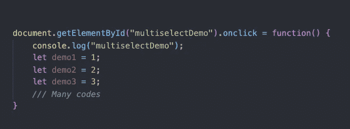

# 如何完整地复制和粘贴一个长函数

> 原文：<https://medium.com/geekculture/vs-code-how-to-copy-paste-a-long-function-in-its-entirety-82bca4d13078?source=collection_archive---------8----------------------->

如果您想将这样的函数复制或剪切到另一个位置，该如何做呢？

-用鼠标拖动
- Shift + ↓ / ↑选择然后复制粘贴？

如果这是一个短函数，那就足够了。

但是如果这个函数有 100 行内容呢？
如果是一次性工作，那就是…