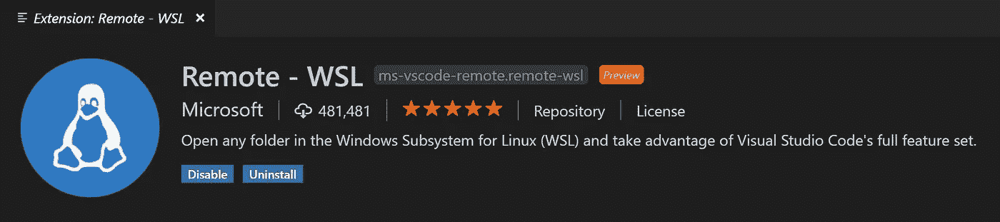

# WSL2-Ubuntu 中的 VSCode

> 原文：<https://medium.com/geekculture/vscode-in-wsl2-ubuntu-dabe5771b597?source=collection_archive---------3----------------------->

## 如何在 Windows 10 上设置 Ubuntu 20.04 LTS 运行 WSL2 中的 VSCode？

[https://code.visualstudio.com/assets/blogs/2019/09/03/remote-wsl-extension.png](https://code.visualstudio.com/assets/blogs/2019/09/03/remote-wsl-extension.png)

本文假设你已经在运行 WSL2 的 Windows 10 上安装并设置了 Ubuntu 20.04 LTS。

## 在 Windows 中安装 VSCode

这听起来可能很奇怪…但是不要在 Ubuntu 中安装 VSCode，而是在 Windows 中安装。