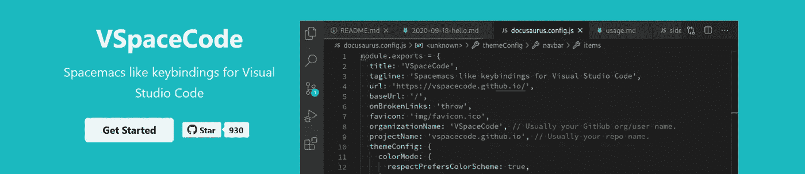

# 立体图上的 VSCode

> 原文：<https://medium.com/geekculture/vscode-on-stereoids-a4119e288d19?source=collection_archive---------7----------------------->

## 如何以类似 Spacemacs 的方式设置和使用 VSCode？

注意:当我认为我错过了一些没有明确通知编辑的东西时，我会马上重新写这篇文章。以后有空再来参观。

Screenshot of the [VSpaceCode website](https://vspacecode.github.io/).

# 介绍

**在 Linux 机器上，我通常使用**[**space Macs**](https://www.spacemacs.org/)**作为“仅键盘”编辑器。**这是一个社区驱动的 [Emacs](https://www.gnu.org/software/emacs/) 发行版，它使用…