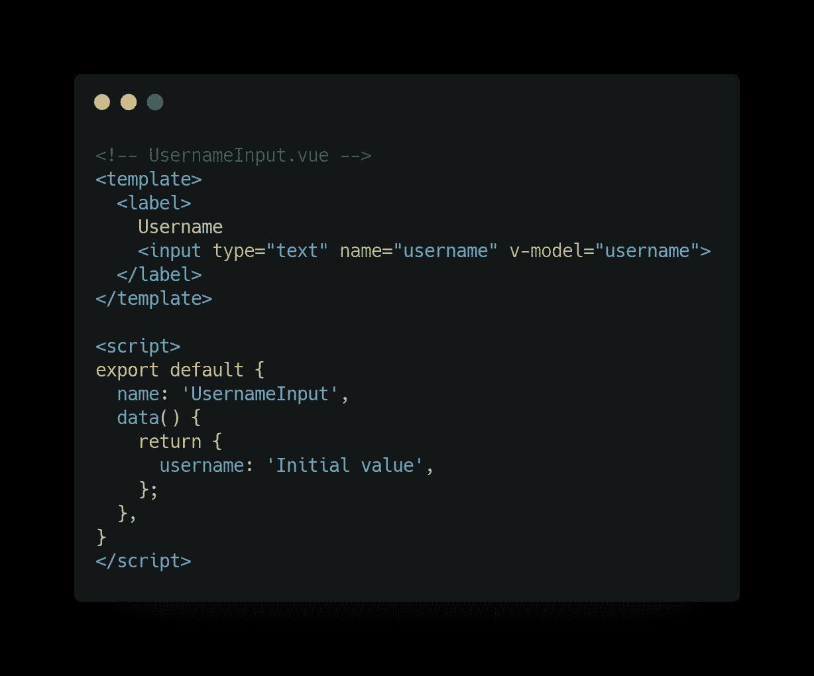
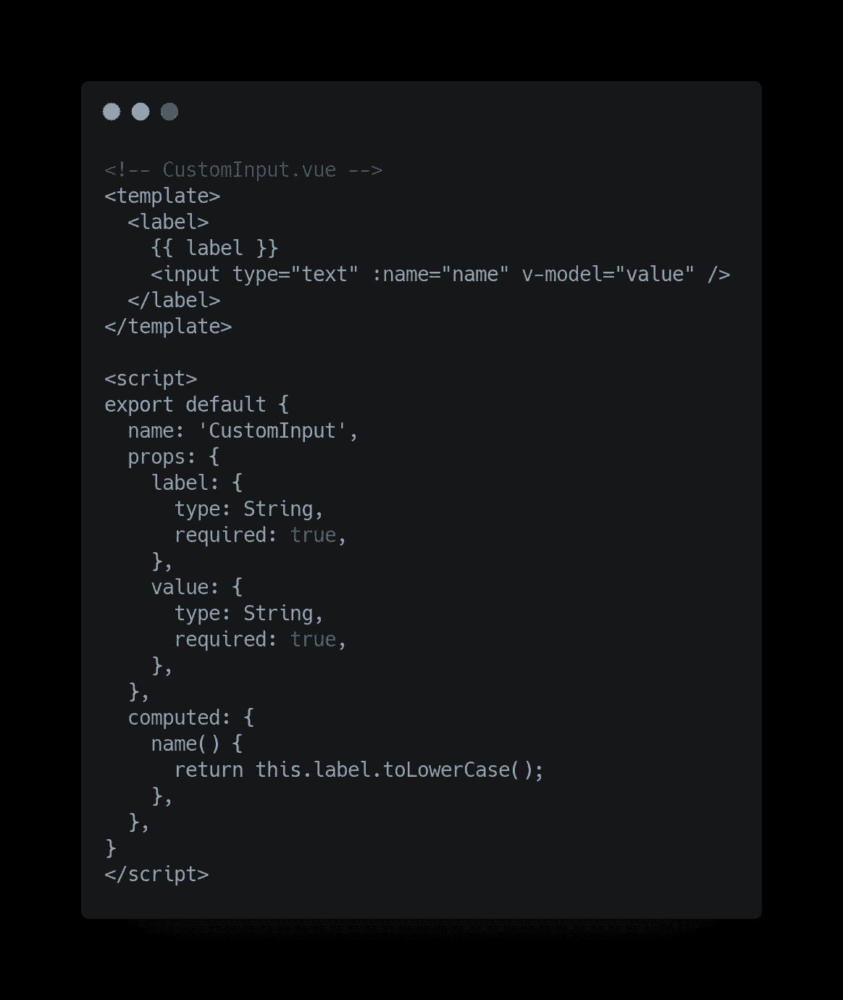
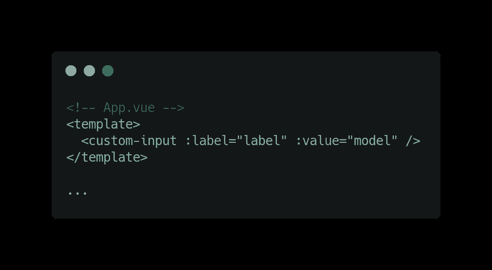
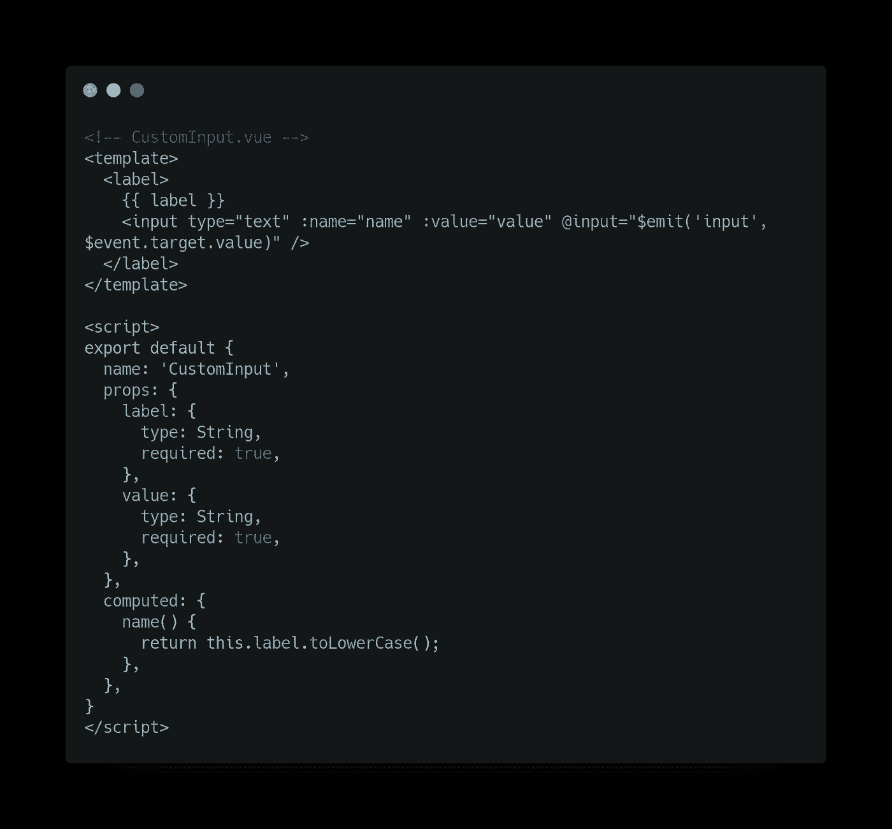
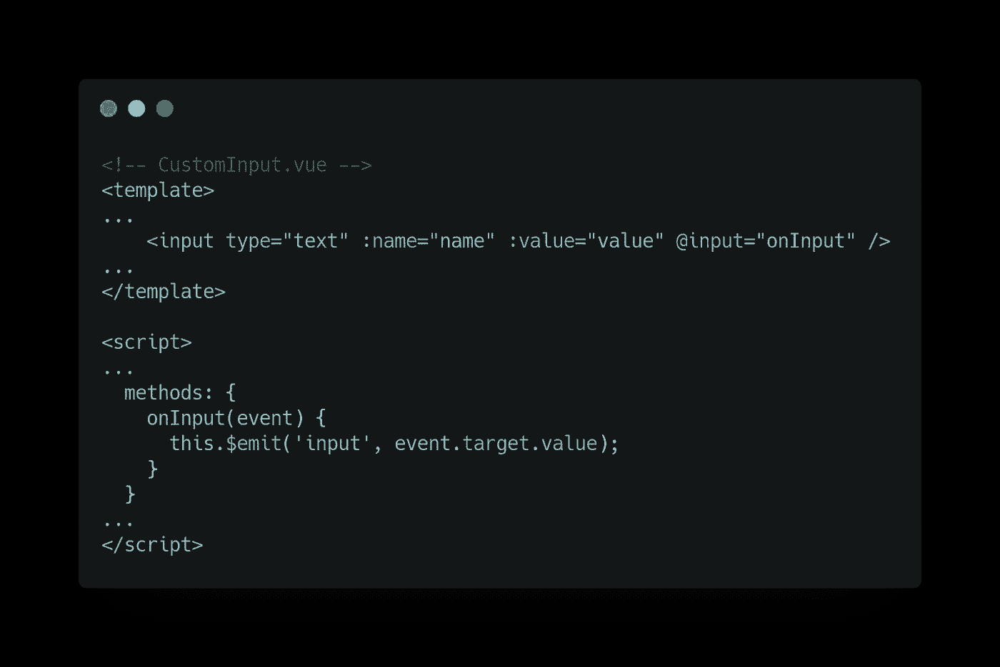
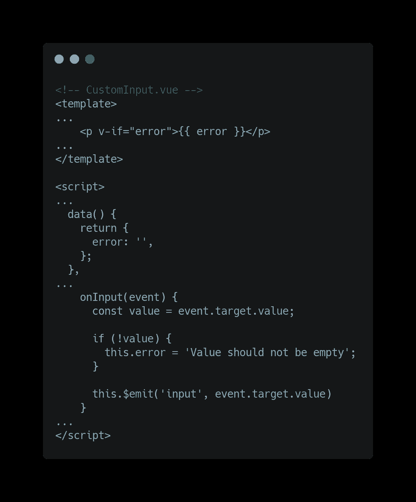
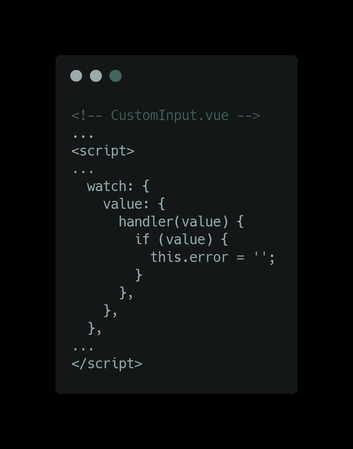
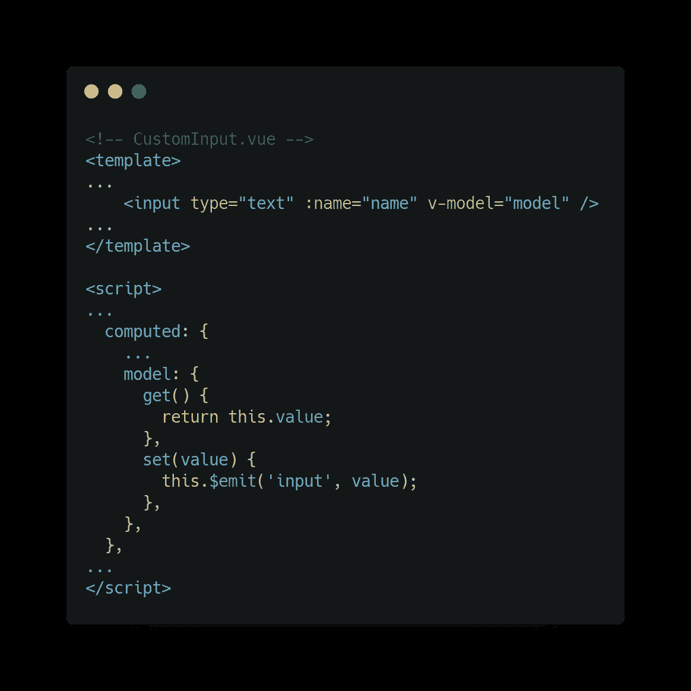
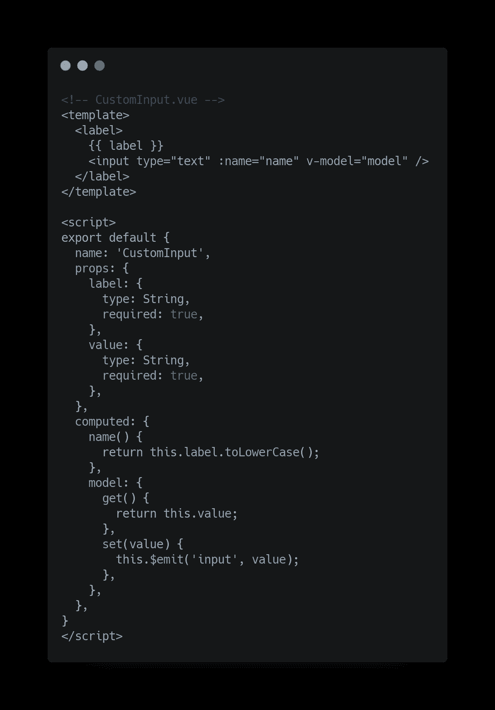
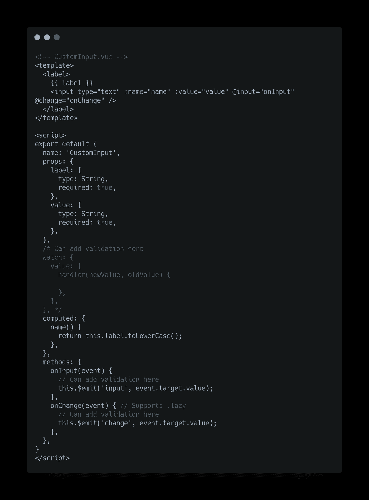

# Vue 自定义输入

> 原文：<https://medium.com/geekculture/vue-custom-input-501c48788a2f?source=collection_archive---------23----------------------->

我们大多数人都面临过这个问题:构建一个定制的输入组件。这背后有多种原因，但总的来说，它有自定义的风格，我们应该能够重用它。

虽然这听起来很简单，但它有一些问题，我们最终会不时地浏览文档来检查一些细节。如果你不太熟悉一些 Vue 概念，事情会变得有点复杂。

上个月，2021 年 2 月，又发生了。当可能的时候，我试着去帮助一个弱势群体中的人，这个问题再次出现。不完全是这个问题，但用户在构建自定义输入组件时遇到了问题。这个问题与一些概念有关。

为了巩固我自己的知识，并把它作为其他人的某种文档，我决定结束编写定制输入的过程。

# v 型车和`<input>`

一旦我们开始用 Vue 构建表单，我们就学习了指令`v-model`。它为我们做了很多艰苦的工作:它将一个值绑定到一个输入。这意味着每当我们改变输入的值时，变量也会被更新。

官方文件很好地解释了它是如何工作的:[https://vuejs.org/v2/guide/forms.html](https://vuejs.org/v2/guide/forms.html)

简而言之，我们可以有下面的模板，我们很好:



我们将有一个以`Initial value`为初始值的输入，一旦我们改变输入的值，用户名数据将自动更新。

上述组件的问题是我们不能重用它。假设我们有一个需要用户名和电子邮件的页面，上面的组件不会处理电子邮件的情况，因为数据在组件本身内部，而不是在其他地方(例如，像父组件)。这是定制输入组件的亮点，也是它的挑战之一:保持`v-model`行为的一致性。

# 错误的自定义输入组件

为什么我要展示这个例子？答案是:这是我们大多数人会尝试的第一种方法。

让我们看看如何使用我们的自定义输入组件:


在这种情况下，自定义输入需要一个`label`和一个`v-model`，看起来像下面的组件:



首先，它期望将`label`作为属性，并在此基础上计算`name`(它也可以是一个属性)。第二，它期待一个`value`属性，并通过`v-model`将其绑定到`<input>`。背后的原因可以在文档中找到[，但简而言之，当我们在自定义组件中使用`v-model`时，它将获得`value`作为属性，这是所使用的`v-model`变量的值。在我们的例子中，它将是在`App.vue`中定义的`model`的值。](https://vuejs.org/v2/guide/components.html#Using-v-model-on-Components)

如果我们尝试上面的代码，它会像预期的那样工作，但是为什么它是错误的呢？如果我们打开控制台，我们会看到类似这样的内容:

```
[Vue warn]: Avoid mutating a prop directly since the value will be overwritten whenever the parent component re-renders. Instead, use a data or computed property based on the prop's value. Prop being mutated: "value"
```

它抱怨说我们正在改变一个属性。Vue 的工作方式是:子组件拥有来自父组件的属性，子组件向父组件发出更改。将`v-model`与我们从父组件获得的`value`属性一起使用违反了它。

看待这个问题的另一种方式是这样重写`App.vue`:



主要区别是使用`:value`而不是`v-model`。在这种情况下，我们只是将`model`传递给`value`属性。该示例仍然有效，我们在控制台中得到相同的消息。

下一步是重做上面的例子，并确保它像预期的那样工作。

# 快乐的自定义输入组件

令人高兴的自定义输入组件不会改变其属性，而是将更改发送给父组件。

文档中有这个确切的例子，但我们在这里会更深入一点。如果我们遵循文档，我们的`CustomInput`应该如下所示:



这足以让它发挥作用。我们甚至可以用两种方式来测试它:一种是使用`App.vue`的，一切正常；另一种是只使用`:value`的，当我们停止改变属性时，它不再正常工作。

## 添加验证(或数据更改操作)

如果我们需要在数据改变时做一些事情，例如检查它是否为空并显示错误消息，我们需要提取 emit。我们将对组件进行以下更改:



现在我们添加空白支票:



它有点工作，首先它不显示任何错误，如果我们键入然后删除它会显示错误信息。问题是错误信息永远不会消失。要解决这个问题，我们需要向 value 属性添加一个观察器，并在更新时清除错误消息。



我们可以在`onInput`中添加一个`else`来获得类似的结果。如果需要，使用观察器使我们能够在用户更新输入值之前进行验证。

如果我们添加更多的东西，我们很可能会进一步扩展这个组件，并且东西会遍布整个`<script>`区块。为了对事物进行分组，我们可以尝试不同的方法:将 computed 与`v-model`一起使用。

## 结合计算和`v-model`

我们可以利用`v-model`和`computed`的能力，而不是监听`input`事件，然后再次发出它。这是我们最接近错误的方法，但仍然是正确的😅
让我们像这样重写我们的组件:



我们可以去掉`onInput`方法，也可以去掉观察器，因为我们可以从 computed 属性处理`get/set`函数中的一切。

我们可以实现的一件很酷的事情是使用修饰符，比如之前需要手动编写的`.trim/number`。

对于简单的输入组件来说，这是一个很好的方法。事情可能会变得有点复杂，这种方法并不能满足所有的用例，如果我们需要绑定值和监听事件的话。一个很好的例子是，如果您想在父组件中支持`.lazy`修饰符，您将需要手动监听`input`和`change`。

# extra:`model`属性

`[model](https://vuejs.org/v2/api/#model)` [属性](https://vuejs.org/v2/api/#model)允许你定制一点`v-model`的行为。您可以指定将映射哪个属性，默认为`value`，以及将发出哪个事件，当使用`.lazy`时，默认为`input`或`change`。

如果您想将`value`属性用于其他用途，这尤其有用，因为它可能对特定的上下文更有意义，或者只是想让事情更明确，例如将`value`重命名为`model`。在大多数情况下，当获取对象作为输入时，我们可能会使用它来定制复选框/单选按钮。

# 那又怎样？

我的观点来自于您的定制输入需要有多复杂:

*   它是为了将样式集中在一个组件中而创建的，它的 API 几乎是在 Vue 的 API 之上:`computed` + `v-model`。它很像我们的例子，它有简单的道具，没有复杂的验证。



*   其他一切(这意味着您需要对之前的设置进行大量调整以支持您需要的东西):监听器、观察器以及您可能需要的其他东西。它可能有多个状态(想想异步验证，加载状态可能是有用的)或者你想从父组件支持`.lazy`修饰符，是避免第一种方法的好例子。



*感谢* [*达尼洛·沃兹尼亚克*](https://medium.com/u/9242a15941fc?source=post_page-----501c48788a2f--------------------------------) *的点评*