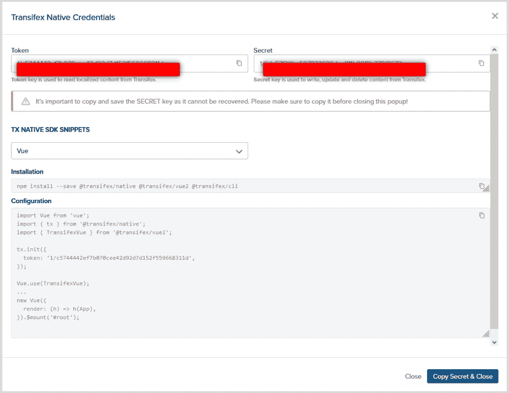
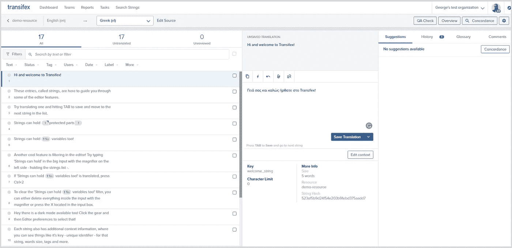

# Vue 国际化:Transifex Native 入门

> 原文：<https://medium.com/geekculture/vue-internationalization-getting-started-with-transifex-native-4d7a14914cc5?source=collection_archive---------16----------------------->


Vue [国际化(i18n)](https://www.transifex.com/blog/2021/what-is-internationalization-i18n-in-software/) 就是让你的 Vue 应用准备好支持多种语言，进入下一步:Vue 本地化。在本文中，我们将探讨如何通过使用 Transifex Native 轻松实现这一点！

更具体地说，我们指的是 Transifex Vue SDK，它与 TX 编辑器结合使用，可以帮助您在专注于编程的同时与翻译人员合作翻译您的网站，即使他们在技术上并不精通。

# 为什么选择 Transifex Native？

*   一旦安装了 [SDK](https://developers.transifex.com/docs/native#usage-scenarios) ，您将能够毫不费力地从您的开发或生产环境中推送或拉出内容。
*   您将获得适用于所有项目的通用本地化语法。
*   Transifex Native 利用无线(OTA)内容交付，无需文件或在工程和本地化团队之间来回传递。

对于这篇文章，我将使用用 Vue.js 开发的个人资料页面。我鼓励你克隆[这个库](https://github.com/olawanlejoel/vue-transifex-localization-starter)，这样你就可以跟着做了。我不会详细介绍我是如何设计这个简单的个人资料页面的，因为这是一篇本地化文章，但是，简单地说，它是一些 HTML 和 CSS。

# Vue 国际化和本地化:入门

第一步是在这里注册一个 [Transifex 账户](https://www.transifex.com/signup/)。您可以使用 GitHub、Google 或 LinkedIn 帐户快速注册。Transifex 为开源项目提供了 15 天的免费试用和永久免费计划！

建立帐户后，下一步是创建项目。您必须提供一个**项目名称**，并选择“**本地**”作为项目类型。最后，您必须指定应用程序的主要语言以及要翻译成的语言。对于本指南，我将选择英语作为主要语言，法语和德语作为目标语言。

完成后，点击****创建项目*** 按钮*。*之后，您将进入下一页，在那里您将找到如何为您的项目生成凭证的说明。点击页面下方的 ***生成本地凭证现*** 。*

*这将在一个弹出窗口中显示 API 令牌和密钥。把两把钥匙都复制一份，因为你以后会需要它们。这还将显示设置我们的 vue.js 应用程序所需的某些配置。*

**

*完成后，您现在可以将 Vue.js 应用程序内容推送到 Transifex，然后将其国际化。*

# *设置应用程序内容并将其推送到 Transifex*

*本地化 vue.js 应用程序的第一步是使用以下命令安装库及其依赖项:*

```
*npm install @transifex/native @transifex/vue2 @transifex/cli --save*
```

*@transifex/native 是库，@transifex/vue2 是用 Transifex Native 本地化 Vue apps 的 vue2 组件；而@transifex/cli 是一个命令行工具。js，。ts，。jsx，。tsx 和。html 源文件，提取被 [Transifex Native](https://www.transifex.com/native/) 标记为本地化的短语，推送到 [Transifex](https://github.com/transifex/transifex-javascript/blob/HEAD/https:/www.transifex.com) 进行翻译。*

*一旦完成，下一步是在应用程序中配置/启动插件。为此，只需复制下面的代码并将其粘贴到 main.js 文件中，或者修改 main.js 以包含以下内容:*

```
*import Vue from 'vue';import App from './App.vue';import { tx } from '@transifex/native';import { TransifexVue } from '@transifex/vue2';tx.init({ token: '<token>',});Vue.use(TransifexVue);new Vue({ render: (h) => h(App),}).$mount('#app');*
```

****注意:*** *确保用您之前复制的令牌替换<令牌>，否则我们可以决定使用环境变量。**

# *添加可翻译的内容*

*现在你可以翻译任何字符串了。为此，vue.js 的 Transifex Native SDK 包含一个组件 T，可用于指示文本是可翻译的。*

*您所要做的就是将内容替换成这样:*

```
*<span><T _str="Web developer" /></span>*
```

*//而对于段落*

```
*<p> <T _str="Joel Olawanle is a Frontend developer with expertise in vue.js and React.js alongside Jamstack frameworks like Nuxt,Next.js and Gridsome. He is highly skilled at converting images/UI designs into frontend codes (UI developer). He is also a Technical writer interested in making the web accessible to everyone by always looking for ways to give back to the tech community. Furthermore, he is currently taking a deep dive into React and Headless CMS of which he is doing a lot of writing on as he learns new things. He is a big fan of open source." /></p>*
```

*t 也可以接受以下道具:*

*PropTypeDescription**_ str**string source string**_ context**string context，影响键生成**_ key**string 自定义字符串键**_ comment**string developer comment**_ charl limit**number character limit instruction for translators**_ tags**string comma 分隔的标记列表*

# *推送翻译内容*

*Transifex 允许我们在终端中使用一个非常简单的命令轻松推送内容:*

```
*npx txjs-cli push src --token=<TOKEN> --secret=<SECRET>*
```

*我们可以决定简化该命令，这样我们就不必通过在 package.json 脚本对象中添加以下命令来反复输入:*

```
*"scripts": { ..., "push-translation": "txjs-cli push src --token=<TOKEN> --secret=<SECRET>"}*
```

****注意:*** *确保用您的 API 令牌密钥替换<令牌>，用您的 API 密钥替换<秘密>。**

*保存后，您现在可以运行以下命令:*

```
*npm run push-translation*
```

*如果这是成功的，你所有的内容将被推送到 Transifex 供你处理翻译。*

# *处理翻译*

*一旦你把你的内容推送到 Transifex，下一件事就是处理翻译。转到您的项目仪表板，点击右上角的翻译按钮。*

*这将把您重定向到一个新的页面，在这里您可以选择翻译字符串的语言，以便能够使用编辑器为每个字符串添加翻译。*

****注:*** *Transifex 是一个* [*翻译管理系统*](https://www.transifex.com/blog/2021/what-is-a-translation-management-system/) *，而不是一个* [*机器翻译*](https://www.transifex.com/blog/2021/what-is-machine-translation/) *工具或者一个* [*翻译厂商*](https://www.transifex.com/translation-vendors/) *。**

*Transifex 通过接口提供机器翻译，以及与我们的合作伙伴一起进行人工翻译(如这里所描述的)。您可以使用机器翻译、订购翻译、邀请合作者和/或自己翻译。*

*按照这个指南，你将自己处理翻译，这很容易通过编辑器来完成。*

**

# *改变语言*

*最后一个主要步骤是在应用程序上轻松切换语言，并实时见证翻译过程。*

*请务必在一小时内将任何新的翻译发布到您的 Vue.js 应用程序中。*

*Transifex Native Vue.js SDK 有一个内置的[组件(useLanguages ),允许您检索项目中可用的语言。这将呈现一个<选择>标签，该标签显示支持的语言并在更改时切换应用程序选择的语言。](https://developers.transifex.com/docs/vue-sdk#languagepicker-component)*

*第一件事是将组件导入到您希望使用该组件的文件中，然后调用该组件。就这么简单。*

```
*<template> <div class="main"> <div class="profile-header"> <div class="profile-img">  </div> <h2>Joel Olawanle</h2> <span><T _str="Web developer" /></span> </div> <div class="profile-info"> <p> <T _str="Joel Olawanle is a Frontend developer with expertise in vue.js and React.js alongside Jamstack frameworks like Nuxt, Next.js and Gridsome. He is highly skilled at converting images/UI designs into frontend codes (UI developer). He is also a Technical writer interested in making the web accessible to everyone by always looking for ways to give back to the tech community. Furthermore, he is currently taking a deep dive into React and Headless CMS of which he is doing a lot of writing on as he learns new things. He is a big fan of open source." /> </p> </div> <LanguagePicker class="lang"/> </div></template> <script>//import language picker componentimport { LanguagePicker } from '@transifex/vue2'; export default { name: 'App', components: { LanguagePicker, }, };</script>*
```

*这会导致这样的结果:*

**

# *结论*

*Transifex 的运行方式与 CDN 类似，它从缓存中提供所有翻译，允许快速检索。它的 SDK 易于安装和设置，所有命令，包括 push 命令，都易于使用。您还会发现 Transifex Native SDK 是一个比您已经知道的更简单的本地化库，因为您不需要为您的翻译文本添加任何额外的 json 文件。*

*最后，使用 Transifex Native 的最大优势是翻译不包含在您的代码库中，正如我们刚刚看到的 vue.js。我真的希望这篇文章有所帮助，如果您需要更多信息，您可以查看 [Transifex 文档](https://developers.transifex.com/docs/vue-sdk)。*

*本帖原载于页面[。](https://www.transifex.com/blog/2022/vue-internationalization-getting-started-with-transifex-native/)*