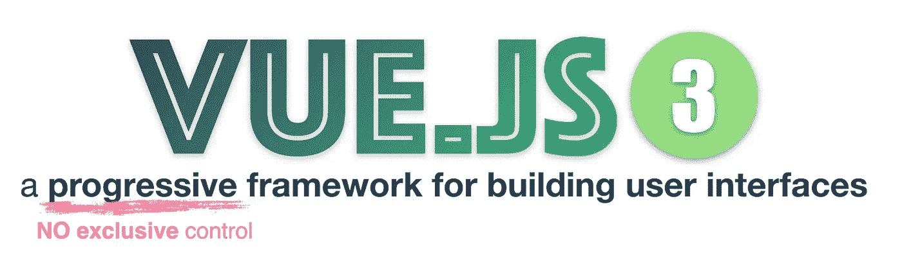

# Vue.js 3 完整指南[2010 年 1 月]

> 原文：<https://medium.com/geekculture/vue-js-3-complete-guide-1-10-intr-81e02c0c3aae?source=collection_archive---------10----------------------->

查看完整的视频课程:

[https://www.udemy.com/course/complete-vuejs-3-course/?referral code = 75f 591 e 320 BC 4 ea 22188](https://www.udemy.com/course/complete-vuejs-3-course/?referralCode=75F591E320BC4EA22188)

Vue 是一个渐进的框架。进步意味着 Vue 不会寻求对整个项目的独家控制。您可以轻松地将 Vue 与其他库或现有项目集成。