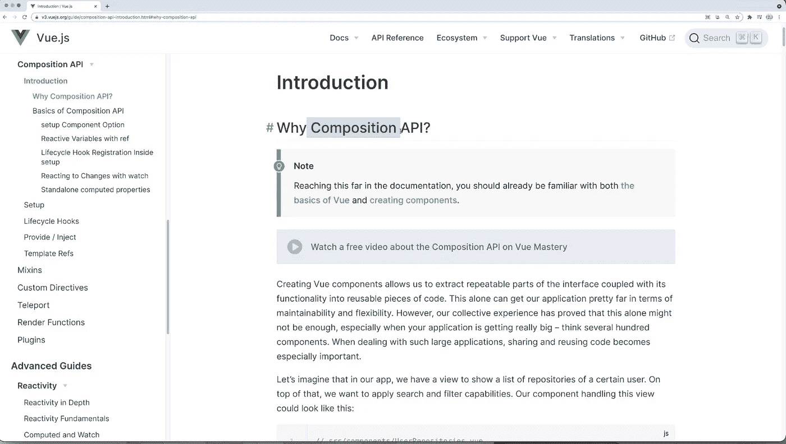

# Vue.js 3 组合 API:设置函数

> 原文：<https://medium.com/geekculture/vue-js-3-setup-function-236063add3cd?source=collection_archive---------2----------------------->

查看完整的视频课程:

[https://www.udemy.com/course/complete-vuejs-3-course/?referral code = 75f 591 e 320 BC 4 ea 22188](https://www.udemy.com/course/complete-vuejs-3-course/?referralCode=75F591E320BC4EA22188)

Vue 3 引入了设置功能。它使我们能够将组件的可重复部分提取到可重用的代码片段中。这些可重用代码以函数的形式存储。这个函数可以被任何组件使用。它的功能范围帮助我们存储和保护数据。

