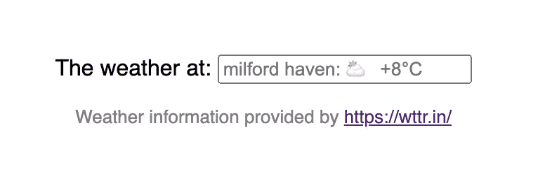

# Vue 天气输入和占位符

> 原文：<https://medium.com/geekculture/vue3-weather-input-ad0260c6b9d7?source=collection_archive---------23----------------------->

天气是最重要的；我是英国人。我住在威尔士西部，我喜欢说我们每天都有各种天气。所以我认为在我的 Vue 站点的菜单栏中显示天气是一个好主意
。

我的灵感来自一个朋友发给我的一封邮件，他担心威尔士那天的天气不好: