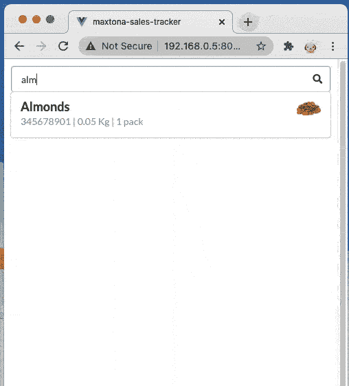

# 使用计算属性的 Vuejs 3 搜索栏[组合 API]

> 原文：<https://medium.com/geekculture/vuejs-3-search-bar-using-computed-properties-composition-api-ee19a796ee5c?source=collection_archive---------8----------------------->

每当我们有一个项目列表，比如产品，很明显在客户端有一个搜索项目的功能，以获得更好的用户体验。

在 **Vue 3 组合 API** 中，我们可以使用计算的属性轻松创建一个搜索栏。

事实上，这是利用计算属性的最佳案例之一。

