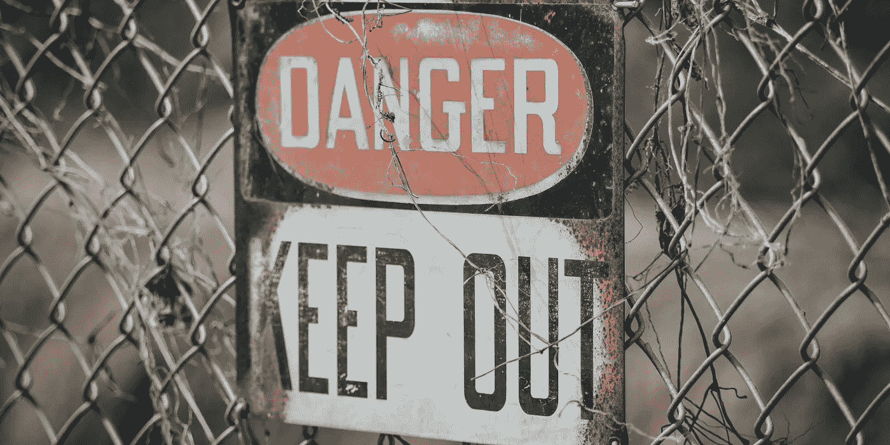

# JWT 认证中的漏洞

> 原文：<https://medium.com/geekculture/vulnerabilities-in-authentication-with-jwt-3f0b7a99f7d2?source=collection_archive---------8----------------------->

## 以及如何正确实施

在过去几个月与 JWT 更深入地合作后，我意识到大多数学习材料的质量都很差。

今天，我想弄清楚 JWT 应该如何在您的身份验证流程中使用，它的安全漏洞是什么，以及如何避免它们。

Photo by [Edwin Hooper](https://unsplash.com/fr/@edwinhooper) on [Unsplash](https://unsplash.com/fr/s/photos/danger)