# 漫游:Android 中的谷歌地图平台 101—Ktx 更新

> 原文：<https://medium.com/geekculture/walk-through-google-map-platform-101-in-android-7c72a4dd40e3?source=collection_archive---------5----------------------->

我将使用 Codelab 中的练习。然而，它的说明是**而不是**用户友好的，你可能在开始时得到一个空白屏幕。

👹:什么 D！他#$！

日志目录:

```
E/Google Maps Android API: **Authorization failure.**  Please see https://developers.google.com/maps/documentation/android-api/start for how to correctly set up the map.
E/Google Maps Android API: In the Google Developer Console (https://console.developers.google.com)
    **Ensure that the "Google Maps Android API v2" is enabled.**
    **Ensure that the following Android Key exists:**
     API Key: {GOOGLE_MAPS_API_KEY}
     Android Application (<cert_fingerprint>;<package_name>): YOUR_SHA1;com.homan.huang.mapdemo
```

放心吧！我会帮你解决这个问题。我们开始吧。

# — ===菜单=== —

**👊1.** [**生成 API 密钥**](#5245) **💰2.** [**启用计费**](#3ad7) **🔗3.** [**链接 API 键到地图项目**](#854e) **✒️4.** [**启动项目**](#8ff6)✔**…………..**💯 [*谷歌云支持*](#869d) **🖍 5。** [**插入标记**](#12cd) **🎱 6.** [**自定义标记**](#6083) **🎳 7.** [**标记簇→重叠标记组**](#1047) **🎨 8.** [**在地图上绘制**](#e2cb) **📷 9.** [**摄像机控制**](#fc97) **🚀 10.** [**KTX 升级**](#8250)🤐 **11。** [**秘密升级**](#ecdd)

# 👊1.生成 API 键…… → [菜单](#f2db)

> 谷歌云平台:[https://console.cloud.google.com/](https://console.cloud.google.com/)

我创建一个项目:`**Map Demo**`

添加 API:`**Maps Static API**`**`**Maps SDK for Android**``**Places**`**

**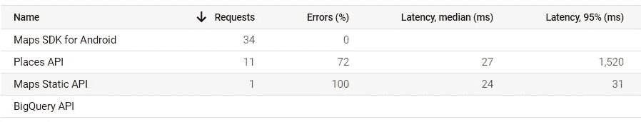**

**根据我的测试，这些 API 在我第一次运行时得到响应。**

> **资格证书**

**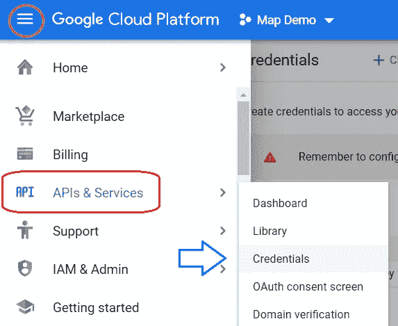**

> **创建凭据**

**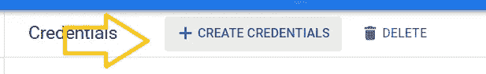**

> **API 密钥**

**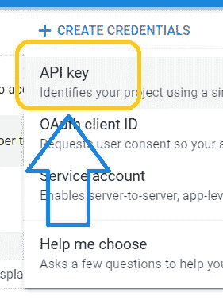****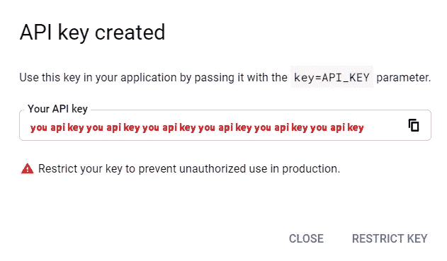****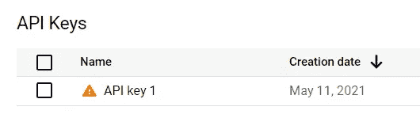**

> **限制到地点 API**

**编辑→**

**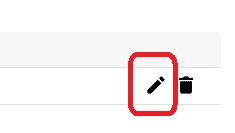**

**集合名称→**

**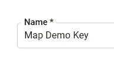**

**设置限制→**

**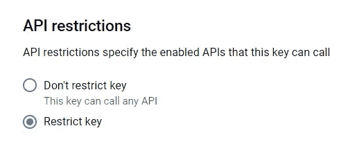**

**选择→您启用的所有地图 API**

**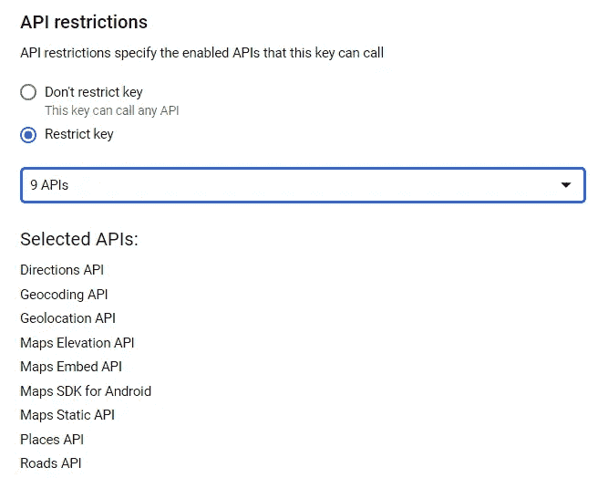**

**保存→**

**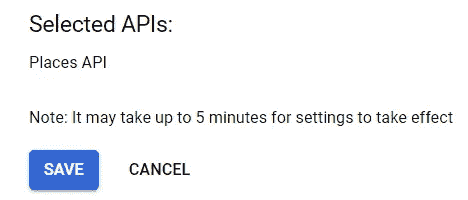**

> **在线测试 API 密钥**

**请将您的密钥添加到此链接**

```
https://maps.googleapis.com/maps/api/place/nearbysearch/json?location=-33.8670522,151.1957362&radius=500&types=food&name=harbour&key=**YOUR_API_KEY**
```

**第一次，我有了这样的信息:**

```
{
    error_message: "You must **enable Billing** on the Google Cloud Project at https://console.cloud.google.com/project/_/billing/enable Learn more at https://developers.google.com/maps/gmp-get-started",
    html_attributions: [ ],
    results: [ ],
    status: "REQUEST_DENIED"
}
```

# **💰2.E **启用计费** …… → [菜单](#f2db)**

> **项目-地图演示:计费**

**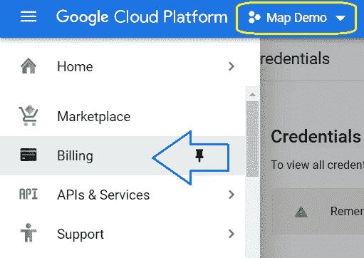**

**如果您已经有一个计费账户，您可以跳过下一步，跳到“ [**链接一个计费账户**](#8f91)**”**。**

> **管理账单账户→**

**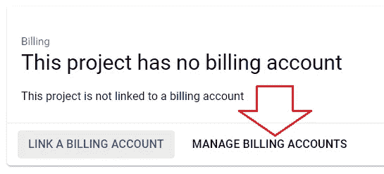**

**创建帐户→**

**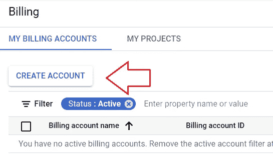**

**创建新的付费账户→**

**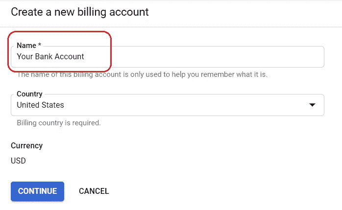**

**接下来，您可以添加您的付款类型。之后，让我们回到计费。**

> **链接计费账户→**

**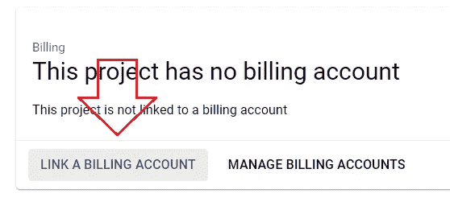****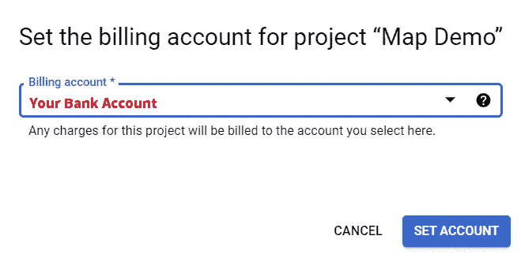**

**你的账单准备好了。让我们再次运行测试链接。你会的，**

**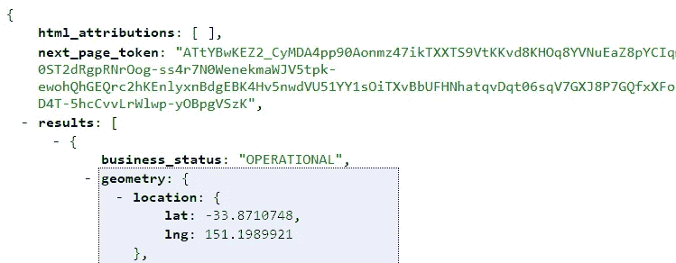**

**不再有错误！**

**✌️，你已经准备好创建你的 Android 项目了。**

# **🔗3.将 API 键链接到地图项目…… → [菜单](#f2db)**

**在我限制 API 密钥之前，我需要一个**包名**和 **SHA-1 指纹**。让我们为谷歌地图打开一个新项目。**

**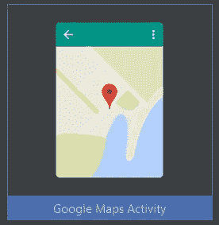**

> **查看***Google _ maps _ API . XML*****

**在调试文件夹下，你会找到一个文件，***Google _ maps _ API . XML .*****

**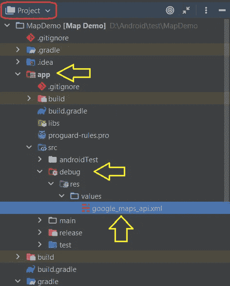****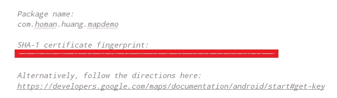**

**你的包裹名称和 SHA-1 已经准备好了。**

> **将密钥限制在您的包中**

**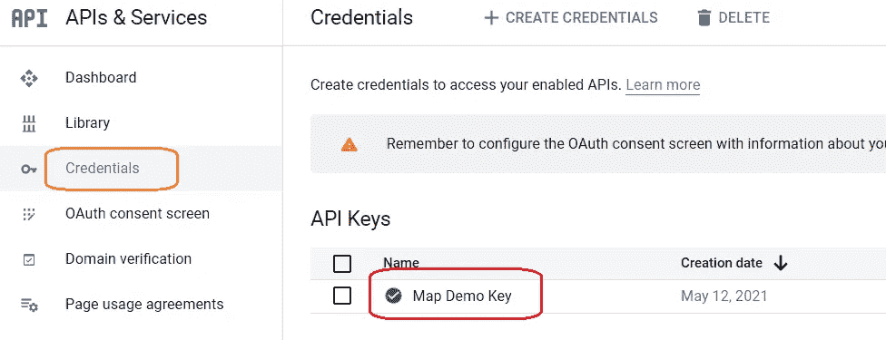******

**应用限制:**

**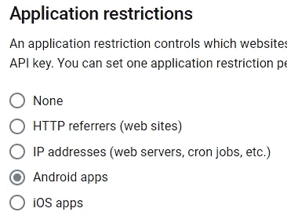**

**我会选择安卓应用。**

**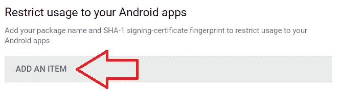**

**粘贴安卓包名和 SHA-1 →**

**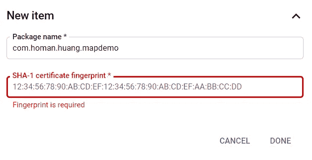**

> **格拉德。组件**

**启用视图绑定。**

```
android **{
...
**    buildFeatures **{** viewBinding **true
    }
}**
```

**并将这些行插入到**依赖关系{}** ，**

```
implementation **'com.google.android.gms:play-services-maps:17.0.1'** implementation **'com.google.android.gms:play-services-location:18.0.0'** implementation **'com.google.code.gson:gson:2.8.6'**
```

**同步。**

> **将您的密钥隐藏在 **local.properties** 中**

**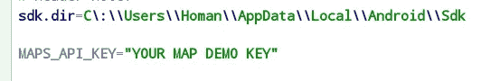**

> **格拉德。模块-读取 local.properties**

```
*// get property from local.properties* **def** getProps(String propName) {
    **def** propsFile = rootProject.file(**'local.properties'**)
    **if** (propsFile.exists()) {
        **def** props = **new** Properties()
        props.load(**new** FileInputStream(propsFile))
        **return** props[propName]
    } **else** {
        **return ""**;
    }
}android **{
    ...** defaultConfig **{
        ...** *//AndroidManifest -- [ Variable: Value ]* manifestPlaceholders = [ **mapKey**: getProps(**'MAPS_API_KEY'**) ]
```

> ****AndroidManifest.xml****

```
<**uses-permission android:name="android.permission.ACCESS_FINE_LOCATION"** />
<**uses-permission android:name="android.permission.ACCESS_COARSE_LOCATION"** />
<**uses-permission android:name="android.permission.INTERNET"** />
<**uses-permission android:name="android.permission.ACCESS_NETWORK_STATE"** />
<**uses-permission android:name="android.permission.WRITE_EXTERNAL_STORAGE"** />

<application
    android:allowBackup="true"
    android:icon="@mipmap/ic_launcher"
    android:label="@string/app_name"
    android:roundIcon="@mipmap/ic_launcher_round"
    android:supportsRtl="true"
    android:theme="@style/Theme.MapDemo">
<**meta-data
            android:name="com.google.android.geo.API_KEY"
            android:value="${mapKey}"
            />**<activity
            android:name="**.ui.MapsActivity**"
            android:label="@string/title_activity_maps">
            <intent-filter>
                <action android:name="android.intent.action.MAIN" />

                <category android:name="android.intent.category.LAUNCHER" />
            </intent-filter>
        </activity>
    </application>

</manifest>
```

# **✒️4.启动项目…… → [菜单](#f2db)**

> **res/layout/activity_maps.xml**

```
*<?***xml version="1.0" encoding="utf-8"***?>* <**FrameLayout 
    xmlns:android="http://schemas.android.com/apk/res/android"
    xmlns:tools="http://schemas.android.com/tools"
    android:layout_width="match_parent"
    android:layout_height="match_parent"
    tools:context="ui.MapsActivity"**>

    <**fragment
        class="com.google.android.gms.maps.SupportMapFragment"
        android:id="@+id/map_fragment"
        android:layout_width="match_parent"
        android:layout_height="match_parent"** />

</**FrameLayout**>
```

**如果你的`***SupportMapFragment***`下面有红线，请降低 gradle 中`**play-services-maps**`的版本。**

## **🚁—我不喜欢这个实验室的文件夹结构。所以我把它改成了 MVVM 风格。**

> **ui/ **MapsActivity.kt****

```
*// check manifests for permissions* **private val** *REQUIRED_PERMISSIONS* = *arrayOf*(
    Manifest.permission.*INTERNET*,
    Manifest.permission.*ACCESS_FINE_LOCATION*,
    Manifest.permission.*ACCESS_COARSE_LOCATION*,
    Manifest.permission.*ACCESS_NETWORK_STATE*,
    Manifest.permission.*WRITE_EXTERNAL_STORAGE* )

**class** MapsActivity : AppCompatActivity(), OnMapReadyCallback {

    **private lateinit var mMap**: GoogleMap
    **private lateinit var binding**: ActivityMapsBinding

    **private val places**: List<Place> **by** *lazy* **{** PlacesReader(**this**).read()
    **}** *// app permission* **private val reqMultiplePermissions** = registerForActivityResult(
        ActivityResultContracts.RequestMultiplePermissions()
    ) **{** permissions **->** permissions.**entries**.*forEach* **{** *lgd*(**"mainAct: Permission: ${it**.**key} = ${it**.**value}"**)
            **if** (!**it**.**value**) {
                *// toast
                msg*(**this**, **"Permission: ${it**.**key} denied!"**, 1)
                finish()
            }
        **}
    }**
```

**使用 Google Maps 在旧金山找到一个演示地点。**

**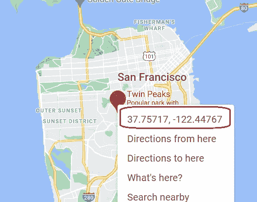**

**接下来，您可以用您的位置替换悉尼。**

```
**override fun** onMapReady(googleMap: GoogleMap) {
    **mMap** = googleMap

    *// Add a marker in Sydney and move the camera* **val** sf = LatLng(37.75, -122.45)
    **mMap**.addMarker(MarkerOptions()
        .position(sf)
        .title(**"Marker in San Francisco"**))
    **mMap**.moveCamera(CameraUpdateFactory.newLatLng(sf))
    **mMap**.animateCamera(CameraUpdateFactory.zoomIn())
    **mMap**.animateCamera(CameraUpdateFactory.zoomTo(13f), 2000, **null**)

}
```

**onCreate():**

```
**override fun** onCreate(savedInstanceState: Bundle?) {
    **super**.onCreate(savedInstanceState)

    **binding** = ActivityMapsBinding.inflate(*layoutInflater*)
    setContentView(**binding**.*root*)

    *// check app permissions* **reqMultiplePermissions**.launch(*REQUIRED_PERMISSIONS*)

    *// Obtain the SupportMapFragment and get notified when the map is ready to be used.* **val** mapFragment = *supportFragmentManager* .findFragmentById(R.id.*map_fragment*) **as** SupportMapFragment
    mapFragment.getMapAsync(**this**)
    mapFragment.getMapAsync **{** googleMap **->** addMarkers(googleMap)
    **}** }
```

**🐟快跑！**

**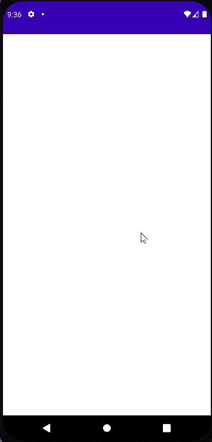**

**没有好的空白屏幕！**

**我在 Logcat 中搜索错误:**

**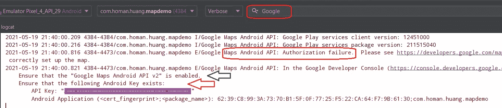**

> **💯谷歌云支持…… → [菜单](#f2db)**

**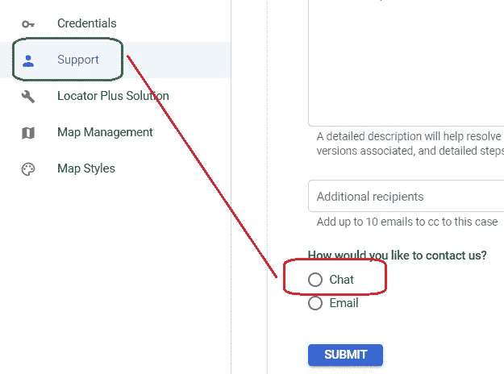**

**我不确定这是服务器的问题还是我的设置的问题。所以我和谷歌云支持聊了聊。我建议你选择聊天也是因为一个真实的人会实时帮助你。**

**❌是第一个让我添加谷歌地图 Javascript API 的人。这家伙一定是个新手，他给了我一些糟糕的建议。所以我尝试添加尽可能多的 API 来解决这个问题。不，一点用都没有。**

**✔️I 又和谷歌支持聊了聊。这个人研究了我的案子 10 分钟。他告诉我 API key 有读取问题，让我直接替换***androidmanifest . XML***中的 key。成功了。但是，将普通密钥放在清单中并不是一个好主意。**

> **搜索问题**

**我感谢谷歌云支持的帮助。之后，我仍然需要找到一个解决方案来保护密钥。最后，我发现这是一个**双引号**问题。API 键是**而不是字符串类型**。是一条短信。**

**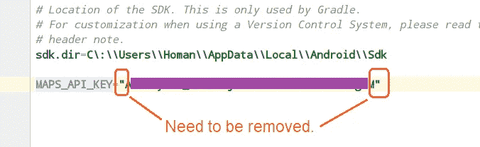**

**local.properties**

**在我删除了***local . properties***中的双引号之后，我得到了这个:**

**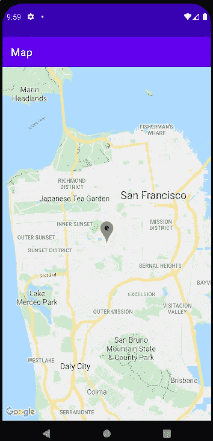**

## **🎊放松，问题解决了。**

# **🖍 5.插入标记… → [菜单](#f2db)**

**标记数据位置: [places.json](https://github.com/googlecodelabs/maps-platform-101-android/blob/main/starter/app/src/main/res/raw/places.json)**

**您需要将该文件下载到 **res/raw** 文件夹中。**

**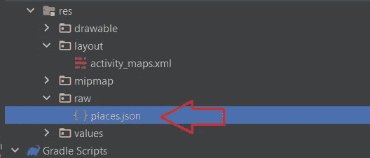**

**Codelab 提供了位置包:**

> **place/ **Place.kt****

```
**data class** Place(
    **val name**: String,
    **val latLng**: LatLng,
    **val address**: String,
    **val rating**: Float
)
```

> **place/ **PlaceReader.kt****

```
class **PlacesReader**(private val context: Context) {

    private val gson = Gson()

    private val inputStream: InputStream
        get() = context.*resources*.openRawResource(R.raw.*places*)

    **fun read()**: List<Place> {
        val itemType = object : TypeToken<List<PlaceResponse>>() {}.*type* val reader = InputStreamReader(inputStream)
        return **gson.fromJson<List<PlaceResponse>>(reader, itemType).*map* {
            it.*toPlace*()
        }**
    }
}
```

> **place/**place response . kt****

```
**data class PlaceResponse(**
    val geometry: Geometry,
    val name: String,
    val vicinity: String,
    val rating: Float
) {

    **data class Geometry(**
        val location: GeometryLocation
    )

    **data class GeometryLocation**(
        val lat: Double,
        val lng: Double
    )
}

fun **PlaceResponse.toPlace()**: Place = Place(
    name = name,
    latLng = LatLng(geometry.location.lat, geometry.location.lng),
    address = vicinity,
    rating = rating
)
```

> ****ui/MapsActivity.kt****

**添加一个新变量—位置**

```
**private val places**: List<Place> **by** *lazy* **{** PlacesReader(**this**).read()
**}**override fun onCreate(savedInstanceState: Bundle?) {
    super.onCreate(savedInstanceState)

    binding = ActivityMapsBinding.inflate(*layoutInflater*)
    setContentView(binding.*root*)

    *// Obtain the SupportMapFragment and get notified when the map is ready to be used.* val mapFragment = *supportFragmentManager* .findFragmentById(R.id.*map*) as SupportMapFragment

    *// add marker from places.json* mapFragment.getMapAsync { googleMap ->
        **addMarkers(googleMap)**
    }
}/**
 * Adds marker representations of the places list on the provided GoogleMap object
 */
private fun **addMarkers**(googleMap: GoogleMap) {
    places.forEach { place ->
        val marker = googleMap.addMarker(
            **MarkerOptions()**
                .title(place.name)
                .position(place.latLng)
        )
    }
}
```

> **🚵运行并检查标记**

**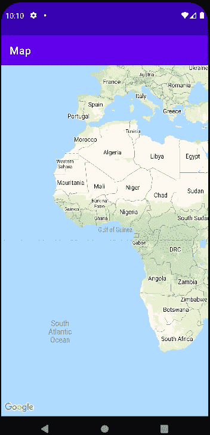**

**非洲？它不起作用。这个 Codelab 给了我们一个可怕的代码例子。**

> **处理**

**我需要设置目的地，放大并添加标记。它错过了两个步骤:设置目的地和放大。在 **onCreate()** 中的修复将是，**

```
**val** mapFragment = *supportFragmentManager* .findFragmentById(R.id.*map_fragment*) **as** SupportMapFragment
**mapFragment.getMapAsync(this)**
mapFragment.getMapAsync **{** googleMap **->** addMarkers(googleMap)
**}**
```

**🏄再次运行。**

****

**完美！**

# **🎱 6.自定义标记… → [菜单](#f2db)**

**在本节中，我们需要将标记图像更改为 [***自行车图像***](https://github.com/googlecodelabs/maps-platform-101-android/blob/main/starter/app/src/main/res/drawable/ic_directions_bike_black_24dp.xml) 。**

> ****RES/layout/marker _ info _ contents . XML****

**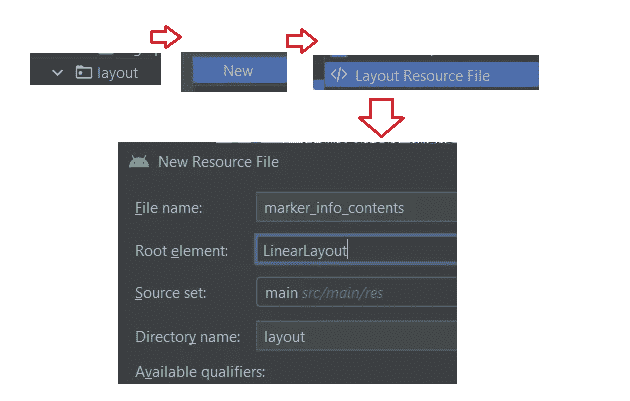**

```
*<?***xml version="1.0" encoding="utf-8"***?>* <**LinearLayout xmlns:android="http://schemas.android.com/apk/res/android"
    xmlns:tools="http://schemas.android.com/tools"
    android:orientation="vertical"
    android:layout_width="wrap_content"
    android:layout_height="wrap_content"
    android:gravity="center_horizontal"
    android:padding="8dp"**>

    <**TextView
        android:id="@+id/tv_title"
        android:layout_width="wrap_content"
        android:layout_height="wrap_content"
        android:textColor="@android:color/black"
        android:textSize="18sp"
        android:textStyle="bold"
        tools:text="Title"**/>

    <**TextView
        android:id="@+id/tv_address"
        android:layout_width="wrap_content"
        android:layout_height="wrap_content"
        android:textColor="@android:color/black"
        android:textSize="16sp"
        tools:text="123 Main Street"**/>

    <**TextView
        android:id="@+id/tv_rating"
        android:layout_width="wrap_content"
        android:layout_height="wrap_content"
        android:textColor="@android:color/black"
        android:textSize="16sp"
        tools:text="Rating: 3"**/>

</**LinearLayout**>
```

**你有一个新的布局。接下来你需要什么？**

**适配器！**

> **ui/adapter/**markerinfowindowadapter . kt****

```
**class** MarkerInfoWindowAdapter(
    **private val context**: Context
) : GoogleMap.InfoWindowAdapter {

    **lateinit var binding**: MarkerInfoContentsBinding

    **override fun** getInfoContents(marker: Marker?): View? {
        *// 1\. Get tag* **val** place = marker?.*tag* **as?** Place ?: **return null** *// 2\. Inflate view and set title, address, and rating* **binding** = MarkerInfoContentsBinding.inflate(
            LayoutInflater.from(**context**) )

        **binding**.**tvTitle**.*text* = place.**name
        binding**.**tvAddress**.*text* = place.**address
        binding**.**tvRating**.*text* = **"Rating: %.2f"**.*format*(place.**rating**)

        **return binding**.*root* }

    **override fun** getInfoWindow(marker: Marker?): View? {
        *// Return null to indicate that the
        // default window (white bubble) should be used* **return null** }
}
```

> **添加自行车图标**

**下载 [***自行车图片***](https://github.com/googlecodelabs/maps-platform-101-android/blob/main/starter/app/src/main/res/drawable/ic_directions_bike_black_24dp.xml)*→*
RES/drawable:****IC _ directions _ bike _ black _ 24dp . XML******

***这是一个矢量文件。所以我们需要一个工具来将 vecort XML 转换成位图数据。***

> ***工具— **BitmapHelper.kt*****

```
***object** BitmapHelper {
    */**
     * Demonstrates converting a* ***[Drawable]*** *to a* ***[BitmapDescriptor]****, for use as a marker icon.
     * Taken from ApiDemos on GitHub: https://github.com/googlemaps/android-samples/blob/master/ApiDemos/kotlin/app/src/main/java/com/example/kotlindemos/MarkerDemoActivity.kt
     */* **fun** vectorToBitmap(context: Context, @DrawableRes id: Int, @ColorInt color: Int): BitmapDescriptor {
        **val** vectorDrawable = ResourcesCompat.getDrawable(context.*resources*, id, **null**)
        **if** (vectorDrawable == **null**) {
            Log.e(**"BitmapHelper"**, **"Resource not found"**)
            **return** BitmapDescriptorFactory.defaultMarker()
        }
        **val** bitmap = Bitmap.createBitmap(
            vectorDrawable.*intrinsicWidth*,
            vectorDrawable.*intrinsicHeight*,
            Bitmap.Config.*ARGB_8888* )
        **val** canvas = Canvas(bitmap)
        vectorDrawable.setBounds(0, 0, canvas.*width*, canvas.*height*)
        DrawableCompat.setTint(vectorDrawable, color)
        vectorDrawable.draw(canvas)
        **return** BitmapDescriptorFactory.fromBitmap(bitmap)
    }
}*
```

> ***ui/**maps activity . kt**→自行车图标***

```
***private lateinit var bicycleIcon: BitmapDescriptor**override fun onCreate(savedInstanceState: Bundle?) {
    super.onCreate(savedInstanceState)

    binding = ActivityMapsBinding.inflate(*layoutInflater*)
    setContentView(binding.*root*)

    *// check app permissions* reqMultiplePermissions.launch(*REQUIRED_PERMISSIONS*)

 **val color = getColor(this, R.color.*colorPrimary*)
    bicycleIcon = BitmapHelper.vectorToBitmap(
        this, R.drawable.*ic_directions_bike_black_24dp*, color)** ...
}private fun addMarkers(googleMap: GoogleMap) {
    places.*forEach* { place ->
        val marker = googleMap.addMarker(
            MarkerOptions()
                .title(place.name)
                .position(place.latLng)
                **.icon(bicycleIcon)**
        )
    }
}*
```

***🗽看起来不错。我们跑吧！***

***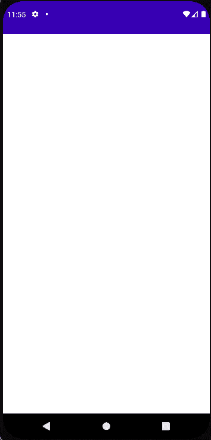***

***很好！没有错误！***

# ***🎳 7.标记簇→Gro**up overlap**ed Markers……→[菜单](#f2db)***

***重叠图标视图在屏幕上看起来很糟糕。这就是为什么我们需要标记集群，它会给我们一个整洁干净的外观。***

> ***格拉德。组件***

```
**//region Google Map* implementation 'com.google.android.gms:play-services-maps:17.0.1'
implementation 'com.google.android.gms:play-services-location:18.0.0'
implementation 'com.google.code.gson:gson:2.8.6' **implementation 'com.google.maps.android:android-maps-utils:1.1.0'** *//endregion**
```

> ***三个步骤***

***实现集群有三个简单的步骤。***

1.  ***实现`ClusterItem`接口。***
2.  ***子类化`DefaultClusterRenderer`类。***
3.  ***创建一个`ClusterManager`并添加物品。***

> ***让我们按照步骤来。***

> ***1️⃣.地点→集群项目***

```
*data class Place(
    val name: String,
    val latLng: LatLng,
    val address: String,
    val rating: Float
): ClusterItem {
 **override fun getPosition(): LatLng = latLng

    override fun getTitle(): String = name

    override fun getSnippet(): String = address** }*
```

> ***2️⃣.添加一个新类:place/[**place renderer**](https://github.com/googlecodelabs/maps-platform-101-android/blob/main/solution/app/src/main/java/com/google/codelabs/buildyourfirstmap/place/PlaceRenderer.kt)**。kt*****

```
***class** PlaceRenderer(
    **private val context**: Context,
    map: GoogleMap,
    clusterManager: ClusterManager<Place>
) : DefaultClusterRenderer<Place>(context, map, clusterManager) {

    */**
     * The icon to use for each cluster item
     */* **private val bicycleIcon**: BitmapDescriptor = *run* **{
        val** color = ContextCompat.getColor(
            **context**,
            R.color.*colorPrimary* )
        BitmapHelper.vectorToBitmap(
            **context**,
            R.drawable.*ic_directions_bike_black_24dp*,
            color
        )
    **}** */**
     * Before the cluster item (the marker) is rendered.
     * Assign location on map.
     */* **override fun** onBeforeClusterItemRendered(
        item: Place,
        markerOptions: MarkerOptions
    ) {
        markerOptions.title(item.**name**)
            .position(item.**latLng**)
            .icon(**bicycleIcon**)
    }

    */**
     * After the cluster item (the marker) is rendered.
     * Properties location on map.
     */* **override fun** onClusterItemRendered(
        clusterItem: Place, 
        marker: Marker
    ) {
        marker.*tag* = clusterItem
    }
}*
```

***我去掉**懒**，在 Kotlin 1.5 上是不行的。***

> ***3️⃣.ui/ **MapsActivity.kt*****

```
*override fun **onCreate**(savedInstanceState: Bundle?) {
    ...
    val mapFragment = supportFragmentManager
        .findFragmentById(R.id.map_fragment) as SupportMapFragment
    mapFragment.getMapAsync(this)
    mapFragment.getMapAsync { googleMap ->        **addClusteredMarkers(googleMap)** *// add zoom control bar* googleMap.*uiSettings*.***isZoomControlsEnabled***= true **}** }*
```

***一句台词就够了。我还添加了**缩放控制条**，这样你就可以在模拟器中放大或缩小。***

```
*/**
 * Adds markers to the map with clustering support.
 */
private fun **addClusteredMarkers**(googleMap: GoogleMap) {
    // Create the ClusterManager class and set the custom renderer.
    val **clusterManager** = ClusterManager<Place>(this, googleMap)
    **clusterManager**.renderer =
        PlaceRenderer(
            this,
            googleMap,
            clusterManager
        )

    // Set custom info window adapter
    **clusterManager**
        .markerCollection
        .setInfoWindowAdapter(MarkerInfoWindowAdapter(this))

    // Add the places to the ClusterManager.
    **clusterManager**.addItems(places)
    **clusterManager**.cluster()

    // Set ClusterManager as the OnCameraIdleListener so that it
    // can re-cluster when zooming in and out.
    googleMap.setOnCameraIdleListener {
        **clusterManager**.onCameraIdle()
    }
}*
```

*****集群管理器**是一个繁忙的管理器，它处理每一个调用。***

***✈️Run！***

***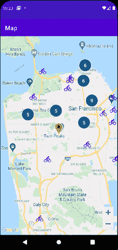***

# ***🎨 8.在地图上画图… → [菜单](#f2db)***

***让我们在地图上找点乐子。首先要有一个点击监听器。***

> ***ui/ **MapsActivity.kt*****

```
*private fun **addClusteredMarkers**(googleMap: GoogleMap) {
    *...*

 **clusterManager.setOnClusterItemClickListener { item ->
        addCircle(googleMap, item)
        return@setOnClusterItemClickListener false
    }**    *// Set ClusterManager as the OnCameraIdleListener so that it
    // can re-cluster when zooming in and out.* googleMap.setOnCameraIdleListener {
        clusterManager.onCameraIdle()
    }
}*
```

> ***addCircle()***

```
*//region circle function
private var **circle**: Circle? = null

/**
 * Adds a [Circle] around the provided [item]
 */
private fun **addCircle**(googleMap: GoogleMap, item: Place) {
    circle?.remove()
    circle = googleMap.addCircle(
        CircleOptions()
            .center(item.latLng)
            .radius(1000.0)
            .fillColor(ContextCompat.getColor(
                this, R.color.colorPrimaryTranslucent))
            .strokeColor(ContextCompat.getColor(
                this, R.color.colorPrimary))
    )
}
//endregion*
```

***单击模拟器，这样就可以用 1000 米画一个圆。***

***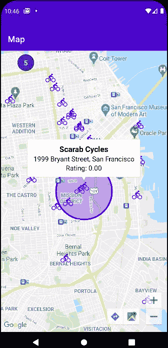***

***您也可以添加折线和多边形。我可能会在单独的文章中展示它们。***

# ***📷 9.相机控制… → [菜单](#f2db)***

***让我们注意到点击收听者有一个清晰的视角，没有圆圈。***

> ***ui/ **MapsActivity.kt*****

***addClusteredMarkers():***

```
**// clusterManager.setOnClusterItemClickListener { item ->
//            addCircle(googleMap, item)
//            return@setOnClusterItemClickListener false
//        }**
```

***onCreate():***

```
*mapFragment.getMapAsync { googleMap ->
    addClusteredMarkers(googleMap)

    // add zoom control bar
    googleMap.uiSettings.isZoomControlsEnabled = true

 **// Ensure all places are visible in the map.
    googleMap.setOnMapLoadedCallback {
        val bounds = LatLngBounds.builder()
        places.forEach { bounds.include(it.latLng) }
        googleMap.moveCamera(
            CameraUpdateFactory.newLatLngBounds(bounds.build(), 20))
    }**
}*
```

***此设置会将地图中心移动到标记的位置。***

***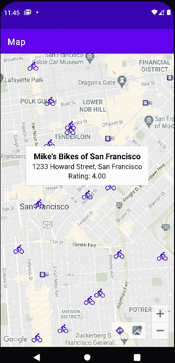***

> *****半透明**效果**运动中的*****

***addClusteredMarkers()***

***该效果要求所有簇在摄影机移动时降低 alpha 值。当摄像机停止时，一切都会恢复正常。***

```
**// Camera moving, alpha ==> translucent.* googleMap.setOnCamera**MoveStarted**Listener **{** clusterManager.*markerCollection*.*markers*.*forEach* **{ it**.*alpha* = 0.3f **}** clusterManager.*clusterMarkerCollection*.*markers*.*forEach* **{ it**.*alpha* = 0.3f **}
}** googleMap.setOn**CameraIdle**Listener **{** *// Camera stops ==> alpha = 1* clusterManager.*markerCollection*.*markers*.*forEach* **{ 
        it**.*alpha* = 1.0f **}** clusterManager.*clusterMarkerCollection*.*markers*.*forEach* **{ 
        it**.*alpha* = 1.0f **}** *// Call clusterManager.onCameraIdle() 
    // Stop ==> reclustering* clusterManager.onCameraIdle()
**}***
```

***🛫Run.***

***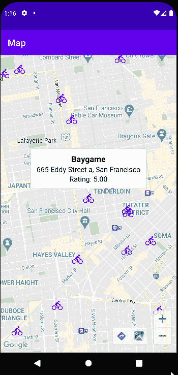***

***变暗了。工作正常！***

# ***🚀 10.KTX 升级…… → [菜单](#f2db)***

***Kotlin 是 Android 的官方语言。我们用它的 Ktx 库吧。***

> ***分级模块***

```
*dependencies {
    // ...

    **// Maps SDK for Android KTX Library
    implementation 'com.google.maps.android:maps-ktx:3.0.0'

    // Maps SDK for Android Utility Library KTX Library
    implementation 'com.google.maps.android:maps-utils-ktx:3.0.0'

    // Lifecycle Runtime KTX Library
    implementation 'androidx.lifecycle:lifecycle-runtime-ktx:2.3.1'**
}*
```

***同步。***

> ***ui/ **MapsActivity.kt*****

*   *****addMarkers():*****

***原创→***

```
***places**.*forEach* **{** place **->
    val** marker = googleMap.addMarker(
        MarkerOptions()
            .title(place.**name**)
            .position(place.**latLng**)
            .icon(**bicycleIcon**)
    )
**}***
```

***Ktx →***

```
***places**.*forEach* **{** place **->
    val** marker = googleMap.*addMarker* **{** title(place.**name**)
        position(place.**latLng**)
        icon(**bicycleIcon**)
    **}** *// Set place as the tag on the marker object
    // so it can be referenced within
    // MarkerInfoWindowAdapter* marker.*tag* = place
**}***
```

***MarkerOption 变成了 lambda。***

*   *****addCircle():*****

***原创→***

```
***circle**?.remove()
**circle** = googleMap.addCircle(
    **CircleOptions()**
        .center(item.**latLng**)
        .radius(1000.0)
        .fillColor(ContextCompat.getColor(**this**, 
            R.color.*colorPrimaryTranslucent*))
        .strokeColor(ContextCompat.getColor(**this**, 
            R.color.*colorPrimary*))
)*
```

***Ktx →***

```
***circle**?.remove()
**circle** = googleMap.*addCircle* **{** center(item.**latLng**)
    radius(1000.0)
    fillColor(ContextCompat.getColor(
        **this@MapsActivity**, R.color.*colorPrimaryTranslucent*))
    strokeColor(ContextCompat.getColor(
        **this@MapsActivity**, R.color.*colorPrimary*))
**}***
```

***同样的，CircleOptions 也缩小成了 lambda。***

> ***生命周期 Ktx***

***我将代码从 onMapReady()中分离出来:***

```
*override fun onMapReady(googleMap: GoogleMap) {
    **setToSF**(googleMap)
}

private fun **setToSF**(googleMap: GoogleMap) { mMap = googleMap

    *// Add a marker in Sydney and move the camera* val sf = LatLng(37.75, -122.45)
    mMap.addMarker(MarkerOptions()
        .position(sf)
        .title("Marker in San Francisco"))
    mMap.moveCamera(CameraUpdateFactory.newLatLng(sf))
    mMap.animateCamera(CameraUpdateFactory.zoomIn())
    mMap.animateCamera(CameraUpdateFactory.zoomTo(12f), 2000, null) **}***
```

***onCreate():***

***原创→***

```
*val mapFragment = supportFragmentManager
    .findFragmentById(R.id.map_fragment) as SupportMapFragmentmapFragment.getMapAsync(this)
mapFragment.getMapAsync { googleMap ->
    addClusteredMarkers(googleMap)

    // add zoom control bar
    googleMap.uiSettings.isZoomControlsEnabled = true

    // Ensure all places are visible in the map.
    googleMap.setOnMapLoadedCallback {
        val bounds = LatLngBounds.builder()
        places.forEach { bounds.include(it.latLng) }
        googleMap.moveCamera(
            CameraUpdateFactory.newLatLngBounds(bounds.build(), 20))
    }
}*
```

***Ktx →***

```
*val mapFragment = supportFragmentManager
    .findFragmentById(R.id.map_fragment) as SupportMapFragment***lifecycleScope*.launchWhenCreated** **{
    *// Get map* val googleMap = mapFragment.awaitMap()

    *// Wait for map to finish loading* googleMap.awaitMapLoad()** 
    *// set location in San Francisco* setToSF(googleMap)

    *// Ensure all places are visible in the map* val bounds = LatLngBounds.builder()
    places.*forEach* { bounds.include(it.latLng) }
    googleMap.moveCamera(
        CameraUpdateFactory.newLatLngBounds(
            bounds.build(), 20))
    googleMap.*uiSettings*.*isZoomControlsEnabled* = true
    addClusteredMarkers(googleMap)
**}***
```

***所有的异步函数都聚集在一起，在 lifecycleScope 中运行。***

***我们跑吧。Ktx 修改应该不会改变过去的结果。***

# ***🤐 **11。秘密升级** …… → [菜单](#f2db)***

***secrets 插件可以节省我们从 secret 文件导入值的大量工作，比如***local . properties***。***

> ***gradle .模块***

***插件→***

```
*plugins **{
    ...** id **'com.google.secrets_gradle_plugin'** version **'0.6'
}***
```

***秘密→***

```
****//// get property from local.properties
//def getProps(String propName) {
//    def propsFile = rootProject.file('local.properties')
//    if (propsFile.exists()) {
//        def props = new Properties()
//        props.load(new FileInputStream(propsFile))
//        return props[propName]
//    } else {
//        return "";
//    }
//}******secrets {
    propertiesFileName 'local.properties'
    ignoreList.add("sdk.*")
}***android **{** compileSdkVersion 30
    buildToolsVersion **"30.0.3"** defaultConfig **{** applicationId **"com.homan.huang.mapdemo"** minSdkVersion 19
        targetSdkVersion 30
        versionCode 1
        versionName **"1.0"** *//AndroidManifest -- [ Variable: Value ]* ***//manifestPlaceholders = [mapKey: getProps('MAPS_API_KEY')]****
```

> *****local.properties*****

```
**#MAPS_API_KEY=blahblahblah* **mapKey**=**blahblahblah***
```

***我重命名了密钥名称，以匹配清单中的名称。***

```
*<**meta-data
    android:name="com.google.android.geo.API_KEY"
    android:value="${mapKey}"***
```

***👍快跑。一切都会一样。***

# ***🤗恭喜你。你已经完成了 101 地图… → [菜单](#f2db)***

***如果你能听懂我的话，请给我鼓掌。***