# 沃尔玛招聘—商店销售预测

> 原文：<https://medium.com/geekculture/walmart-recruiting-store-sales-forecasting-b8b2f4cf19b1?source=collection_archive---------12----------------------->

> “**预测**的**目标**不是预测未来，而是告诉你你需要知道什么，以便在当下采取有意义的行动”。——**保罗·萨佛**


**目录:**

1.  商业问题

2.为什么这个问题需要解决？

3.机器学习如何帮助解决这个问题？

4.作为性能指标的加权平均绝对误差(WMAE)

5.为什么我们使用 WMAE 作为我的绩效指标？

6.数据集信息

7.探索数据分析

8.基线模型

9.数据预处理

10.模型

11.部署

12.未来的工作

13.参考:

# 1.简介和目标:

> 沃尔玛是一家著名的零售公司，经营连锁超市。这里，沃尔玛提供了 45 家商店的数据组合，包括商店信息和月销售额。数据每周提供一次。沃尔玛试图发现假期对商店销售的影响。为此，它将四个假期周纳入数据集，分别是圣诞节、感恩节、超级碗、劳动节。这里我们要分析给定的数据集。在此之前，让我指出这个分析的目的。
> 
> 我们的主要目标是预测商店一周内的销售额。
> 
> 由于数据集大小和时间相关数据作为特征给出，因此分析销售是否受到基于时间的因素和基于空间的因素的影响。
> 
> 最重要的是，如何在一周内包括假期来提高商店的销售额？

## 2.为什么这个问题需要解决？

假期会对销售产生巨大影响。因此，如果对销售额有一个好的预测，沃尔玛就可以计算出假期期间要订购多少产品。这将有助于预测假期期间需要购买哪些产品。因为计划购物的顾客希望产品能立即上市。通过预测，他们可以计算出什么时候需要什么产品。从而提高顾客对沃尔玛的信任度。这个问题也可以解决营销活动的问题。因为预测通常用于调整广告和营销活动，并能影响销售额。沃尔玛全年都会举办几次降价活动。这些降价事件发生在重要的节假日之前。因此，为了解决这个问题，沃尔玛可以更有效地组织这样的活动。

## 3.机器学习如何帮助解决这个问题？

已知具有线性的时间序列数据。简单的均值或中值模型不能有效或完全映射线性关系。像[*【ARIMA】*](https://en.wikipedia.org/wiki/Autoregressive_integrated_moving_average)(自回归综合移动平均线)这样的模型在预测销售额时没有考虑到商店规模、商店类型、假期等特征的影响。因此，如果数据集满足其线性假设，像线性回归模型这样的机器学习模型可以提供稳健的预测。再者，机器学习预测不是黑箱；可以衡量和理解模型输入的影响，从而使预测直观而透明。机器学习模型也可以更新，并适应数据集的变化。

且还通过机器学习帮助，可以使用机器学习模型以正确的方式利用降价事件和每周销售之间的关系。

> 机器学习模型需要一个衡量标准来检查模型的表现是好是坏。这个指标被称为性能指标。

**4。加权平均绝对误差(WMAE)作为性能指标**

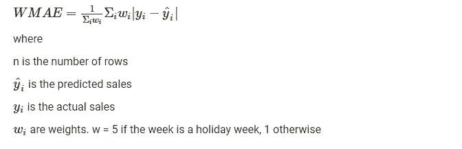

很明显，我们的目标是在预测每周销售额的同时，尽可能降低这一分数。我们将在回归模型中使用这个性能指标。

## **5。为什么我们使用 WMAE 作为我的绩效指标？**

首先，让我们看看为什么不使用 RMSE(均方根误差)而使用 MAE。给定的数据集不是大型数据集，因此异常点的影响会比通常情况下更大。而使用 RMSE 它可以使冲击力增加两倍以上。假设我们对你的问题有两个模型(M1 和 M2)。假设我们有 4 个正常点和 1 个异常点。让我们有实际的销售是正常的一周销售有平均值约 10 和离群值有销售 100。模型 1 用平均值 11 和异常值 110 来预测正常周的销售额。模型 2 预测正常周平均值为 14，异常值为 105。分母中的 N 是常数，两种情况下计算异常点模型 1 的 MAE:110–100 = 10 计算异常点模型 1 的 MSE:(110–100)= 100

计算异常点模型 1 的 MAE:105–100 = 5 计算异常点模型 1 的 MSE:(105–100)= 25

模型 1 的 RMSE 值将为=平方根(100+1+1+1+1) = 10.9，而对于模型 2 =平方根(25+3+3+3+3) = 6.08。由于模型 1 的 RMSE 大于模型 2，仅仅因为单个异常点，它将丢弃实际上表现更好的模型 1。

然而，模型 1 的 MAE = 14，模型 2 的 MAE = 17

显然，在较小的数据集中，MAE 受异常值的影响较小。

现在，我们使用 WMAE 而不是普通的 MAE，因为我们需要增加假期周销售的影响，因为沃尔玛根据即将到来的假期计划活动。很明显，WMAE 就是这么做的，因为它给了放假的那几周 5 倍的权重。

> 注:模型的 WMAE 值越小，模型性能越好。

## 6.数据集信息

*沃尔玛提供了四个数据集:这里的数据源链接是**。*

***Stores.csv***

它有三列。店铺:店铺编号从 1 到 45，尺寸:店铺尺寸已提供，类型:店铺类型已提供，有 A、B、C 三种类型。

***Train.csv***

它有五列。 Store:商店编号，Dept:部门编号，Date:星期，Weekly_Sales:给定商店中给定部门的销售额，IsHoliday:该周是否为特殊假日周

***test . CSV****与 train.csv 相同，只是它没有 IsHoliday 列。*

***Features.csv***

它有十一列。商店:商店编号，日期:星期，温度:该地区的平均温度，燃料价格:该地区的燃料成本，减价 1–5:与沃尔玛正在进行的促销减价相关的匿名数据。降价数据仅在 2011 年 11 月后可用，并非所有商店都随时可用。任何缺少的值都标有安娜。数据集中包括选定的假日降价事件。众所周知，这些降价会影响销售，但要预测哪些部门会受到影响以及影响的程度是很困难的。3 CPI——消费者价格指数，失业:失业率，假日:一周是否是特殊假日

**没有低延迟要求，模型花费的时间足够了。**

# 7.探索性数据分析(EDA):

> 在机器学习/深度学习中，当务之急是知道什么是什么，怎样是什么？到目前为止，我们已经知道了问题的定义，我们也清楚我们想要达到的目标。但我们如何实现它才是最重要的。为了前进，我们需要已经提供给我们的数据。我们将执行称为探索性数据分析的过程，这是一种分析数据集以总结其主要特征的方法，通常采用可视化方法。

首先，我们将导入所有需要的库。

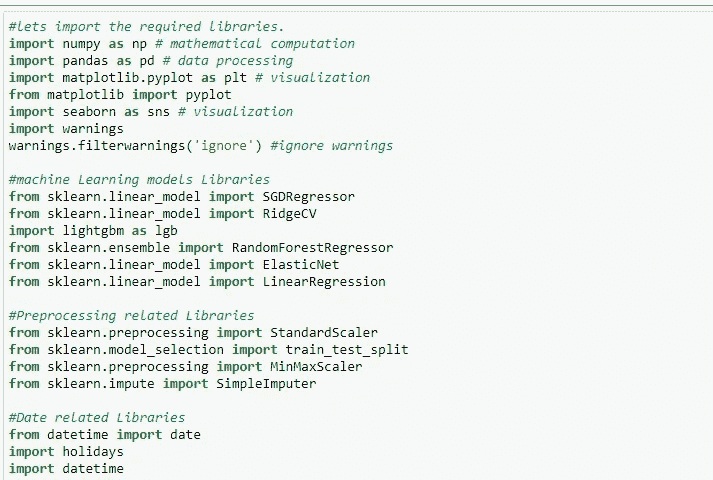

接下来，我们加载所有数据集:

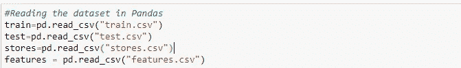

**现在我们从 train.csv 文件**的日期特征中提取一些时间相关特征

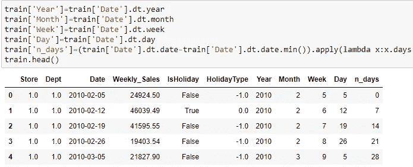

现在让我们检查在所提供的时间段内是否有任何趋势、波动或随机事件发生。

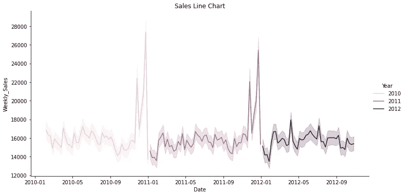

## 观察:

从折线图可以看出，没有年度趋势，也没有随机事件在任何一年发生。

还可以看到，与其他月份相比，年底的销售额很高，这表明圣诞节和感恩节对销售额的影响比超级碗和劳动节更大。

我们可以创建功能，我们可以给每个假期单独的类别

**周特征折线图**

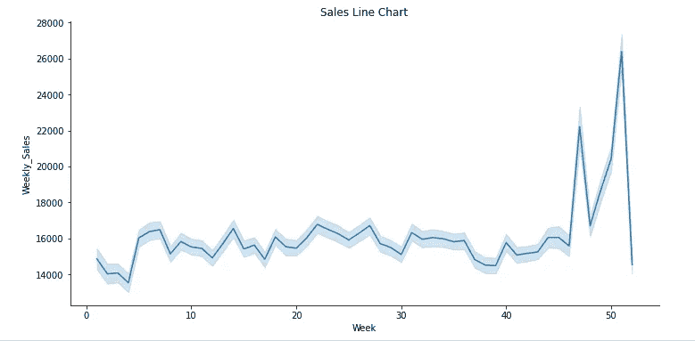

**观察:**

这可能是一个有用的特性，因为 line 每周都在波动。同样，在圣诞节和感恩节到来的时候，第 45 到 50 周的销售额更高。

**然后我们将 train.csv 与 stores.csv 和 features.csv 合并，以获得 train.csv 中每个数据点的更多特征**

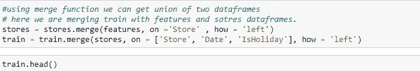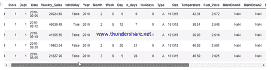

现在我们来看看哪些特性与 Weekly_Sales 更相关。在此之前，我们必须记住，有一些分类特征和一些数字特征，Weekly_Sales 本质上也是数字的。因此，要检查数字特征与 Weekly_Sales 的相关性，我们可以简单地使用 [Pearson 相关系数](https://en.wikipedia.org/wiki/Pearson_correlation_coefficient)或 [Spearman 等级相关系数](https://en.wikipedia.org/wiki/Spearman%27s_rank_correlation_coefficient)这两种方法都广泛用于数字特征之间的相关性。为了检查分类特征和数字特征之间的相关性，我们有一个特殊的方法叫做 [eta 平方检验](https://www.statisticshowto.com/eta-squared/)。

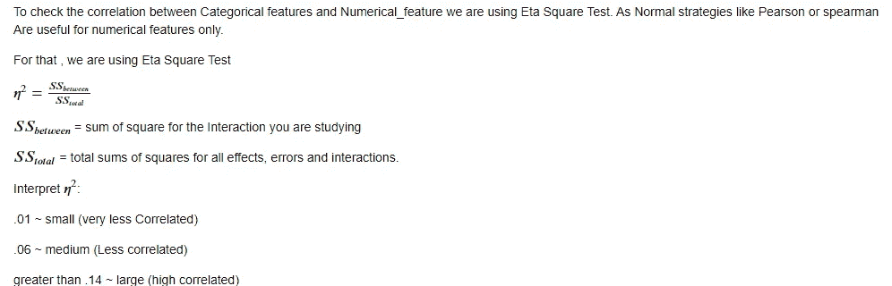

**分类特征与周销售额的相关性**

```
Correlation of store feature with Weekly_Sales
0.09320619110455744
**************************************************
Correlation of Department feature with Weekly_Sales
0.5368007370698533
**************************************************
Correlation of Type feature with Weekly_Sales
1.8841978383051284e-07
**************************************************
```

很容易看出，部门特征与周销售额高度相关。

商店特征也与周销售额适度相关。

**数字特征与周销售额的相关性**

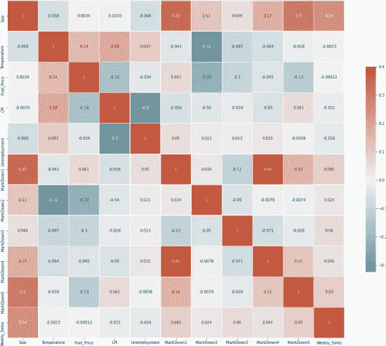

Heat Map of Correlation between Numerical Features

**观察:**

规模与周销售额最相关。

大多数特征与尺寸相关，这在使用机器学习预测销售时并不好(点击[此处](https://datascience.stackexchange.com/questions/24452/in-supervised-learning-why-is-it-bad-to-have-correlated-features)了解原因)。因此，大多数功能可能是无用的，可以在以后删除。

**让我们使用简单随机森林模型来检查哪些特征是重要的。**

```
Top 5 Important Features:
['Dept', 'Size', 'Store', 'Week', 'CPI']
```

因此，成功地完成了上述分析。

**让我们分别了解数据集中所有要素的分布**

**类型特征:**

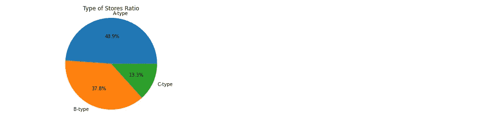

**观察**:A 型店很多，C 型店很少

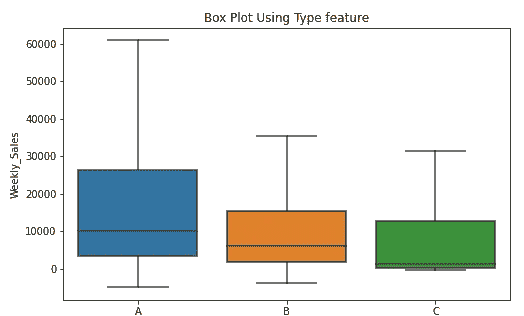

观察:每类店铺的中位数从左到右递减，即**。**，从 A 店到 c 店。

**店铺特色:**

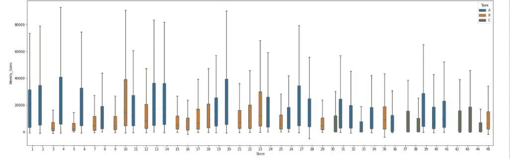

**观察:**

商店特征是预测销售的有用特征。因为每个商店都有不同含义。假设:该特征包括部门、规模或类型，以及数据集中未提供的地区。

**部门特色:**

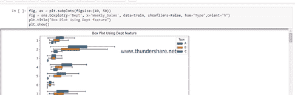

Box plot of Department feature

**观察:**

部门可能是预测销售额的一个因素，因为通过箱线图可以看出，每个部门的销售额都不同于其他部门。此外，部门特征与类型特征的组合也增强了更准确地预测销售额的能力，因为可以看出类型 A 在大多数部门中具有更高的销售额。

**CPI 特征(数值特征):**

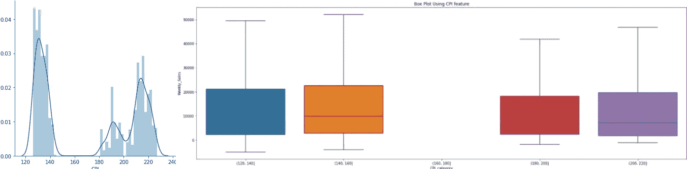

PDF and Box plot of CPI feature

**观察:**

CPI 在 160 到 180 之间，因为没有数据，所以没有销售。除此之外，在特定时期内消费价格指数变化没有太大差别。

**失业特征:**

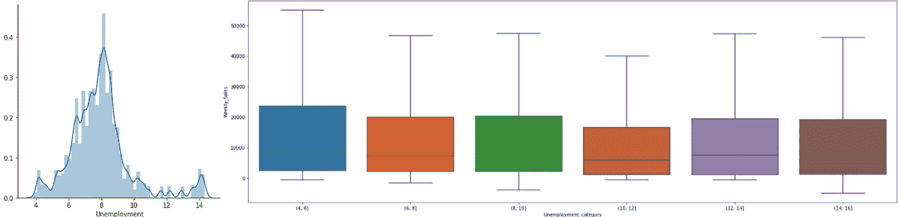

PDF and Box plot of Unemployment feature

**观察:**

所有箱线图范围平均值相对来说是相等的，因此它在确定商店的销售额时没有用。所以这个功能可以去掉。

**燃油价格特性:**

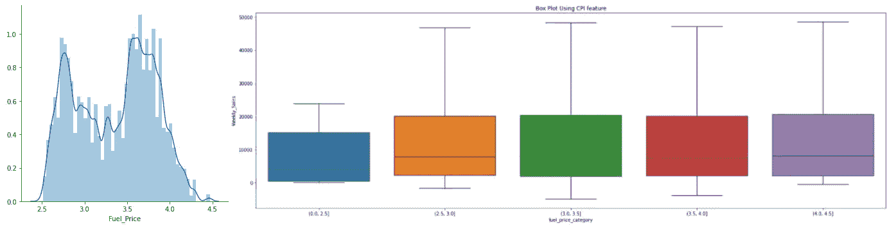

PDF and Box plot of Fuel Price feature

**观察:**

燃料价格对销售的影响很小，因为随着燃料价格的增加，销售没有变化。所以这个功能也可以去掉。

**温度特性:**

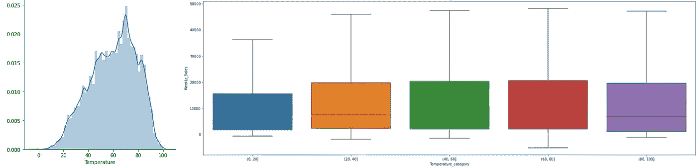

PDF and Box plot of Temperature feature

**观察:**

这一功能也可以取消，因为在任何温度范围内销售都没有变化。

*注意:因为销售额不能为负，所以删除销售额为负的所有数据点。*

> 我们再提取一些特征，看看有没有用。

**让我们创建一个功能，查找一周中的假期数。**

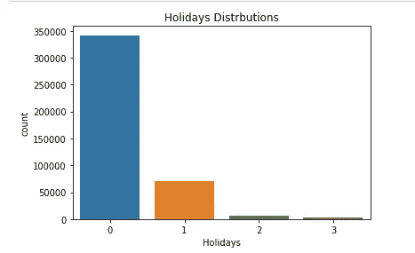

Histogram of Holidays

**观察:**

很少有一周有两个或两个以上的假期，一周中的大部分时间都没有假期。

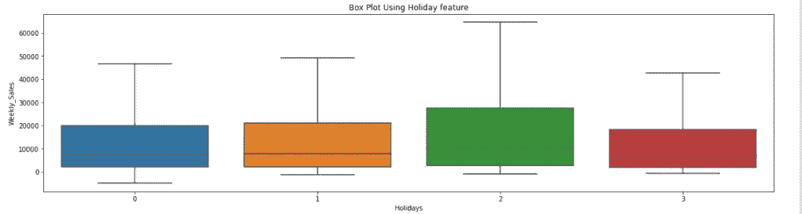

**观察:**

销售额随着一周假日数的变化而变化。所以这是一个有用特性。

**无效** **特征提取。**

我们还尝试了月末功能和月初功能，因为人们往往在月末会有较少的工资，而在月初人们会得到工资，但这些功能被证明是无用的。

```
Correlation of Is_month_end feature with weekly_sales
5.109982375092706e-06
**************************************************
Correlation of Is_month_start feature with weekly_sales
1.919291806025242e-05
**************************************************
```

相关值很少被称为有用。

使用[自动编码器](https://machinelearningmastery.com/autoencoder-for-classification/)提取特征也没有用。

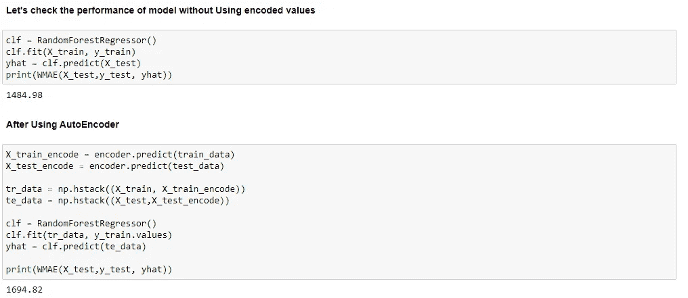

使用自动编码器功能后，WMAE 增加，这意味着模型性能下降。

## 我们发现感恩节和圣诞节比其他两个更有影响力。所以每个节日都有不同程度的影响。所以我们可以制作一个假日类别作为特色。

**现在让我们检查 Nan 值的影响**

```
Feature         Nan values fractionStore           0.000000
Dept            0.000000
Date            0.000000
Weekly_Sales    0.000000
IsHoliday       0.000000
Year            0.000000
Month           0.000000
Week            0.000000
Day             0.000000
n_days          0.000000
Type            0.000000
Size            0.000000
Temperature     0.000000
Fuel_Price      0.000000
MarkDown1       0.642572
MarkDown2       0.736110
MarkDown3       0.674808
MarkDown4       0.679847
MarkDown5       0.640790
CPI             0.000000
Unemployment    0.000000
dtype: float64
```

通过这一点，您可以看到降价价值具有高百分比的 Nan 值。

**由于降价事件发生在假期之前，因此可能会对 Weekly_Sales 产生影响。所以简单地给 0 或删除这些列可能会丢失一些信息。让机器学习模型学习隐藏在其中的模式，然后填充空值。**

```
Features         Nan values fractionStore            0.000000
Dept             0.000000
Date             0.000000
Weekly_Sales     0.000000
IsHoliday        0.000000
Year             0.000000
Month            0.000000
Week             0.000000
Day              0.000000
n_days           0.000000
Type             0.000000
Size             0.000000
Temperature      0.000000
Fuel_Price       0.000000
MarkDown1        0.000000
MarkDown2        0.000000
MarkDown3        0.000000
MarkDown4        0.000000
MarkDown5        0.000000
CPI              0.000000
Unemployment     0.000000
dtype: float64
```

现在让我们看看降价价值有多有用。

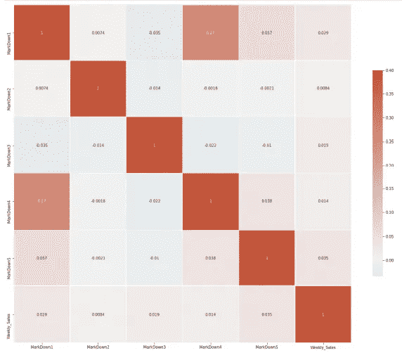

Heat map of markdown values and Weekly_Sales

**观察:**

现在降价价值与周销售额的相关性很小。而 markdown 1 和 markdown4 也是高度相关的。所以我们可以放弃他们。

# 8.基线模型:

基线是一种使用启发式、简单汇总统计、随机性或机器学习来为数据集创建预测的方法。您可以使用这些预测来衡量基线的性能(例如，WMAE)，然后这个指标将成为您与任何其他机器学习算法进行比较的标准。

```
Mean = np.mean(train['Weekly_Sales'])
predicted value  = np.full((train.shape[0]), Mean)
print("Model Performance(WMAE) of Mean Model: ",WMAE(train,train['Weekly_Sales'], predicted value))Model Performance(WMAE) of Mean Model:  15350.22Median **=** np.median(train['Weekly_Sales'])
predicted_value  **=** np.full((train.shape[0]), Median)print("Model Performance(WMAE) of Median Model: ",WMAE(train,train['Weekly_Sales'], predicted_value))Model Performance(WMAE) of Median Model:  13625.26
```

# 9.数据预处理:

**预处理数据进行训练。**

**对测试数据进行预处理。**

# 10.型号:

**让我们使用 WMAE 作为性能指标来检查哪些模型性能最佳，以排除所有用于超参数调整的坏模型。**

```
WMAE score of  linear regression  :  1.3978614345983337e+18
----------------------------------------------------------------------------------------------------
WMAE score of  SVR  :  734286.36
----------------------------------------------------------------------------------------------------
WMAE score of  RidgeCV  :  14816.99
----------------------------------------------------------------------------------------------------
WMAE score of  ElasticNet  :  14775.04
----------------------------------------------------------------------------------------------------
WMAE score of  RandomForest  :  1424.24
----------------------------------------------------------------------------------------------------
WMAE score of  XGboost  :  4244.98
----------------------------------------------------------------------------------------------------
```

RandomForest 和 XGboost 是最好的模型。我们也可以试试弹力网。

**让我们超调前面提到的模型**

**随机森林回归器**

```
n_estimators = [100,120,140]
max_depth = [25, 27, 30]
random_forest(n_estimators, max_depth)k: 1 , n_estimators: 100 , max_depth: 25
k: 2 , n_estimators: 100 , max_depth: 25
k: 3 , n_estimators: 100 , max_depth: 25
k: 4 , n_estimators: 100 , max_depth: 25
WMAE: 1446.8874999999998
k: 1 , n_estimators: 100 , max_depth: 27
k: 2 , n_estimators: 100 , max_depth: 27
k: 3 , n_estimators: 100 , max_depth: 27
k: 4 , n_estimators: 100 , max_depth: 27
WMAE: 1406.7475000000002
k: 1 , n_estimators: 100 , max_depth: 30
k: 2 , n_estimators: 100 , max_depth: 30
k: 3 , n_estimators: 100 , max_depth: 30
k: 4 , n_estimators: 100 , max_depth: 30
WMAE: 1417.2475
k: 1 , n_estimators: 120 , max_depth: 25
k: 2 , n_estimators: 120 , max_depth: 25
k: 3 , n_estimators: 120 , max_depth: 25
k: 4 , n_estimators: 120 , max_depth: 25
WMAE: 1419.4924999999998
k: 1 , n_estimators: 120 , max_depth: 27
k: 2 , n_estimators: 120 , max_depth: 27
k: 3 , n_estimators: 120 , max_depth: 27
k: 4 , n_estimators: 120 , max_depth: 27
WMAE: 1415.1875
k: 1 , n_estimators: 120 , max_depth: 30
k: 2 , n_estimators: 120 , max_depth: 30
k: 3 , n_estimators: 120 , max_depth: 30
k: 4 , n_estimators: 120 , max_depth: 30
WMAE: 1411.4775
k: 1 , n_estimators: 140 , max_depth: 25
k: 2 , n_estimators: 140 , max_depth: 25
k: 3 , n_estimators: 140 , max_depth: 25
k: 4 , n_estimators: 140 , max_depth: 25
WMAE: 1419.2275
k: 1 , n_estimators: 140 , max_depth: 27
k: 2 , n_estimators: 140 , max_depth: 27
k: 3 , n_estimators: 140 , max_depth: 27
k: 4 , n_estimators: 140 , max_depth: 27
WMAE: 1412.5725000000002
k: 1 , n_estimators: 140 , max_depth: 30
k: 2 , n_estimators: 140 , max_depth: 30
k: 3 , n_estimators: 140 , max_depth: 30
k: 4 , n_estimators: 140 , max_depth: 30
WMAE: 1429.3125
```

*最佳参数是 n_estimators = 100，max_depth = 27*

现在让我们用最佳参数训练随机森林。

```
RF = RandomForestRegressor(n_estimators= 100 , max_depth= 27)
RF.fit(data,train['Weekly_Sales'])
```

使用 Kaggle 在随机森林的测试数据集上预测周销售额的 WMAE 得分。


**用 XGboost 回归器训练数据集。**

```
max_depth = [20,25]
n_estimators = [6000,7000,8000]
gbdt(n_estimators, max_depth)k: 1 , n_estimators: 6000 , max_depth: 20
k: 2 , n_estimators: 6000 , max_depth: 20
k: 3 , n_estimators: 6000 , max_depth: 20
k: 4 , n_estimators: 6000 , max_depth: 20
WMAE: 1423.1125
k: 1 , n_estimators: 6000 , max_depth: 25
k: 2 , n_estimators: 6000 , max_depth: 25
k: 3 , n_estimators: 6000 , max_depth: 25
k: 4 , n_estimators: 6000 , max_depth: 25
WMAE: 1436.5400000000002
k: 1 , n_estimators: 7000 , max_depth: 20
k: 2 , n_estimators: 7000 , max_depth: 20
k: 3 , n_estimators: 7000 , max_depth: 20
k: 4 , n_estimators: 7000 , max_depth: 20
WMAE: 1416.3425000000002
k: 1 , n_estimators: 7000 , max_depth: 25
k: 2 , n_estimators: 7000 , max_depth: 25
k: 3 , n_estimators: 7000 , max_depth: 25
k: 4 , n_estimators: 7000 , max_depth: 25
WMAE: 1405.5575
k: 1 , n_estimators: 8000 , max_depth: 20
k: 2 , n_estimators: 8000 , max_depth: 20
k: 3 , n_estimators: 8000 , max_depth: 20
k: 4 , n_estimators: 8000 , max_depth: 20
WMAE: 1382.7775
k: 1 , n_estimators: 8000 , max_depth: 25
k: 2 , n_estimators: 8000 , max_depth: 25
k: 3 , n_estimators: 8000 , max_depth: 25
k: 4 , n_estimators: 8000 , max_depth: 25
WMAE: 1372.6275
```

最佳参数是 n 估计值= 8000，最大深度= 25

现在让我们用最佳参数来训练 XGboost。

```
gb = lgb.LGBMRegressor(n_estimators=8000, max_depth=25)
gb.fit(data, train['Weekly_Sales'])
```

使用 Kaggle 预测 XGboost 测试数据集 Weekly_Sales 的 WMAE 得分。


**用 ElasticNet 回归器训练数据集。**

```
l1_ratio = np.linspace(0.5, 1.0, num=6)
linear regression(l1_ratio)k: 1 , l1_ratio: 0.5
k: 2 , l1_ratio: 0.5
k: 3 , l1_ratio: 0.5
k: 4 , l1_ratio: 0.5
WMAE: 15394.74
k: 1 , l1_ratio: 0.6
k: 2 , l1_ratio: 0.6
k: 3 , l1_ratio: 0.6
k: 4 , l1_ratio: 0.6
WMAE: 15340.665
k: 1 , l1_ratio: 0.7
k: 2 , l1_ratio: 0.7
k: 3 , l1_ratio: 0.7
k: 4 , l1_ratio: 0.7
WMAE: 15365.2275
k: 1 , l1_ratio: 0.8
k: 2 , l1_ratio: 0.8
k: 3 , l1_ratio: 0.8
k: 4 , l1_ratio: 0.8
WMAE: 15316.400000000001
k: 1 , l1_ratio: 0.9
k: 2 , l1_ratio: 0.9
k: 3 , l1_ratio: 0.9
k: 4 , l1_ratio: 0.9
WMAE: 15389.147500000001
k: 1 , l1_ratio: 1.0
k: 2 , l1_ratio: 1.0
k: 3 , l1_ratio: 1.0
k: 4 , l1_ratio: 1.0
WMAE: 14790.029999999999
```

**最佳 l1_ratio = 1.0**

现在让我们用最佳参数训练 ElasticNet。

```
lr = ElasticNet(random_state=0,normalize = True,l1_ratio = 1.0)
lr.fit(data, train['Weekly_Sales'])
```

使用 Kaggle 对 ElasticNet 的测试数据集预测 Weekly_Sales 的 WMAE 得分。


还尝试了[堆叠](https://scikit-learn.org/stable/modules/generated/sklearn.ensemble.StackingRegressor.html)回归器。

使用 Kaggle 对堆叠测试数据集预测 Weekly_Sales 的 WMAE 得分。


所有型号性能:


## 随机森林被证明是最好的模型。

# 11.部署:

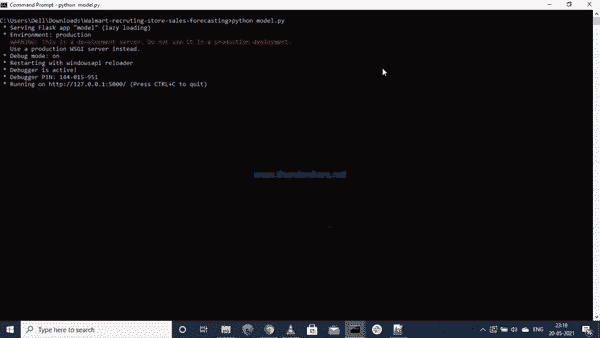

我们在这里做的第一件事是输入商店号、部门号、该周是否有假日以及该周的最后一个星期五。利用这个信息网站已经预测了那一周的销售额。

# 12.未来工作:

1.  由于资源有限，我使用了 10 万个数据点。使用所有数据肯定会提高模型的性能。
2.  实现深度学习。

# 13.参考:

[](https://www.kaggle.com/c/walmart-recruiting-store-sales-forecasting) [## 沃尔玛招聘-商店销售预测

### 使用历史降价数据预测商店销售额

www.kaggle.com](https://www.kaggle.com/c/walmart-recruiting-store-sales-forecasting) [](https://www.appliedaicourse.com/course/11/Applied-Machine-learning-course) [## 应用课程

### 应用机器学习课程文凭在人工智能和 ML 门 CS 混合课程面试准备课程人工智能工作坊人工智能…

www.appliedaicourse.com](https://www.appliedaicourse.com/course/11/Applied-Machine-learning-course) [](https://machinelearningmastery.com/basic-feature-engineering-time-series-data-python/) [## Python 中时间序列数据的基本特征工程-机器学习精通

### 在我们可以开始使用机器学习之前，时间序列数据必须重新构建为监督学习数据集…

machinelearningmastery.com](https://machinelearningmastery.com/basic-feature-engineering-time-series-data-python/) [](https://barnesanalytics.com/2017/06/14/basics-of-arima-models-with-statsmodels-in-python/) [## Python - Barnes Analytics 中带 Statsmodels 的 ARIMA 模型基础

### 许多企业中的一个常见问题是预测未来的价值。它对设定预算很有用…

barnesanalytics.com](https://barnesanalytics.com/2017/06/14/basics-of-arima-models-with-statsmodels-in-python/) 

你可以在我的 Github [**这里**](https://github.com/iaayushgupta/walmart) **找到完整的代码。**

很高兴在 [**linkedin**](https://www.linkedin.com/in/aayush-gupta-925442190/) 上与您连线😃