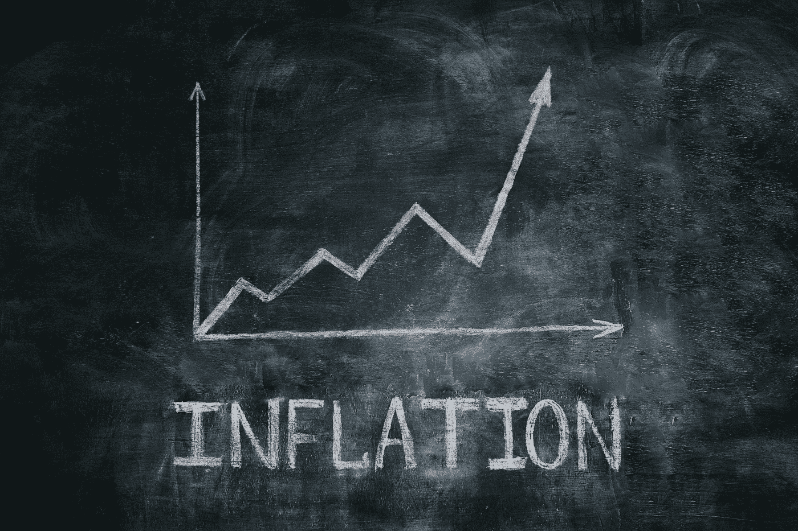

# 想让比特币的价格上去？不要赌通货膨胀

> 原文：<https://medium.com/geekculture/want-bitcoins-price-to-go-up-don-t-bet-on-inflation-dca07427476?source=collection_archive---------18----------------------->

似乎几乎所有东西的价格都在上涨。

这没什么新鲜的。今天的政府竭尽全力做到这一点。通常，他们做得很好，人们通常不会大惊小怪。

直到最近。

在欧洲，价格上涨速度超过了 2016 年以来的水平。美国通货膨胀率上升 5.4%…