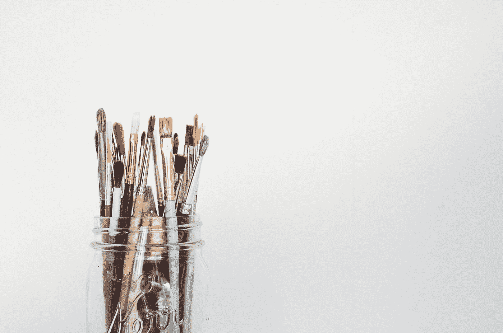

# 想成为更好的数据科学家？你需要知道的 4 件事

> 原文：<https://medium.com/geekculture/want-to-be-a-better-data-scientist-4-things-you-need-to-know-a87eb6183412?source=collection_archive---------7----------------------->

## 知道如何使用工具和库是不够的。数据科学是一门艺术。

Photo by [Debby Hudson](https://unsplash.com/@hudsoncrafted?utm_source=medium&utm_medium=referral) on [Unsplash](https://unsplash.com?utm_source=medium&utm_medium=referral)

> 想象你是一个在空白画布前的艺术家。你有一套画笔和颜色。你结合画笔和颜色的方式，以及…