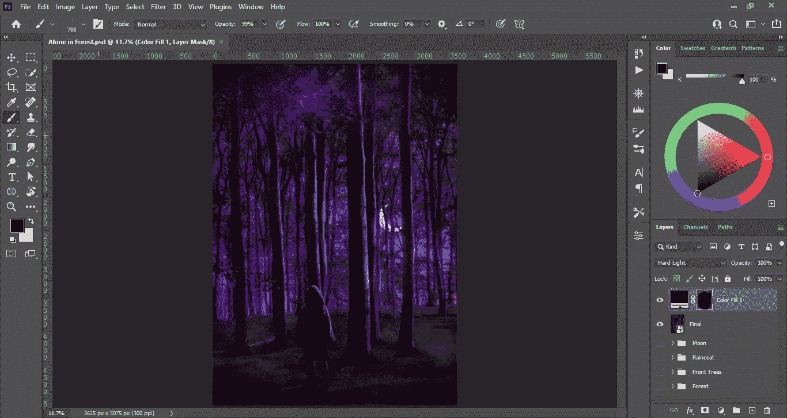

# 初学者学习 Photoshop 的完整路线图

> 原文：<https://medium.com/geekculture/want-to-learn-how-to-use-photoshop-but-dont-know-where-to-start-37a292bd5655?source=collection_archive---------40----------------------->

下面是每个初学者都应该掌握的基本功能和工具！

Screenshot provided by the author

当任何人想到图形设计或看到一件数字创意作品时，首先想到的可能是 Photoshop。

学习使用这个工具不仅能打开设计世界的大门，还能让你把想法变成现实！