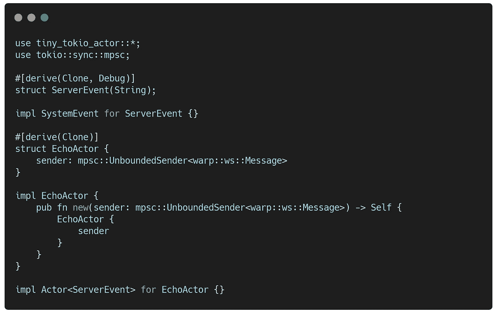
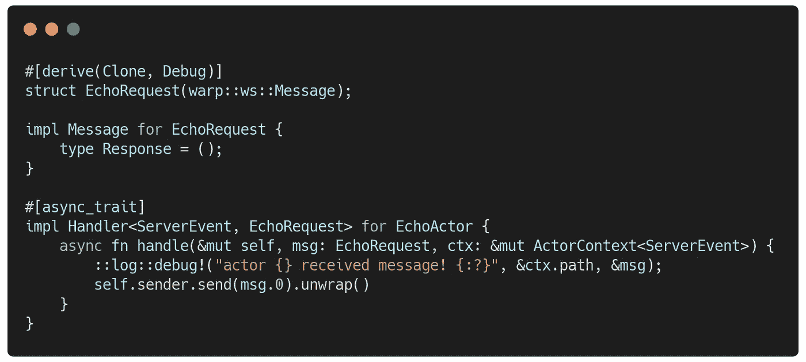
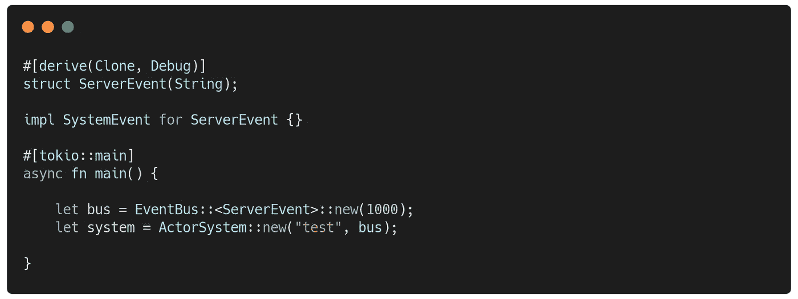
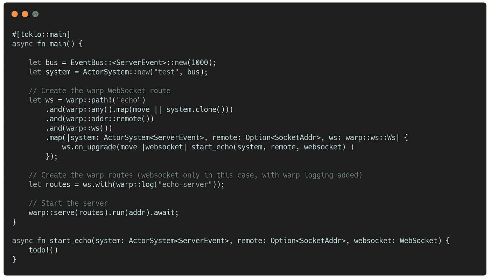
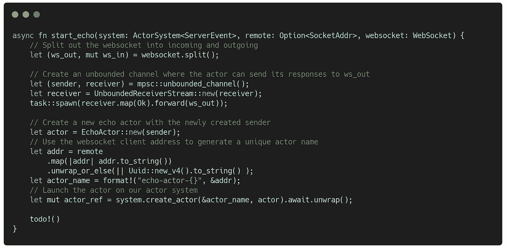
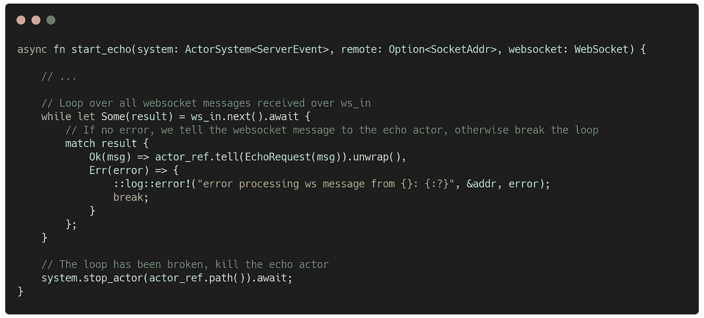

# Warp WebSockets 和 Tokio Actors

> 原文：<https://medium.com/geekculture/warp-websockets-and-tokio-actors-de44c106d599?source=collection_archive---------6----------------------->


我在我的项目中使用了很多 warp，并且经常需要通过 websockets 公开一些服务。warp 项目有一个关于如何使用 web sockets 的很好的例子，而且非常容易使用。然而，我认为在这里使用演员使事情变得更干净和更容易。

下面是一个关于如何使用 Warp websockets 的 actors 的小例子。为了跟进，您必须将以下依赖项包含到您的`Cargo.toml`中:

```
[dependencies]
tiny-tokio-actor = "0.2"
tokio = { version = "1", features = ["full"] }
futures = "0.3"
tokio-stream = "0.1"
uuid = { version = "0.8", features = ["v4"] }
warp = "0.3"
env_logger = "0.9"
dotenv = "0.15.0"
```

# 回声演员

为了创建能够回应任何消息的 actor，我使用了我在 tokio 上创建的一个名为 [tiny-tokio-actor](https://github.com/fdeantoni/tiny-tokio-actor) 的小库。演员很简单:



To copy/paste use the [complete code](#4ebf) at the bottom

除了 actor 之外，我们还创建了一个名为`ServerEvent`的结构，并为其实现了`SystemEvent`特征。这将被我们稍后会看到的 actor 系统使用。现在让我们把注意力放在演员身上。

参与者拥有一个属性，那就是 websocket 消息的无边界发送者。参与者将通过这个发送者发回回显消息。

接下来，我们创建我们的`EchoActor`将接收的消息:



如您所见，这个消息只是一个 warp websocket 消息的包装。处理该消息的参与者处理程序只是记录一条调试消息，并使用参与者的`sender`属性将其发回。

我们的 echo 服务完成了！我们现在要做的就是把它连接到曲速的其他部分。

# 曲速服务器

要运行我们的服务器，我们需要用 tokio 运行时创建一个主函数。在这个主函数中，我们还将启动我们的 actor 系统:



接下来，我们创建可以服务 websocket 连接的 warp 服务器:



我们让 warp route 获取我们的 actor 系统、连接客户端的远程地址、warp websocket 处理程序，并将其全部传递给`start_echo`函数。

在`start_echo`函数中，我们将为连接的客户端创建一个`EchoActor`，使用客户端的地址作为参与者名称的一部分。当我们的 actor 使用`UnboundedSender<warp::ws::Message>`时，我们将需要构建必要的通道来链接到传出的 websocket 接收器。为了获得接收器，我们`split`web socket 连接:



我们首先将 websocket 分成一个`ws_out`接收器和一个`ws_in`流，以接收来自连接的 websocket 客户端的消息。`ws_out`接收器用于将消息发送回客户端。

我们创建一个连接到`ws_out`接收器的无界通道。这个通道的发送者将通过`ws_out`接收器将消息发送回 websocket 客户端。

接下来我们创建`EchoActor`，并传入我们刚刚创建的通道的发送者。我们使用从远程客户机地址(主机名&端口)生成的惟一名称在我们的 actor 系统上运行这个 actor。如果由于某种原因，我们无法检索远程地址，我们只是使用一个随机生成的 UUID。

现在我们可以从`ws_in`流中获取消息，并将它们发送到我们的`EchoActor`:



我们循环从`ws_in`流接收的消息，直到我们得到一个错误。如果有错误发生，我们会记录下来并退出循环。当循环结束时，我们也停止我们的`EchoActor`。

就是这样！当您运行服务器时，您应该能够通过类似于 [websocat](https://github.com/vi/websocat) 的东西连接到它，例如:

```
$ websocat ws://127.0.0.1:9000/echo
```

完整代码:

这段代码也是 [tiny-tokio-actor](https://github.com/fdeantoni/tiny-tokio-actor) 在 [examples](https://github.com/fdeantoni/tiny-tokio-actor/tree/main/examples) 文件夹中的项目的一部分。