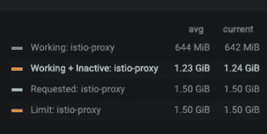
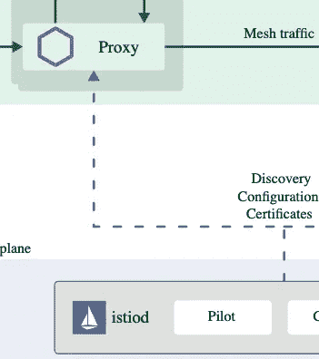
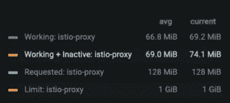

# 小心这个 Istio 代理边车内存陷阱

> 原文：<https://medium.com/geekculture/watch-out-for-this-istio-proxy-sidecar-memory-pitfall-8dbd99ea7e9d?source=collection_archive---------1----------------------->


Image Source: YouTube

在我们与我公司的 Istio 一起进行的服务网格之旅中，我们遇到了许多令人困惑的问题，其中许多问题让我们希望我们能够提前知道这些陷阱。这是在大型 Kubernetes 集群中使用 Istio 时可能会遇到的一个陷阱。通过分享我在这个问题上的经验，我希望能帮助你在自己的 Istio 工作中避免它。

# 问题 Istio 代理边车的内存消耗过多

特使代理边车是 Istio 服务网状架构的基石。特使代理为网格中的服务执行所有流量管理功能，例如路由、mTLS、断路、授权、重试等。

当我们第一次在专门用于 Istio 实验的小型 Kubernetes 集群中部署 Istio 时，一切都是教科书式的。我们学习并尝试了它的功能，并建立了前进的信心。然后，我们决定在我们更大的开发 Kubernetes 集群中部署 Istio。这个集群已经使用了一段时间，跨多个业务线的多个团队正在积极地使用它来部署和测试他们的容器化工作负载。部署在该集群中的独特服务数量约为数百个。

当我们在这个集群中部署我们的测试 Istio 应用程序时，我们注意到在较小的集群中平均消耗 700MB 的每个 pod 中的代理 sidecars 现在突然在较大的集群中消耗 700MB 到 1.2 GB！这是同一个应用程序，配置没有变化。为什么它突然消耗了这么多内存？！



Excessive memory consumption by Envoy proxy sidecars

每个 pod 1GB 的配额根本不可行。但更重要的是，很明显有些事情不太对劲，所以我们决定调查一下。

# 根本原因

为了执行其流量管理功能，每个代理边车需要了解集群中的服务生态系统。该信息由 Istio 控制平面的“pilot”组件提供给代理边车(pilot 现在是 Istio 控制平面中单一“istiod”服务的一部分)。



Pilot feeds metadata about deployed cluster services to each proxy sidecar (Source: Istio.io)

这里有一个问题——默认情况下，pilot 假设每个代理可能需要将流量路由到集群中的*任何*服务，因此它继续将集群中每个服务的*元数据推送到每个代理。代理将这些元数据保存在内存中。默认情况下，Istio 控制平面推送的元数据量(以及每个代理保存在内存中的数据量)与集群中部署的服务数量成正比。在我们的案例中，这个数字是几百。其结果就是我们在该集群中部署第一个网格服务后立即观察到的情况——每个边柜消耗 1 GB 内存！*

您可以使用 istioctl 工具找出特定 pod 中的 sidecar 代理加载了多少配置信息。

```
istioctl proxy-config clusters <<name-of-pod>> -n <<namespace-where-pod-is-deployed>>
```

在我们的情况下，这是很多！

# 简单的解决方法

幸运的是，有一种简单的方法可以修复这种导致具有大量服务的集群中失控的代理边盘内存消耗问题的默认行为。使用 [Sidecar](https://istio.io/latest/docs/reference/config/networking/sidecar/) 定制资源，您可以很容易地限制名称空间，Istio 控制平面会将信息推送到您的代理 Sidecar。在我们的案例中，我们部署了以下边车资源:

```
apiVersion: networking.istio.io/v1alpha3
kind: Sidecar
metadata:
  name: default
  namespace: istio-system
spec:
  egress:
  - hosts:
    - "./*"
    - "istio-system/*"
```

上述边车将部署在集群中的 istio 代理边车的流量管理范围限制为仅部署在与它们相同的命名空间中的服务，以及部署在 istio-system 命名空间中的服务，其中部署了 Istio 控制平面和入口/出口网关服务。除了施加其他流量管理限制之外，这个 Sidecar 还限制了推送到代理和由代理缓存的配置数据量。

注意,“默认”Sidecar 资源需要部署在“rootNamespace”中，通过 [MeshConfig](https://istio.io/latest/docs/reference/config/istio.mesh.v1alpha1/) 进行配置。默认情况下，这是“istio-system”名称空间，但是如果您在集群中覆盖了这个名称空间，那么您的默认 Sidecar 将需要部署在您为 Istio config 指定的“rootNamespace”名称空间中。

一旦我们部署了这个 Sidecar 资源并重新部署了我们的 Istio 应用程序，我们立即注意到代理 Sidecar 在内存消耗方面的差异。



Reduction in proxy sidecar memory consumption after namespace restriction via “Sidecar” resource

内存消耗从 1GB 下降到 74MB 左右，这是一个显著的改进。我们使用 istioctl 工具验证了代理，并确认它们在更改后确实只有特定于名称空间的配置信息。

如果您需要特定名称空间中的代理 sidecars 能够与集群中的其他名称空间通信，该怎么办？这可以通过在各个名称空间中部署更好的 Sidecar 资源来覆盖默认的 Sidecar 资源来实现，这些名称空间扩展了该名称空间中代理的名称空间范围。

# 结论

当涉及到资源消耗时，部署 Istio 的 Kubernetes 集群的特征对其行为有明显的影响。监控与各种 Istio 控制平面和数据平面组件相关的资源指标非常重要，尤其是当您将服务网格应用程序迁移到新集群，或者更改当前集群的架构和大小时。默认行为可能不正确。幸运的是，有一些技术和方法可以用来调整默认行为——在这种情况下，就是代理边车的资源消耗。

看看克里斯蒂安·波斯塔(即将出版的书[的合著者](https://www.manning.com/books/istio-in-action))的这个短片，它很好地解释了这个问题和解决方案:【https://www.youtube.com/watch?v=JcfLUHdntN4】的