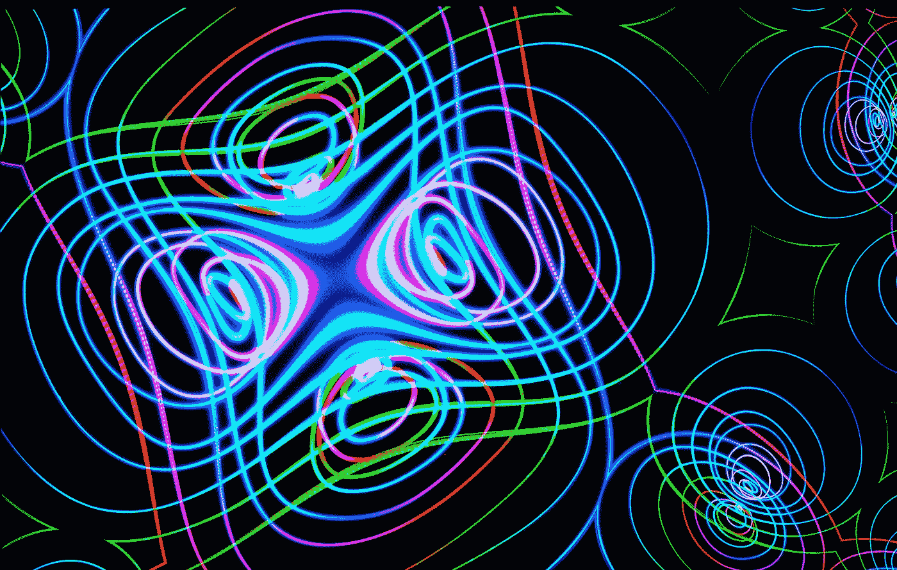
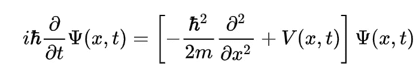
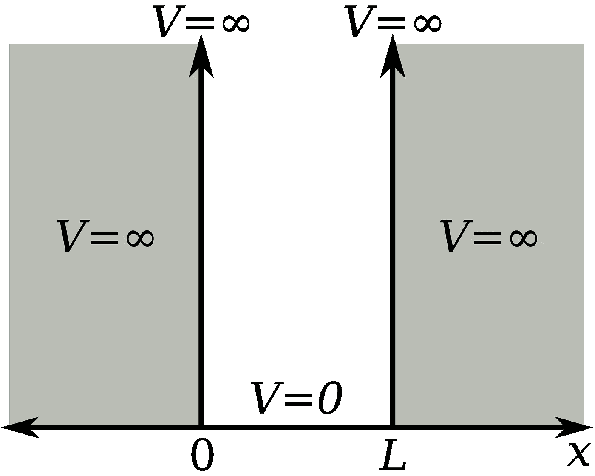
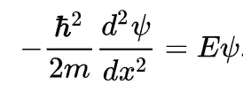
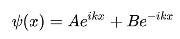
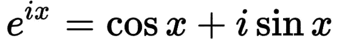
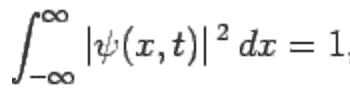
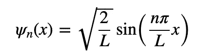
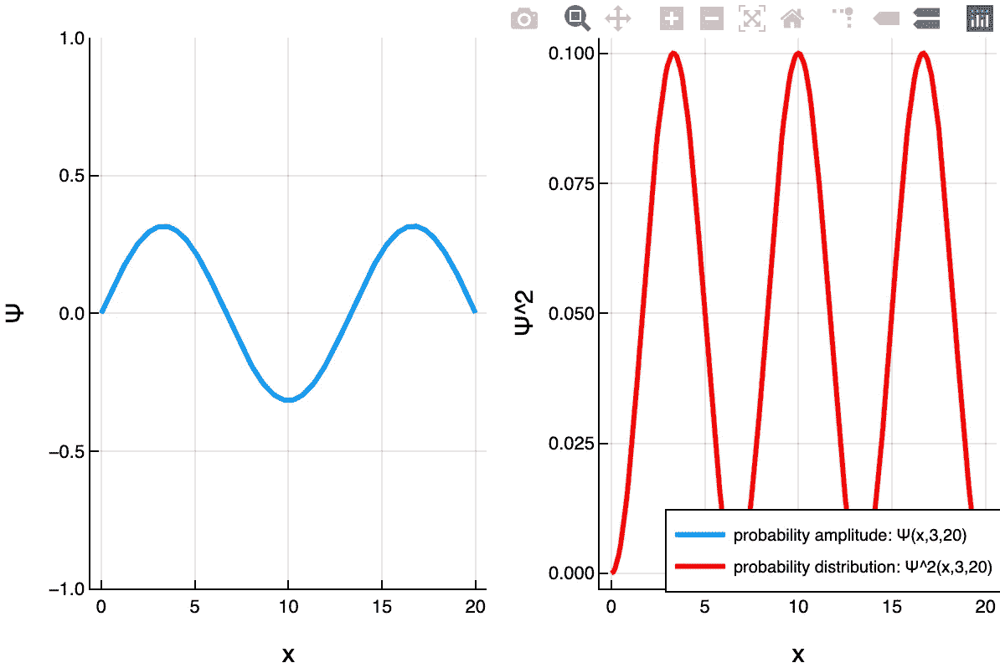

# 用 Julia 研究 1D 薛定谔方程的波函数

> 原文：<https://medium.com/geekculture/wavefunction-of-the-1d-schrodinger-equation-using-julia-ee6c0e89bf67?source=collection_archive---------14----------------------->



Photo by [FLY:D](https://unsplash.com/@flyd2069?utm_source=medium&utm_medium=referral) on [Unsplash](https://unsplash.com?utm_source=medium&utm_medium=referral)

量子力学的基石之一是波粒二象性。

在显微镜下，事情的表现极不符合直觉。事实上，事物在眨眼之间出现和消失。

而物质的行为更像波浪，来回波动。

这些波的控制方程遵循奥地利物理学家欧文·薛定谔发现的薛定谔方程。

[](https://en.wikipedia.org/wiki/Schr%C3%B6dinger_equation#Approximate_solutions) [## 薛定谔方程-维基百科

### 薛定谔方程是一个线性偏微分方程，它决定了一个原子的波函数

en.wikipedia.org](https://en.wikipedia.org/wiki/Schr%C3%B6dinger_equation#Approximate_solutions) 

对于这个例子，我们将处理一个最简单的情况。但即便如此，它也需要非同寻常的数学处理。

被限制在一维盒子里的粒子。

它可能存在于盒子内部的任何地方，但不存在于盒子外部。

一个小小的口袋宇宙，如果你愿意的话。



The infinite potential well

它的行为受二阶微分方程控制，如下所示。



其中 h_bar 是普朗克常数，m 是粒子的质量。

# 通用解决方案

二阶微分方程允许以下形式的一般解:



利用[欧拉公式](https://en.wikipedia.org/wiki/Euler%27s_formula)计算复数



我们可以将解决方案改写成以下形式:


# 边界条件

因为粒子被限制在盒子里，所以它不能存在于盒子的边界。

**零点和 L 点**

因此，

```
for x = 0, C sin(k(0)) + D cos(k(0)) = 0, > D = 0 for x = L, C sin(kL) + D cos(kL) = 0 
C sin(kL) + 0         = 0Csin(kL) = 0
kL = nπ , where n = 1, 2, 3,......=> **k = nπ/L**
```

c 是归一化常数，

```
**√(2/L)** 
```



Normalisation of the expression

# 波函数

因此我们得到下面给出的波函数。



它决定了在井内定位该粒子的概率。

# 朱莉娅代码

[](https://chem.libretexts.org/Courses/University_of_California_Davis/UCD_Chem_110A%3A_Physical_Chemistry__I/UCD_Chem_110A%3A_Physical_Chemistry_I_%28Larsen%29/Text/03%3A_The_Schrodinger_Equation_and_the_Particle-in-a-Box_Model/3.I%3A_Interactive_Worksheets/3.I.2%3A_Particle_in_an_Infinite_Potential_Box_%28Python_Notebook%29) [## 3.I.2:无限势盒中的粒子(Python 笔记本)

### 在下一个单元格中，我们将导入笔记本中使用的库，并调用一些重要的函数…

chem.libretexts.org](https://chem.libretexts.org/Courses/University_of_California_Davis/UCD_Chem_110A%3A_Physical_Chemistry__I/UCD_Chem_110A%3A_Physical_Chemistry_I_%28Larsen%29/Text/03%3A_The_Schrodinger_Equation_and_the_Particle-in-a-Box_Model/3.I%3A_Interactive_Worksheets/3.I.2%3A_Particle_in_an_Infinite_Potential_Box_%28Python_Notebook%29) 

***我实际上偶然发现了上面链接中提供的 Python 代码片段。***

***并决定在 Julia 中重新编写代码。***

[](http://docs.juliaplots.org/latest/) [## 家园地块

### 要开始，请参阅教程。几乎所有的绘图都是通过指定绘图属性来完成的。点击进入…

docs.juliaplots.org](http://docs.juliaplots.org/latest/) 

由于不需要特殊的库，我们只需要绘图库**绘图。**

```
using Plots
plotly()
Plots.PlotlyBackend()#Declare plotly backend
#At the time of publication, default "GR" backend is glitchy
```

创建波函数并输入相关的输入

```
**#Wave function**
function Ψ(x,n,L)
    √(2.0/L)*sin(Float16(n*π*x)/L)
end**#n = energy level (n = 1,2,3, ....  ∞ )
#L = box width in angstrom**L = 20
n =  3
x = 0:0.1:L
y = Ψ.(x,n,L)
```

创建绘图以可视化粒子的位置概率。

波函数提供了定位粒子的**概率振幅**。

我们需要平方它，以便获得**概率分布。**

```
p1=plot(x,y, w=3, label=”probability amplitude: Ψ(x,$n,$L)”, 
xlabel=”x”, ylabel=”Ψ”, ylim=(-1,1))p2=plot(x,**y.^2**, w=3, label=”probability distribution: Ψ²(x,$n,$L)”, xlabel=”x”, ylabel=”Ψ²”, line=:red)plot(p1, p2, layout=(1,2), legend=:bottomright, legendfontsize=7)
```

从下面的红色图表可以看出，粒子最有可能位于势阱中的三个地方。



最后，为了确保我们的结果是正确的，让我们对 psi_square 提供的表达式进行积分，以确保我们是正确的。

我们将在表达式下积分，看看是否能得到值 1。

由于粒子被限制在盒子里，它在盒子里的可能性必须是 100%。

并且我们使用下面的**高斯 Konrod 积分算法**

[](https://github.com/JuliaMath/QuadGK.jl) [## GitHub-Julia math/quad GK . JL:Julia 中的自适应一维数值高斯-克朗罗德积分

### 文档:这个包在 Julia 中提供了对一维数值积分的支持，使用自适应…

github.com](https://github.com/JuliaMath/QuadGK.jl) 

```
using QuadGK g(x) = (√(2.0/L)*sin(Float64(n*π*x)/L))^2integral, err = quadgk(x -> g(x), 0, 20, rtol=1e-5)**# rtol here refers to the error tolerance. 
# Often in numerical methods, we cannot obtain an exact solution, and we terminate the solver once it get close enough.** .
.
.< (1.0, 0.0) > 
```

和预期的一样，我们得到了**1 的值。**

由于表达式简单到可以求解，相对误差为**零。**

为了方便读者，整个代码被合并在下面。