# 在 TypeScript 中使用第三方库的方法

> 原文：<https://medium.com/geekculture/way-to-use-3rd-party-libraries-in-typescript-84ab879b3890?source=collection_archive---------6----------------------->


TypeScript 是 JavaScript 的超集，在大多数项目中使用。

与 JavaScript 不同，当我们想使用**一些内置的包或库** **时，typescript 无法理解**它。

让我们举个例子来理解清楚。 **Lodash** 是著名的 JS 库之一，提供**实用函数**供日常使用。

步骤 1:安装 lodash

```
npm install –save lodash
```

第二步:像普通的 JavaScript 导入一样使用 lodash。下面使用的 shuffle 函数在加载时打乱数组中的数据。

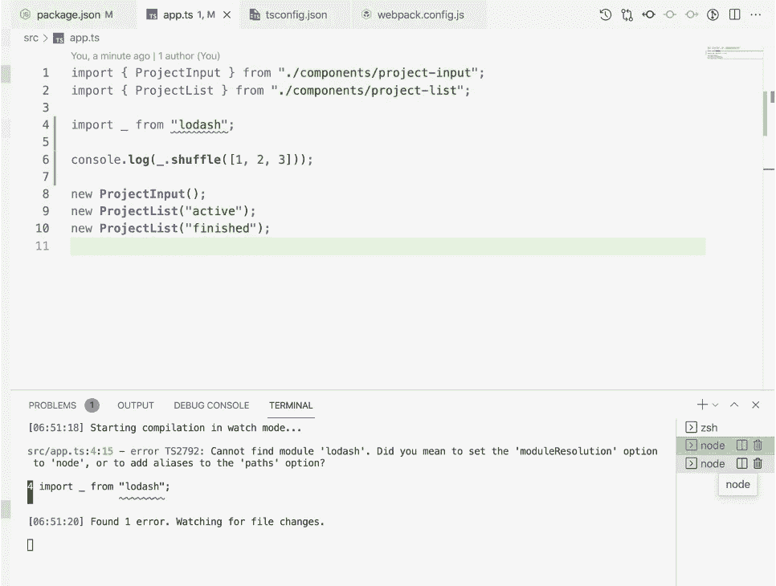

TypeScript 对此不满意，并抱怨该包。

这是因为**那些包本来是要和**普通 JS** 一起使用的**。TypeScript 不理解它。

**解决方案:**

**答:对于大多数 JS 包:**

有一个包叫做[**definitely typed**](https://github.com/DefinitelyTyped/DefinitelyTyped/tree/master/types)**(即@types)。**

它列出了 JavaScript 中使用的许多流行的包。请参考下面的链接:

[](https://github.com/DefinitelyTyped/DefinitelyTyped/tree/master/types) [## 主节点上的明确类型化/类型明确类型化/明确类型化

### 高质量类型脚本类型定义的存储库。-主服务器上的明确类型化/类型…

github.com](https://github.com/DefinitelyTyped/DefinitelyTyped/tree/master/types) 

安装软件包就可以了。现在**路径将被处理**并且**错误将消失**

```
npm install --save @types/lodash
```

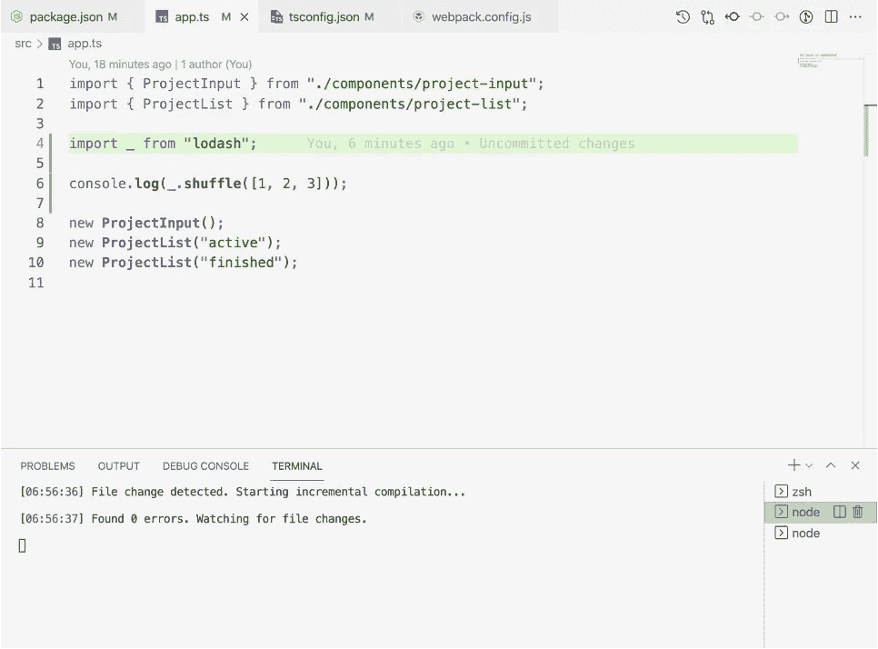

→我们现在还有**lodash 包的自动完成**。感谢@types/lodash

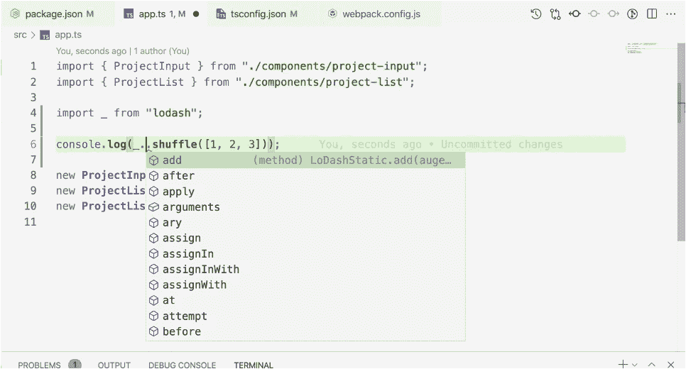

大多数插件将存在于@types 中，但不是全部:

→如果一些 JS 代码写在@types 包中没有的任何文件或插件中。有一种方法可以修复它。

→打字稿不允许使用它

例如。

index.html

```
<!DOCTYPE *html*> <html *lang*="en"> <head> <meta *charset*="UTF-8" /> <meta *name*="viewport" *content*="width=device-width, initial-scale=1.0" /> <meta *http-equiv*="X-UA-Compatible" *content*="ie=edge" /> <title>Project Manager</title> <link *rel*="stylesheet" *href*="app.css" /> <script *type*="module" *src*="dist/bundle.js"></script> </head> <body> <div *id*="app"></div> </body><!-- Use below data in another js file of the app --><script> const GLOBAL = "THIS IS SET";</script></html>
```

index.html

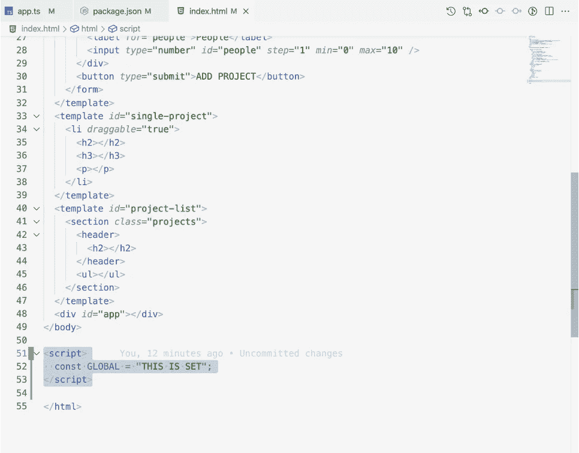

应用程序

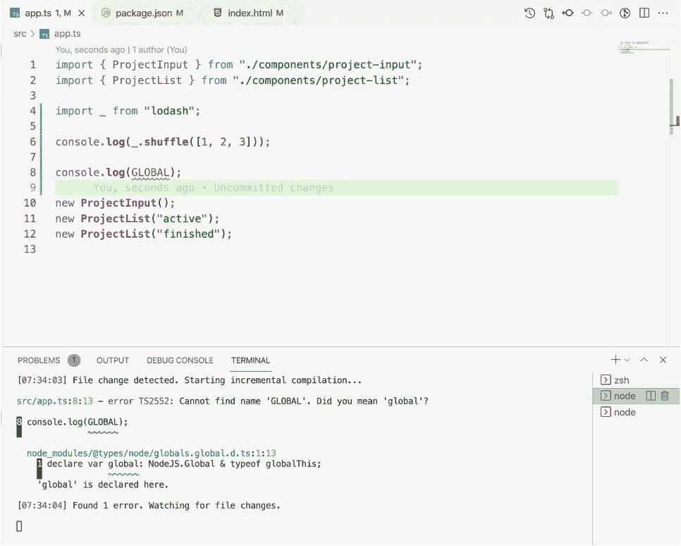

→要修复它，我们需要声明它的类型。我们确信这些文件存在，因此声明了正确的类型

```
declare var GLOBAL: string;   // Writing variable type
```

→这是在大多数第三方库或包的@types 插件中处理的。

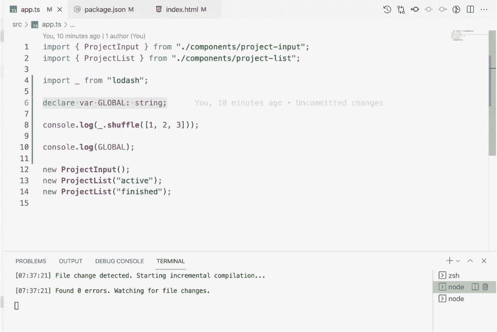

TypeScript error is gone

**C .检查包装:变压器类**

→当我们从数据库或 API 获取大量数据，并且需要将数据转换为类的实例时，这个包很有用

→让我们看一个代码场景

**案例 1:**

产品.型号. ts

```
export class **Product** { title:string; price:number; constructor(t:string, p:number) { this.title = t; this.price = p; } **getInformation**() { return [this.title, `$${this.price}`]; }}
```

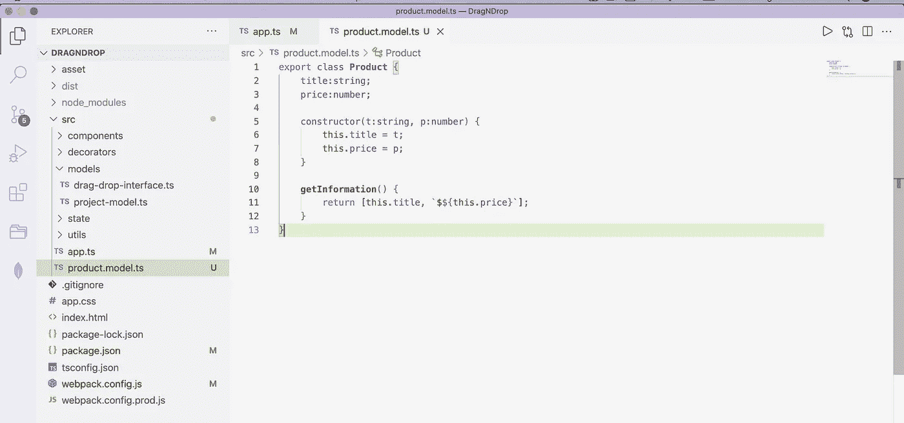

应用程序

```
import { Product } from './product.model';const p1 = new **Product**('A Book', 12.99);console.**log**(p1.**getInformation**());  // this will give array of data
```

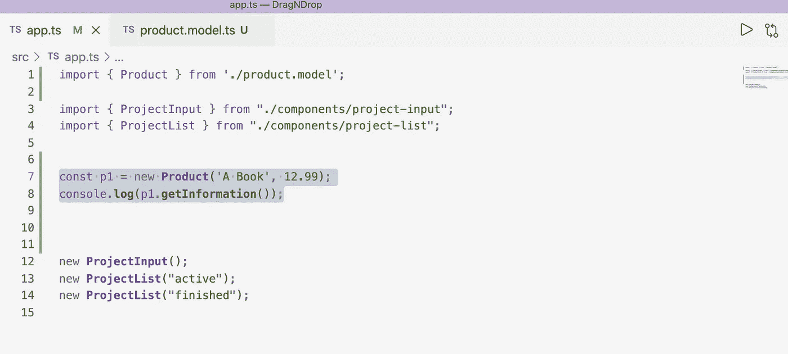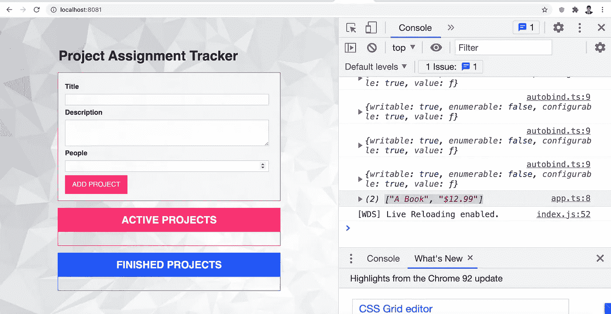

**情况 2:假设现在数据来自数据库或者写了一些直接数据。我们需要在类**的实例中创建它们

应用程序

```
import { Product } from './product.model';*// Assuming below data is loading from database or an API*let products = [ {title: 'An Unbrella', price: 12.99},
  {title: 'Rich Dad Poor Dad', price: 121.99},];// Making above data  of class instance - custom codeconst loadedProducts = products.**map**(prod => {
  return new **Product**(prod.title, prod.price);
});for(const prod of loadedProducts) {
  console.**log**(prod.**getInformation**());
}
```

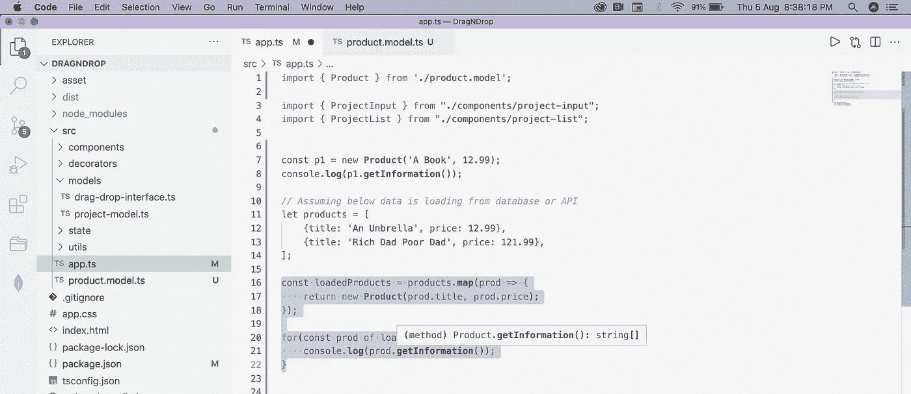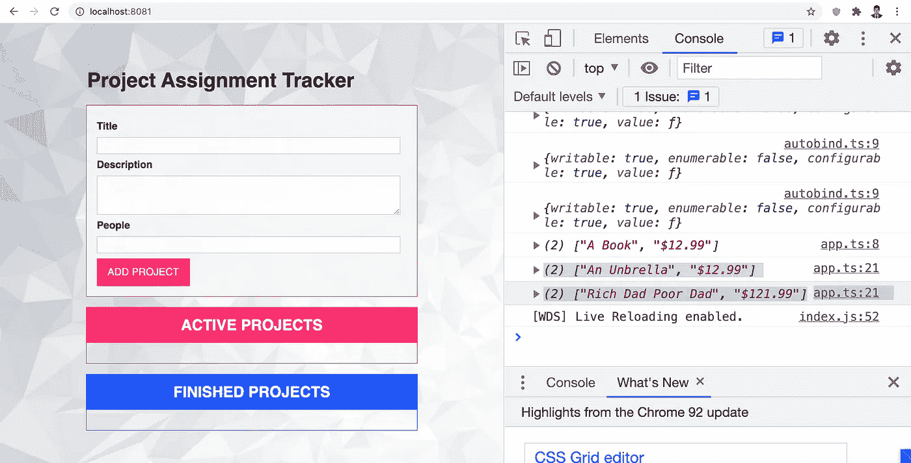

从上面的代码看，一切都很好。如果有一个可以为我们使用实例化的包不是很好吗？

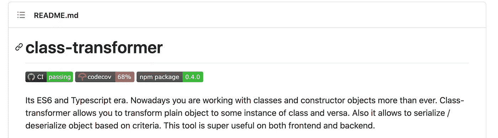

安装:

```
npm install class-transformer —- save
npm install reflect-metadata --save
```

应用程序

```
import 'reflect-metadata';  // must import from above packageimport { plainToClass } from 'class-transformer';import { Product } from './product.model';*// Assuming below data is loading from database or API*let products = [
  {title: 'An Unbrella', price: 12.99},
  {title: 'Rich Dad Poor Dad', price: 121.99},
];*// Class Transformer: Param1 - className, Param2 - data* const loadedProducts = **plainToClass**(**Product**, products);// Previous way - custom code*// const loadedProducts = products.map(prod => {
//     return new Product(prod.title, prod.price);
// });*for(const prod of loadedProducts) {
  console.**log**(prod.**getInformation**());
}
```

→上述 o/p 将与之前相同，代码行数减少，因此得到优化。


参考:

[](https://github.com/typestack/class-transformer) [## GitHub-typestack/class-transformer:基于装饰的转换、序列化和…

### 现在是 ES6 和 Typescript 时代。如今，你比以往更多地使用类和构造函数对象…

github.com](https://github.com/typestack/class-transformer) 

# 总结:

在 TypeScript 中处理 JS 第三方库的两种方法:

a.从@types 或安装特定包

b.显式添加变量的类型。

# 结束语:

因为 TypeScript 也可以使用 JavaScript 库。发展变得友好。

> 谢谢你一直坚持到最后🙌。如果你喜欢这篇文章或者学到了新的东西，请点击下面的分享按钮来支持我，让更多的人了解我和/或在 [Twitter](https://twitter.com/amir__mustafa) 上关注我，看看我在那里学到和分享的其他技巧、文章和东西。