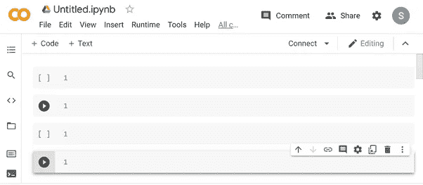
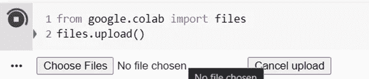
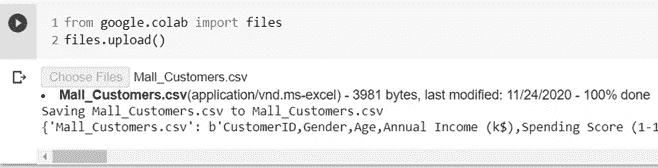
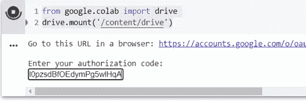
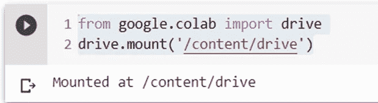
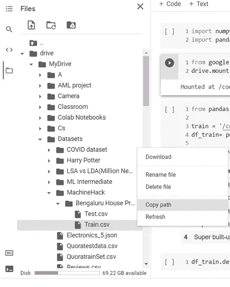

# 将数据加载到 Colab

> 原文：<https://medium.com/geekculture/ways-to-load-data-to-colab-3e58b5a7a771?source=collection_archive---------13----------------------->



Image by Author

Google Collabotory 或 Colab 是 Google 的一个产品，它对于通过浏览器编写和执行任意 python 代码很有用。它也非常适合机器学习、数据分析和教育。

我开始学习机器学习用的是 Colab 笔记本，而不是 Jupyter 笔记本。所以我找到了几种将数据文件加载到 Colab 的方法。

我说数据文件而不是 CSV 文件是因为数据可以是 CSV、XLS 甚至 JSON。

你可以在 Colab 中使用所有这样的数据。

所以，我找到了三种方法来做到这一点。这只是我的发现，可能不止这些。

> ***第一种方式:直接上传文件。***

只需输入下面的代码并运行单元。

```
from google.colab import files
files.upload()
```



Image by Author

点击选择文件。

选择所需的文件，然后单击打开。

你会看到这样的东西。



Image by Author

您的数据已经加载。现在可以使用*pandas . read _ CSV(" filename . CSV ")*或*pandas . read _ JSON(" filename . JSON ")*等。开始你的工作。

> ***第二种方式:从云存储如 AWS，或 GCP 等访问。***

这里有一种方法。

您的数据框已准备就绪，可以继续工作了。

> ***方式三:上传数据集到 google drive，直接从 Google Drive 访问数据。***

Google drive 赠送约 15 GB 免费云存储空间。

只需将您的数据上传到驱动器上，然后将下面的代码粘贴到单元格中并运行。

```
from google.colab import drive
drive.mount('/content/drive')
```

你会看到这样的东西。


Image by Author

点击链接。

使用存储文件的帐户登录。

会提示你这样的东西。


Image by Author

向下滚动并点击允许。

它会给你这样的东西。


Image by Author

复制给定的代码，并将其粘贴到您的 Google Colab 的输入字段中，如下所示，然后单击 Enter。



Image by Author

它会向你展示这样的东西。



Image by Author

单击文件部分，选择并复制路径。



Image by Author

然后创建一个新的单元格并运行下面的代码。

```
data = 'paste_copied_file_path_using_Ctrl+v'df_train= pd.read_csv(data)# your copied path should be something like this
#/content/drive/MyDrive/Datasets/MachineHack/Bengaluru House Price Prediction/Train.csv
```

您的数据框现已准备就绪，可以继续工作了。

# 关键要点:

在这里，我向你展示了三种加载文件的方法，这是我在使用 Google Colab 学习机器学习时学到的。

你可以找到更多的方法来加载你的文件。但是我发现这些是最简单最容易的方法。

感谢您的阅读。