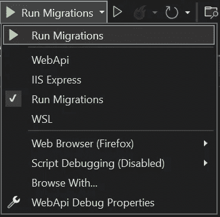
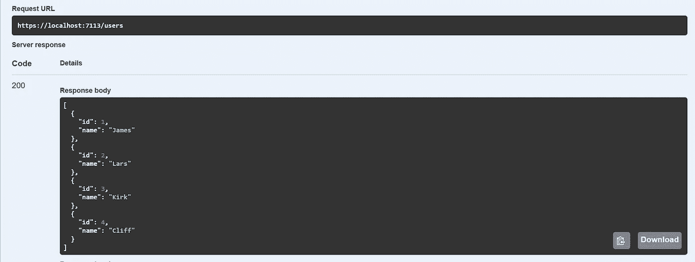

# 在 ASP.NET 核心 6 中运行实体框架迁移的方法

> 原文：<https://medium.com/geekculture/ways-to-run-entity-framework-migrations-in-asp-net-core-6-37719993ddcb?source=collection_archive---------0----------------------->

## 如何将您的迁移添加到 CI/CD 管道


Photo by [Julia Craice](https://unsplash.com/@jcraice?utm_source=medium&utm_medium=referral) on [Unsplash](https://unsplash.com?utm_source=medium&utm_medium=referral)

如果您已经决定在您的下一个项目中使用实体框架(代码优先的方法)，迟早，您将不得不通过迁移对您的数据库进行更改。在本文中，我们将考虑如何使用 EF 迁移，以及如何将它们作为 DevOps 管道的一部分来运行。

# 目录

1.  [Web API 项目设置](#c735)
2.  [DbContext &型号](#ced5)
3.  [第一次迁徙](#2be2)
4.  [在 CI/CD 中处理迁移的常用方法](#6fc2)
5.  [运行迁移的非典型方式](#ef52)
6.  [命令行解析器](#b34c)
7.  [结论](#0dff)

# **Web API 项目设置**

首先，让我们使用下面的代码创建一个新的 web 项目。NET CLI 命令:

```
dotnet new sln --name EfMigrationsApp
dotnet new web --name WebApi --framework net6.0
dotnet sln add .\WebApi\WebApi.csproj
```

接下来，让我们转到 WebApi 项目，并向其中添加一些 NuGet 包:

```
cd WebApi
dotnet add package Swashbuckle.AspNetCore --version 6.2.3
dotnet add package Microsoft.EntityFrameworkCore --version 6.0.9
dotnet add package Microsoft.EntityFrameworkCore.Design --version 6.0.9
dotnet add package Microsoft.EntityFrameworkCore.Sqlite --version 6.0.9
```

*Swashbuckle。AspNetCore —* 我们需要这个包通过 Swagger 与未来的 API 端点进行交互。

微软。EntityFrameworkCore — 将允许我们使用实体框架的主要特性(如 DbContext)。

微软。EntityFrameworkCore . Design—将为我们提供一个迁移工作的选项。

微软。EntityFrameworkCore . Sqlite—一个 [SQLite](https://www.sqlite.org/index.html) 数据库的提供者。在我们的测试应用程序中，我们希望尽可能快地准备好数据库，SQLite 完全符合我们的需求。

现在让我们告诉我们的 app 默认启动 Swagger 转到 *launchSettings.json* 并将以下行添加到 WebApi 和 IIS Express 配置文件中:

```
"launchUrl": "swagger"
```

并使 *Program.cs* 看起来像这样:

Program.cs

好了，这个项目有了一个基本的配置，所以我们可以继续设置模型和 DbContext。

# 数据库上下文和模型

首先，让我们创建一个数据访问文件夹，并以如下方式定义我们的模型:

User.cs

为了与数据库交互，我们还需要创建一个 DbContext 类，如下所示:

AppDbContext.cs

让我们向 ASP.NET 核心注册我们的 DbContext 为此，我们需要以如下方式修改 *Program.cs* 中的*和*:

Program.cs

我们已经配置了连接到 SQLite 数据库的上下文(第 9–10 行)。此外，我们还添加了一个简单的端点来获取数据库中的所有用户(第 17–22 行)；我们稍后会用到它。

正如您所看到的，我们从[配置](https://learn.microsoft.com/en-us/aspnet/core/fundamentals/configuration/?view=aspnetcore-6.0)类中检索数据库的连接字符串，因此为了使这项工作有效，我们还需要以如下方式更新 *appsettings.json* (第 9–11 行):

appsettings.json

从这一点，我们可以开始将迁移添加到我们的项目中。

# **第一次迁徙**

为了管理迁移，我们将使用 [dotnet ef 工具](https://learn.microsoft.com/en-us/ef/core/cli/dotnet)，因此让我们通过在 cmd 中运行以下命令来安装它们:

```
dotnet tool install --global dotnet-ef
```

现在让我们用数据库的初始状态创建我们的第一个迁移。为此，我们需要运行以下命令:

```
dotnet ef migrations add Initial
```

通过下一个命令，我们可以将迁移应用到我们的数据库:

```
dotnet ef database update
```

好的，这对于当地的发展应该足够了。我们可以使用上面的命令来管理数据库状态。但是，如果我们需要将迁移添加到 CI/CD 管道中，该怎么办呢？让我们来看看可能的方法。

# 在 CI/CD 中处理迁移的常用方法

通常，在 DevOps 管道中有三种方式来处理 EF 迁移:

## 1.SQL 脚本

实体框架核心允许我们基于迁移生成纯 SQL 脚本。我们需要做的就是运行以下命令:

```
dotnet ef migrations script
```

记住这一点，我们可以在构建管道期间创建脚本，将它们作为工件发布，并在发布管道期间运行它们。关于如何在 Azure DevOps 中做到这一点，有一篇很好的[文章](https://dotnetthoughts.net/run-ef-core-migrations-in-azure-devops/)。

## 2.DevOps 友好的 EF 核心迁移包

与。NET 6，EF 核心团队发布了一个新的迁移包特性。其思想是您可以生成一个包含运行迁移所需的一切的可执行文件。我们可以通过运行以下命令来创建一个包:

```
dotnet ef migrations bundle --configuration Bundle
```

结果，我们将得到*efbundle.exe*文件，可以执行该文件来将迁移应用到数据库。尽管这种方法在某些情况下可能更好，但一般算法仍然与 SQL 脚本相同。我们仍然需要生成一个文件作为 CI 流程的一部分，并将其作为 CD 的一部分来执行。

## 3.应用程序启动

实体框架为我们提供了一个通过运行*数据库以编程方式运行迁移的选项。Migrate()* 方法。考虑到这一点，我们可以将该方法放在*程序的开头。cs* 和在应用程序启动期间运行迁移。代码可能如下所示:

Program.cs

尽管这是处理迁移的最快和最简单的方法，但这种方法有风险，不推荐用于生产应用程序。如果多个应用程序节点同时运行，它们可能会尝试同时应用迁移和更新数据库，这将导致故障或数据损坏。

# 运行迁移的非典型方式

在大多数情况下，我会使用 SQL 脚本或迁移包方法作为最安全和最可靠的方法。但是，如果我们不打算在部署之前查看 SQL 迁移脚本，而只想将迁移作为 CD 管道的一部分来处理，我们可以执行以下操作:

Program.cs

这个想法是通过命令行参数来指定是否运行迁移。如果我们在启动应用程序时传递“ *— RunMigrations* ”参数，它将只需要运行迁移，而不需要构建实际的 web 应用程序。

我们可以说，我们的应用程序现在可以在两种模式下运行——作为 web 和作为控制台应用程序，输入参数决定了模式。

在控制台模式下，我们不需要创建一个 web 应用构建器，注册服务，以及做一个真正的 web 应用所需的所有其他花哨的事情。我们需要做的就是手动创建一个 DbContext 实例，向它传递连接字符串，并以编程方式运行迁移(第 6–18 行)。

在 CD 管道中，运行迁移的 PowerShell 任务可能如下所示:

```
dotnet WebApi.dll --RunMigrations
```

注意，您应该为您的 WebApi.dll 文件指定正确的路径。

由于这是管道中的一个单独步骤，我们已经减轻了应用程序启动方法的风险，但是有一个问题—我们使用 *appsettings.json* 来获取连接字符串。这在本地工作得很好，但是要使它在所有环境中都工作，我们最好将连接字符串作为输入参数传递。该命令可能如下所示:

```
dotnet WebApi.dll --RunMigrations --connectionString "Data Source=SQLite.db"
```

现在让我们弄清楚如何在我们的应用程序中解析这样的字符串。

# 命令行分析器

为了处理输入参数，我们将使用 [CommanLineParser](https://github.com/commandlineparser/commandline) lib，所以让我们将它添加到我们的项目中:

```
dotnet add package CommandLineParser --version 2.9.1
```

接下来，让我们创建一个 *CommanLineParser* 类来解析我们的参数:

CommandLineParser.cs

*Program.cs* 中的用法如下 *:*

Program.cs

为了获得更好的本地开发体验，让我们修改 *launchsettings.json* 和并向其中添加一个新的部分(第 30–33 行):

launchSettings.json

由于这一改变，我们在 Visual Studio 中有了一个新的按钮，我们可以使用它在本地运行迁移。



让我们通过迁移播种一些初始数据，以检查一切是如何工作的。首先，让我们以如下方式更新 *AppDbContext.cs* :

AppDbContext.cs

接下来，让我们创建一个迁移:

```
dotnet ef migrations add InitialData
```

通过 Visual Studio 或 cmd 运行迁移后，让我们启动应用程序并调用端点来获取用户:



API Response

我们看到所有用户都已成功播种。

# 结论

好吧，就这样。感谢阅读！请分享你对文章中描述的方法的想法。另外，我想知道你们在项目中是如何处理 EF 迁移的。

你可以在我的 [GitHub](https://github.com/BohdanTron/EfMigrationsApp) 上找到源代码。