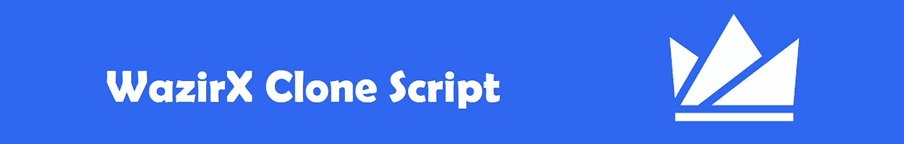
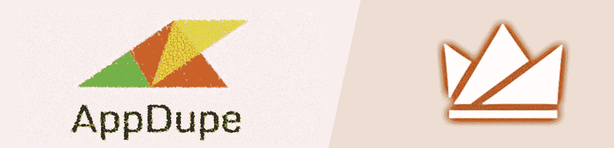
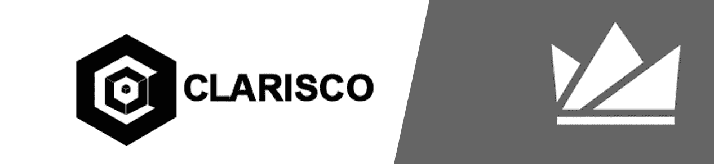

# Wazirx 克隆脚本(介绍+比较公司)

> 原文：<https://medium.com/geekculture/wazirx-clone-script-introduction-comparing-companies-77794b214333?source=collection_archive---------14----------------------->

加密货币的巨大进步影响了整个世界，每个人都在寻找一种方式，以便从这个数字世界中获得最大利益。你可以通过多种方式从加密货币中获益，其中一种方式是从交换加密货币中获益，但这并不像听起来那么简单。为了拥有一个可以进行加密货币交易的平台，人们需要一些编程和编码技能，然后需要一个很好的榜样来跟随。Wazirx 是这样做的最好例子之一。在本文中，我们旨在介绍这种流行的加密交换，然后列举一些公司，如 RadinDev，它们可能适合您未来的 [**wazirx 克隆脚本**](https://radindev.com/wazirx-clone-script/) 项目。所以，和我们在一起吧。

**瓦济克斯**

众所周知，Wazrix 是最大的加密交易所，交易的加密货币超过 30 种。它使对等交换过程(如比特币、莱特币、以太币等密码的交换)成为可能。直接从一个到另一个，有相同兴趣的交易者走到一起，交易被系统地组织)更容易。一些令人难以置信的 Wazirx 统计数据是:迄今为止，他们已经完成了约 1800 万美元的 P2P 交易，他们的应用程序已经被下载了 1000 万次。他们的每周访问量是 503，018，他们支持大约 232 枚硬币。

有一个问题，人们可能想知道它的答案，“为什么我们更喜欢 WazirX 克隆脚本用于交易初创公司？”在这里，我提供了一个选择这个克隆脚本的理由列表:

1.事实上，它能够处理数百万笔交易。为了满足激增的需求，他们的基础架构可以在几秒钟内扩展。

2.在这个平台上，完成 KYC 的身份验证过程在注册后几个小时内完成。通过引入鲁棒性，验证次数减少了一半。

3.协议遵循他们的后端数据库，这使得它的最大特点之一。

4.WazirX 克隆具有 WazirX 交易所的所有潜在特征，这是有利可图的，因为它防止了时间的浪费。

Wazir Clone 的一些以用户为中心的特性

o 保证金交易

超快的 KYC

o 闪电般的交易速度

o 用户友好的界面

o 200+加密货币支持

o 点对点(P2P)交易

我提供了 WazirX 克隆脚本的一些主要特性，可能会帮助您做出决定。

o **场外交易**

Wazirx 的最大特点之一是能够支持直接通过钱包存款和取款，事实上，场外交易是以分散的方式交换数字货币，而不使用控制用户资产的中央机构，但你需要记住，交易请求必须是 50，000 美元才能被接受。

o**IEO/发射台**

IEO 或初始交换发生在用钱包中的资金购买代币时，这种交换发生在一个称为 IEO 发射台的平台上，它有一些独特的功能，如双因素认证、KYC/AIML 解决方案、用户友好的界面、实时统计，可以吸引人们的注意力。

o **原子互换**

当加密货币通过区块链技术进行交换时，如果没有第三方参与，就会发生原子互换。此功能主要完成智能合约的工作，HTL(哈希时间锁)用于这种交换，以自动化交换过程。

o **托管整合**

这种集成使用户免受任何欺诈，很明显，这是一种安全的交易方式，换句话说，用户的所有功能都保留在这个系统中，以确保他们做正确的事情。

o **综合交易机器人**

一些特殊的计算机程序是为交易加密货币而编写的，它们被称为集成交易机器人。事实上，他们使用自动化和智能技术，如人工智能、机器学习等，这些机器人有许多类型，如套利机器人、硬币借贷机器人、保证金交易和做市商机器人。

o **加密货币赌注**

在这个交换平台中，用户可以通过保存和押注某些加密货币来获得奖励。这个过程使用了一种叫做利益证明的机制来确保交易的安全。

o **赏金/转介计划**

wazirx 克隆脚本使你能够整合推荐或赏金程序作为交换。佣金拆分、API 支持、用于管理其推荐的单独仪表板都包含在单个仪表板中。

有了这个惊人的功能解释，你可能想知道如何像 Wazirx 一样建立一个加密交换。这里是你应该遵循的步骤，以拥有像 Wazir 一样独特的加密交换。

**第一步**

第一步是，购买 WazirX 克隆。这是一个白色标签的网站脚本，提供了 wazirx 的主要和重要功能，通过购买这个，任何人都可以建立自己的货币交易所，并在特定的地理位置实现加密货币交易。第二种方式是联系 Wairx 团队，向他们寻求帮助和咨询。但是，要做到这一点，你需要填写一份申请表，当他们批准你时，团队会提供流动性、技术基础设施、托管和合规支持等功能。

**第二步**

下一步是雇佣一个专业的开发人员，即使你已经雇佣了 [Wazirx](http://wazirx.com) 团队，他也应该知道这个领域的所有该做和不该做的事情。开发人员应该在前端，后端编程知识。在这篇文章的最后一部分，我选择了一些公司，你可以信任做这个项目。

**第三步**

测试项目是项目成功和可信的关键。数以百万计的人可能会检查和使用你的网站，所以你需要测试你的网站所有可能的缺陷，当测试完成后，你就可以推出你的交换。

**第四步**

一个密码交易所通常在营销活动上花费数百万美元，但是你，刚刚在这个领域迈出一步，不需要花这么多钱。首先，根据你的预算时间表，最好专注于谷歌搜索活动。

这里有一些公司可能会帮助你建立一个加密货币交易平台。

**拉丁捷夫**

我在这个领域见过的最好的公司。他们以把顾客的满意放在第一位而闻名。经验丰富的开发人员致力于帮助您进行所需的交流。他们还提供加密货币兑换软件开发、P2P 加密货币兑换软件、信托钱包克隆应用程序开发、NFT 市场开发等服务。以下是他们为 Wazirx 提供的一些安全功能

o SSL 加密

o 服务器端请求伪造(SSRF)保护

o 监狱登录和加密数据

o 高度安全的应用内聊天系统

o 多种加密货币钱包

o 通过生物特征认证

o 安全的支付网关。

o 端到端聊天加密

o 服务器端请求伪造(SSRF)保护

o 跨站点请求伪造(CSRF)保护

o HTTP 参数污染保护

o CSRF 防护和防 DDoS 安全

他们提供的 Wazirx 克隆具有一些为管理面板(管理网站的面板，该面板连接到完整节点的主服务器)指定的功能，以下是这些功能:

o 因素认证

o 用户注册管理

o 汇总订单簿

o 钱包管理

o 即时显示

o 账户管理

他们还提供一些用户面板(用户可以通过面板买卖加密货币)功能:

o 用户面板是。

o API 自动

o 展示活动的能力

o 查看和管理钱包

o 最近的订单

o 查看订单

o 人工交易

**Suffescom**

这家公司的总部设在旁遮普的莫哈利，他们是这个领域的成功公司之一，除了交易所，他们还提供 NFT 市场开发。以下是他们为自己的 Wazir 克隆产品提供的一些好处:

o 无数支付选项

o 独立的点对点交易

o 多语言支持

o 流线型仪表板

o 评论和评级

o 离线钱包

下面是他们的 Wazrix 克隆脚本的特性列表

o 一流的安全性

超快的 KYC

o 高速交易

o 多平台

o 简单高效的设计

充满激情的团队

**Appdupe**

该公司位于印度，因向客户提供多项服务而闻名。他们成立于 2007 年，是一家移动应用开发公司，2017 年，他们开始在区块链开发上开展业务，并取得了相当大的成功。他们是这个领域的成功公司之一，他们提供的一些好处可能适合你想要的交换。

他们的 WazirX 克隆的好处

o 众多支付选项

o 独立的 P2P 交易

o 多语言支持

o 集中式仪表板

o 审查和评级

o 离线钱包

o 托管中介

**硬币挤压器**

该公司成立于 2018 年，位于印度。CoinsQueens 是一家领先的加密货币兑换脚本提供商，它以可承受的成本提供可靠和高质量的加密货币兑换脚本。他们提供的克隆脚本之一是 Wazirx。而你，作为一个客户，可以通过联系他们的区块链专家，获得他们的加密货币兑换脚本的免费演示。以下是他们的 Wazir 克隆版的突出特点列表:

o 实时价格和视图

o 多种交易选项

o 多种集成选项

o 多种加密货币

o 交易机器人

o 高级用户界面/UX

o 根据交易者体验的交易界面

o 上市硬币

**克拉里斯科**

他们自称是领先的区块链开发公司，他们相信客户满意度是由他们在区块链开发的专家保证的。该公司的成功得益于为不同行业提供了广泛的定制解决方案。他们全天候为您的交易平台提供帮助。以下是他们拥有的一些瓦齐尔克隆人的特征:

o **综合交易机器人**

该功能允许用户自动完成购买和销售过程。它有助于用户做出明智的决策，同时也简化了流程。

o **实时价格跟踪器**

该平台提供实时加密货币统计数据和市值价格，允许用户比较加密货币价格、交易量和排名，帮助您做出明智的决策。

o **评论&评级**

该功能允许管理员根据用户的反馈来增强加密货币交换，如 WazirX。

o**KYC/反洗钱核查**

这是任何加密货币交易所的关键特征之一，因为它有助于确认用户的身份和分析风险值。

o **冷钱包**

这一功能使得多种加密货币的无障碍存储和管理过程变得更加容易。请记住，与热钱包相比，冷钱包非常安全。

o **IEO 发射台**

他们声称，他们可以通过采用企业级技术的一流 IEO 发射台成功发射令牌。

o **场外交易**

场外(OTC)交易允许两个用户直接交换资产交易，不需要任何第三方。

o **管理面板**

另一个值得一提的特性是提供一个数据丰富的仪表板，允许 exchange 管理员监控所有用户的交易活动。

o **原子互换**

如前所述，原子交换消除了中间人，增强了令牌所有者的能力。它允许来自不同区块链的加密货币直接兑换。

o **多语言支持**

允许全球使用各种语言的用户使用 WazirX 等加密货币交易平台交易数字资产。

o **交易历史跟踪**

每一个点对点的交易都被记录下来，就像 Wazir 本身一样，所有的欺诈活动都可以在几分钟内被追踪到。

o **直观的用户界面/UX**

UI/UX 帮助您吸引更多用户使用您的加密货币交易所。

以下是 Clarisco 的 WazirX 克隆产品的一些优点:

o 实时位置跟踪

o 快速 KYC 验证

o 多语言支持

o 即时通知

o 强大的交易引擎

o 多币种钱包

o 无可挑剔的交易速度

o 绝对安全

o 综合交易机器人

o 赏金特征

o 双因素认证