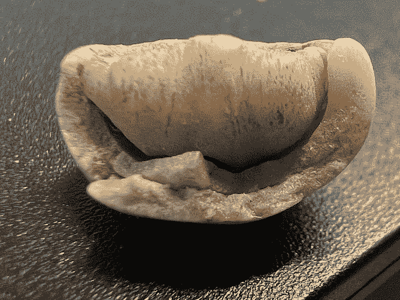
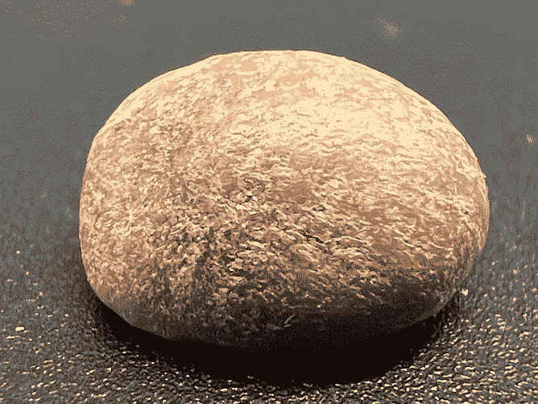
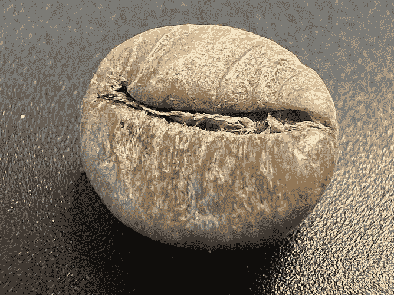
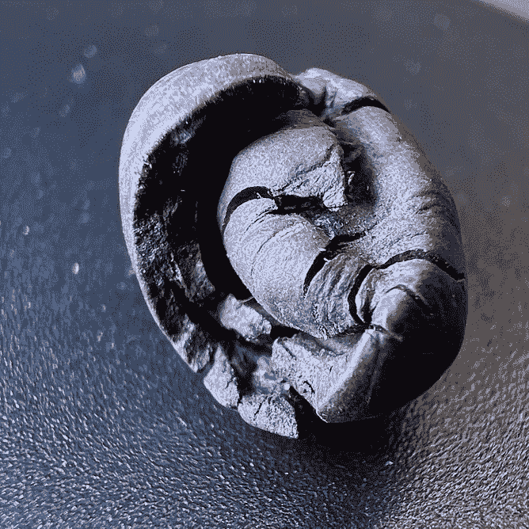
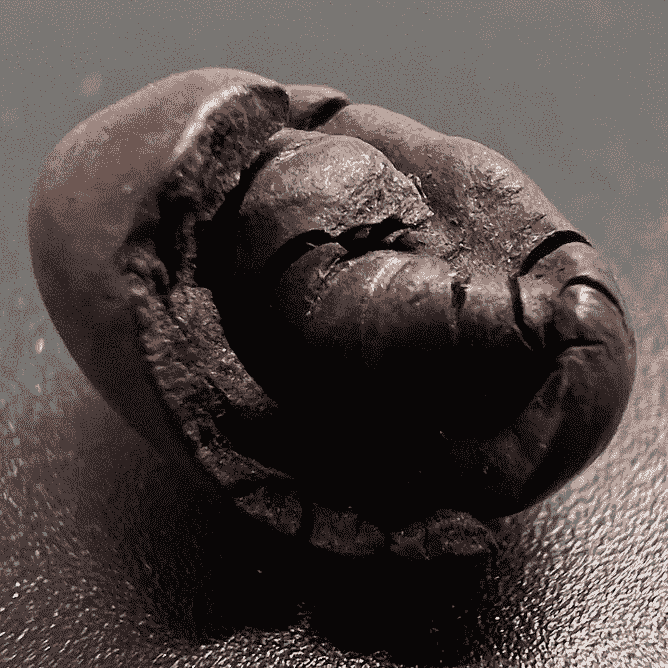
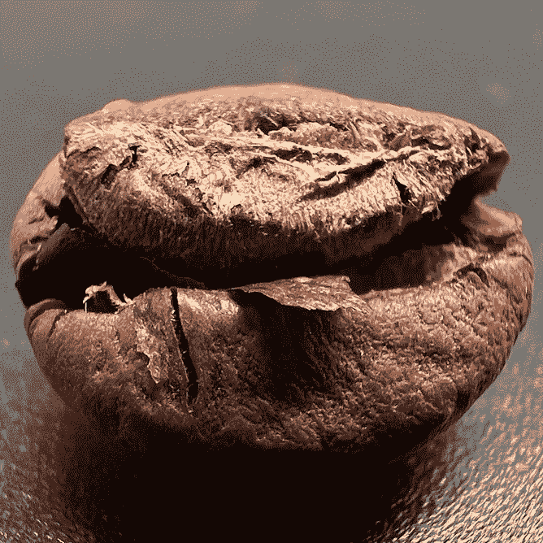
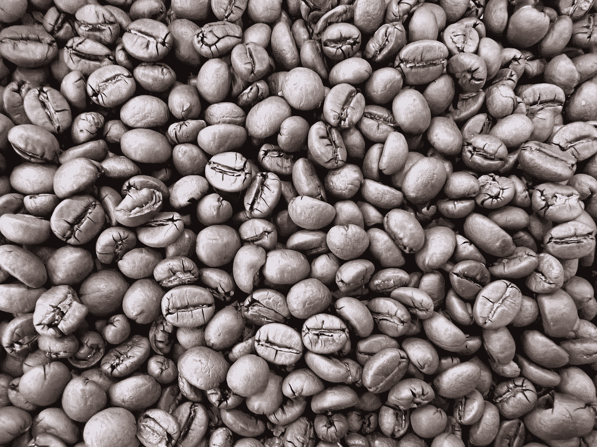
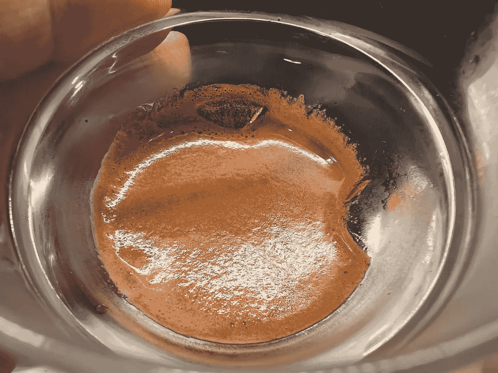
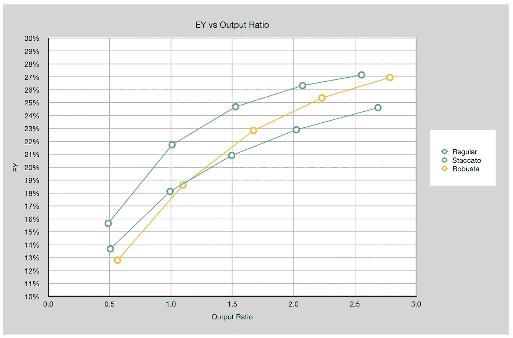

# 我们不谈罗布斯塔！

> 原文：<https://medium.com/geekculture/we-dont-talk-about-robusta-fa5d14c8e505?source=collection_archive---------2----------------------->

## 咖啡数据科学

## 罗布斯塔的另一种看法

我第一次接触到浓缩咖啡是在欧洲，最大的吸引力是口感。我怀疑这种口感大部分来自混合物中的罗布斯塔咖啡。然而，回到美国后，我发现咖啡一般都很难喝。特色咖啡刚刚开始流行。

当我再次开始喝浓缩咖啡时，咖啡更好了，但都是阿拉比卡咖啡。我找到了突破极限和改善口感的方法，得到了那种糖浆般的味道。然而，我继续寻找一种能很好混合或单独使用的 robusta。

我不知道，我找错了地方。

# 在彩色咖啡输入 Hiver

我通过 Instagram 认识了来自 [Chromatic Coffee](https://www.chromaticcoffee.com/) 的 Hiver van Geenhoven，我们知道我们在彼此身上找到了合适的咖啡爱好者。我想试试 Osma，他想试试 staccato 浓缩咖啡。所以我们见面了，我们深入地谈论了咖啡。我们一谈到罗布斯塔，他就把我介绍给了[马萨迪](https://www.instagram.com/masadicoffee/)。

豆子很大！

他给了我一些来烤，它们太棒了，太漂亮了。

我知道罗布斯塔咖啡豆要大一些，但这些咖啡豆是普通阿拉比卡咖啡豆的两倍大。

这就是我一直在寻找的口感。它没有甜味，但苦味是不同的。这和我喝过的任何咖啡都不一样，它把我带回了欧洲。

# 罗布斯塔的秘诀

首先，让镜头冷却。通常，我会把一杯阿拉比卡咖啡冷却到 47 摄氏度或更低，大约需要 6 分钟。对于纯罗布斯塔酒，我发现冷却到最佳口味需要将近 10 分钟。不把镜头冷却，就尝不出苦涩底下的别样滋味。随着温度的降低，苦味逐渐消失。

其次，慢慢喝。在最初的苦味过后，你的舌头似乎正常化到了苦味的程度。一旦它发生了，那种味道不会淹没，它只是美丽的。Masadi 苦味并不粗糙或涩，但更像是一种普通的味道。

并非所有的罗布斯塔咖啡都很棒，由于密度的原因，它们应该与阿拉比卡咖啡分开烘焙，但有些咖啡非常棒，因为它们和特产阿拉比卡咖啡一样受到精心呵护。

# 意大利腊肠

为了增加一些关于罗布斯塔如何提取的数据，我发现它在开始时有点慢，与阿拉比卡相比，提取率在拍摄后期加快，更接近我对断奏拍摄的预期。

我把这个意大利香肠分成了五杯，我尝了每一杯。不像阿拉比卡，最后两杯没有难闻的味道；他们只是没有强烈的味道。第一杯具有最后一杯的所有强度和味道。

我很高兴发现了一些非常棒的罗布斯塔咖啡。我期待着有一天，伟大的罗布斯塔像伟大的阿拉比卡豆一样普遍。我认为它们比阿拉比卡咖啡豆更适合用来制作牛奶浓缩咖啡，因为口感极佳。对于 affogato 来说尤其如此。

我认为加深对罗布斯塔咖啡的理解和欣赏将会影响和改善所有的咖啡。

如果你愿意，可以在推特、 [YouTube](https://m.youtube.com/channel/UClgcmAtBMTmVVGANjtntXTw?source=post_page---------------------------) 和 [Instagram](https://www.instagram.com/espressofun/) 上关注我，我会在那里发布不同机器上的浓缩咖啡照片和浓缩咖啡相关的视频。你也可以在 [LinkedIn](https://www.linkedin.com/in/dr-robert-mckeon-aloe-01581595) 上找到我。也可以关注我在[中](https://towardsdatascience.com/@rmckeon/follow)和[订阅](https://rmckeon.medium.com/subscribe)。

# [我的进一步阅读](https://rmckeon.medium.com/story-collection-splash-page-e15025710347):

[我未来的书](https://www.kickstarter.com/projects/espressofun/engineering-better-espresso-data-driven-coffee)

[我的链接](https://rmckeon.medium.com/my-links-5de9eb69c26b?source=your_stories_page----------------------------------------)

[浓缩咖啡系列文章](https://rmckeon.medium.com/a-collection-of-espresso-articles-de8a3abf9917?postPublishedType=repub)

工作和学校故事集