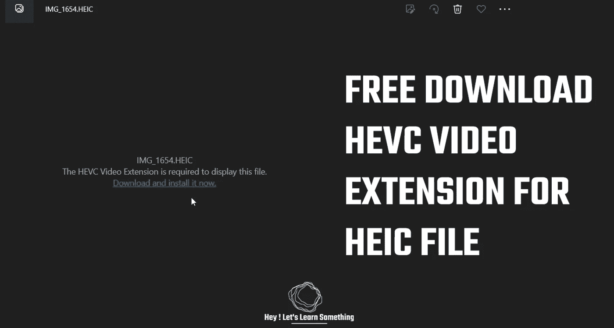

# 使用免费的 HEVC 扩展在 Windows 上打开 HEIC 图像

> 原文：<https://medium.com/geekculture/we-downloaded-hevc-extensions-for-free-windows-1f186a73b32c?source=collection_archive---------4----------------------->

请勾选此选项，它也可以将 HEIC 转换为 JPG

**更新:**
*由于免费的 HEVC 扩展不再可用，这里有一个替代:* [点击这里](https://heyletslearnsomething.com/blog/open-convert-heic-file-jpg)

当我们试图打开从 iPhone 导入的图像时，windows 无法打开该文件。该图像带有 HEIC 扩展名，当试图打开…