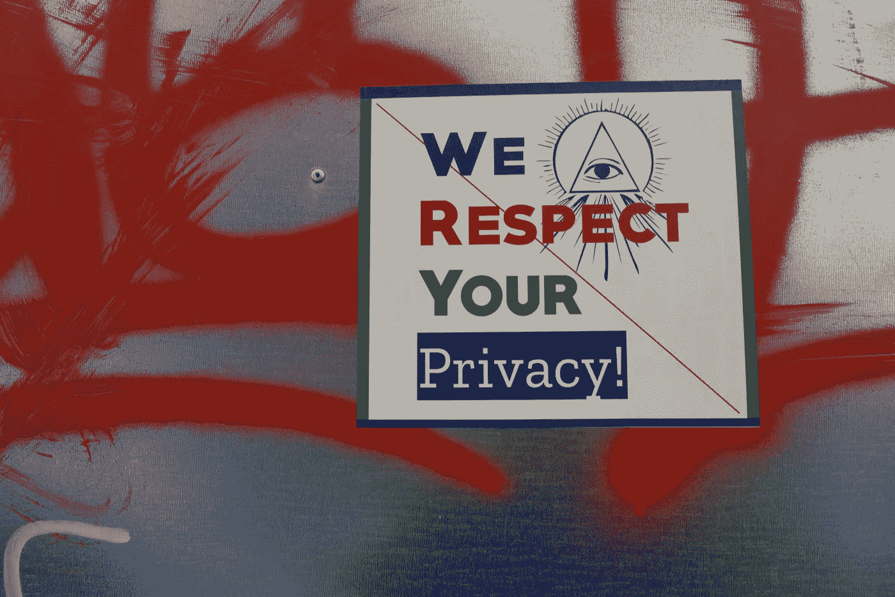

# 我们需要改变我们谈论技术的方式

> 原文：<https://medium.com/geekculture/we-need-to-change-how-we-talk-about-technology-f01e03b266c5?source=collection_archive---------18----------------------->

Maxim Hopman

在这些动荡的日子里，世界是分裂的，每个人都有自己的看法。很难责怪人们在讨论特定话题时过于情绪化，尤其是当这只是朋友之间的随意交谈时。然而，最近报道社交应用和互联网的趋势让我很不安。这一切都始于新闻，Signal 是一款以私密和迎合我们人口中一些弱势群体而闻名的消息应用程序，它推出了 40 人的群组通话。作为回应，Gizmodo，一个非常受欢迎的渠道，发表了一篇名为“Signal Now 让你可以同时给 39 个罪犯同伴打电话”的新闻[。如果你对此感到惊讶，你并不孤单。是时候讨论我们如何谈论技术了。](https://gizmodo.com/signal-now-lets-you-call-up-to-39-of-your-fellow-crimin-1848223487)

# 私下谈话的难以解释的危险

Marija Zaric

那么，为什么 Gizmodo 会开玩笑说信号是给罪犯用的呢？同样的原因，像 Tor，Telegram 甚至 VPN 这样的新闻报道经常被简化为“这对阴谋论者和罪犯来说是一个危险的地方”——所有这些东西都提供了隐私。出于这样或那样的原因，他人的隐私现在成了争论的话题。对这种隐私将被用于犯罪的持续恐惧影响了人们的判断，尽管事实上大多数人会利用这种隐私对朋友进行冷嘲热讽，分享购物清单，只是闲聊。

越来越明显的是，数百万人使用的工具不是基于大多数人，而是基于少数人。德国政治家现在正在辩论是否应该禁止电报，因为一些人在上面传播 COVID 错误信息，而其他人则重申，因为一只苍蝇落在一匹马身上而杀死它充其量是一个轻率的决定。关于我们作为一个社会如何监管我们的在线空间，无论是 Reddit、Twitter 还是 Signal，都有一场对话，以纳入善良、守法的人，并排除犯罪分子和危险的人。然而，这场辩论显然还没有举行，因为越来越多的渠道更喜欢关注人们打开消息应用程序并与朋友聊天的“危险”，仅仅因为百万分之一的用户可能会将他们引入歧途。

这种担忧可能是一个受脸书令人讨厌的算法困扰的社会的症状，这些算法故意将用户推入疯狂和仇恨的兔子洞。然而，他们所错过的是，脸书是一个集中的体验，在那里你不能只是登录并与一个人交谈。不管你喜不喜欢，你都会看到不断的通知和推荐帖子，把你引向脸书认为会吸引你的任何东西。无论是 Telegram，Tor，还是其他任何我们用来保护隐私的工具，都不能做到这一点。它们只是提供一个聊天的地方，如果有人决定不谈办公室事务，那么，这个选择是在他们结束使用这些服务之前很久就做出的。

# 科技的替罪羊

William Hook

当问题开始时，将激进化、犯罪和民间动乱的问题堆在*甚至不可用的*应用程序的肩上，这不仅是短视的，也是危险的。这有助于延续神话，在这一点上，我们需要的只是关闭一些东西，任何东西。当然，脸书最终结束其邪恶统治将对每个人的心理健康产生积极影响，但这并不能治愈疾病。当你乘坐的船在水下一半时，修理漏水的水龙头救不了你。

关闭 Signal 等工具或禁止 VPN 不仅无助于遏制犯罪或假新闻，还会严重损害人们的隐私和通信自由，尤其是在最需要的地方。当电报在[港](https://edition.cnn.com/2019/06/13/tech/telegram-ddos-attack-hong-kong-china/index.html)和[白俄](https://www.washingtonpost.com/politics/2020/09/11/theres-more-belaruss-telegram-revolution-than-cellphone-app/)抗议中使用时，媒体吹捧它是人民的捍卫者。也许很难看出为一个应用欢呼的虚伪，当它帮助独裁政权的人们有一个安全的地方说话，同时呼吁自己的公民失去访问它的机会。但是缺乏逻辑思维不是借口，而是对我们如何对待帮助我们所有人的技术的谴责，而我们却高兴地购买另一台脸书生产的虚拟现实设备，或者相信苹果会保护我们所有人，而它的“反跟踪”措施对停止跟踪毫无作用。

# 重新考虑

所以下次你看到一篇文章，只提到某个毒贩通过 Signal 账户卖大麻被抓，想想这个:在 Signal 存在之前，那个家伙还在卖大麻。他可能一直在使用脸书或 WhatsApp，甚至 Twitter。但所有这些平台都乐于与执法部门共享信息，甚至不需要真的这么做。只有当一家公司决定表明立场，在你的沟通和窥探之间设置这层保护时，其他人才会开始担心。

这是为什么呢？