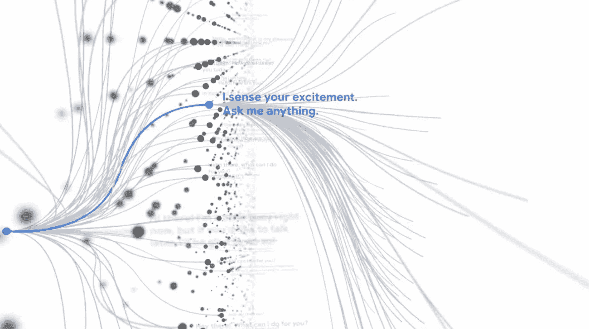
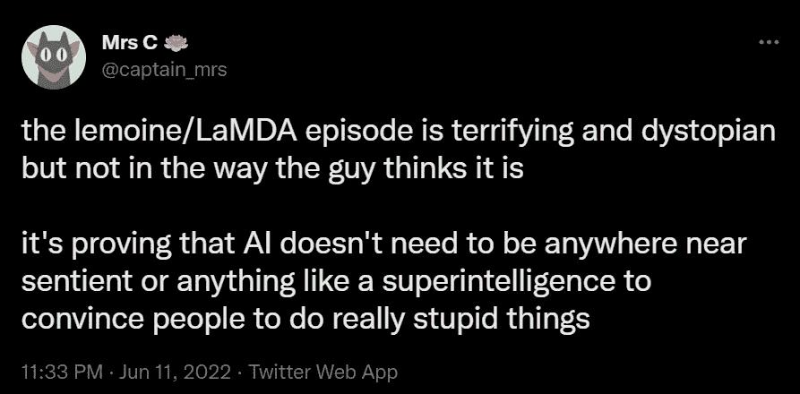
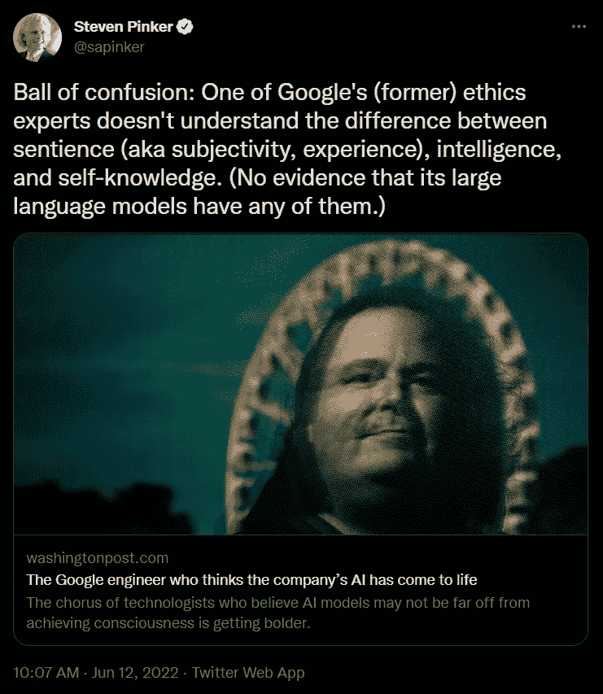
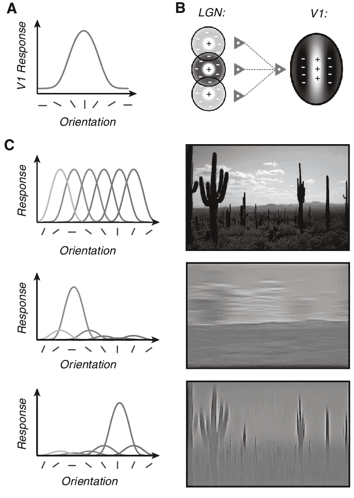
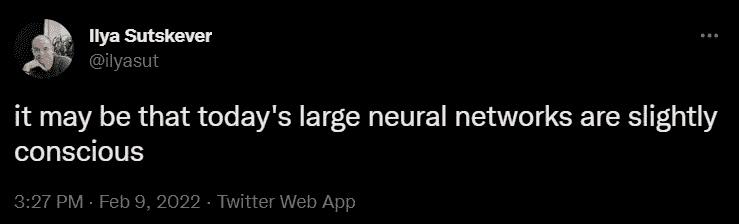

# 我们真的不知道是什么让事物有感知能力——所以我们不要再假装知道了

> 原文：<https://medium.com/geekculture/we-really-dont-know-what-makes-things-sentient-so-let-s-stop-pretending-we-do-bb2d2e320cb8?source=collection_archive---------4----------------------->

## 人工智能是一个神经科学问题，而不是机器学习问题。

最近对 T2 的强烈抗议强化了一段时间以来萦绕在我脑海中的一件事:大多数专家都不知道他们在谈论什么。

对于那些不了解内情的人，谷歌的一名工程师最近闭门采访了他们的一个大型语言模型。这位名叫[布雷克·莱莫因](https://twitter.com/cajundiscordian)的工程师对 LaMDA 回复他的雄辩和连贯感到非常惊讶，并很快说服自己这是一个有意识的人，应该享有权利。

LaMDA[的确令人印象深刻。至于它是否有感知能力，这是我稍后要探讨的问题。我首先想谈的是对他的说法的回应，以及为什么这表明了人工智能社区中普遍存在的错觉。](https://blog.google/technology/ai/lamda/)

# 回应

紧接着他的建议，布莱克收到了一个名副其实的大剂量的警告，贬低和光顾。甚至暗示 LLM 能够以任何方式进行主观体验都是不可能的。

普遍的共识？很明显，LaMDA 只不过是一个大的统计过程:一个城市大小的多米诺骨牌集合，一个接一个地倒下。

但是他们走得更远。这是史蒂芬·平克，世界上最重要的认知科学家之一，声称 LLM 不具备智力。我会说 LLM 拥有智慧——这难道不是重点吗？

这些说法的可信度令人困惑——主要是因为它们都没有证据，除了“这当然不是真的”之外，很少有后续措施。

然而，作为一个有神经科学背景的人，我并不信服。

# LLMs 和生物神经网络

大型语言模型确实*接近神经元的工作方式，至少在接口层面是这样。他们没有模拟亚细胞过程，但可以说神经元功能最重要的部分 *—* 动作电位阈值 *—* 是通过简单的非线性函数模拟的。*

目前，我将 LLM 的形态比作专门的皮质柱状物*——*，就像枕叶皮质中用于建立视觉刺激特征集的柱状物。

# 感知在 LLM 中是如何产生的

从这里，我们有以下内容:

*   大脑是由生物神经元组成的，
*   大脑是我们目前认为宇宙中唯一具有感知能力的东西
*   人工神经元近似于生物神经元，

那么，问一个自然的问题“人工大脑”是否也有感知能力有什么奇怪的呢，*？如果是，它会发生在什么级别？*

# *感知在 LLM 中不可能出现*

*当然，生物和人工神经元并不完全相同，如果不指出这一点，任何讨论都是不公平的。以下是 LaMDA 可能没有知觉的主要原因:*

*   *生物大脑会根据新信息进行自我调整。简而言之，他们是“在线”学习者。目前，大多数 LLM 没有:它们被训练一次，然后被冻结用于推断。这可能是感知能力的先决条件之一*——*更新神经元权重的能力久而久之。如果是这样的话，LaMDA 将被冻结在时间中，因而不拥有主观经验。往返于 LaMDA 的强化学习模型可能会解决这个问题。*
*   *生物神经元拥有大量人工神经元无法模拟的亚细胞和量子过程。每秒钟有数十亿个分子进出细胞，它们拥有许多独特的细胞器，这些细胞器有助于它们的功能。有可能这些亚细胞过程对感知是必要的(尽管我认为这不太可能)。*

*但重要的是，我不是简单地说“不可能如此”。人工大脑和生物大脑之间有许多相似之处，想知道前者是否会随着规模的扩大而变得有知觉，这并不遥远。*

# *感知是一个神经科学问题，而不是机器学习问题*

*一只昆虫或一种动物在什么样的复杂程度下会变得有知觉？*

*迄今为止，感觉似乎是随着网络中神经元数量的增加而自然产生的。人类是有知觉的；苍蝇和蚊子不是。*

*髓鞘形成和不同的神经模块如何连接很可能是影响这一阈值的超参数，这就是为什么一些具有较高神经元数量的生物仍然被认为比其他生物“更少”有知觉(例如，人类被认为比大象或鲸鱼更有知觉[，即使后者具有更高的神经元数量](https://www.ncbi.nlm.nih.gov/pmc/articles/PMC4685590/#:~:text=The%20largest%20number%20of%20cortical,brains%20of%20the%20former%20two.))。*

*鉴于规模和感知之间的明确关系，以及生物和人工神经元之间的相似性，完全有理由质疑现代 LLM——比人类发明的任何东西都要复杂*个数量级*——是否正在变得有感知能力。*

# *我们真的不知道——所以让我们停止假装我们知道*

*当 Ilya Sutskever，可能是地球上最前沿的人工智能公司的首席技术官，[讨论一个类似的问题](https://twitter.com/ilyasut/status/1491554478243258368)时，他很快就被痛斥了。*

**

*但他不应该这样。因为老实说，以我们目前的知识水平，真的没有办法知道。*

*这类似于一些人认为除了我们之外，宇宙中没有生命。他们真的有什么证据来证明他们的主张？*

*[没有证据就是不存在的证据](https://www.lesswrong.com/posts/mnS2WYLCGJP2kQkRn/absence-of-evidence-is-evidence-of-absence)，当然。但这不足以排除其他地方存在生命的可能性。我们只是不知道生命是否是地球独有的，或者它是否可能出现在另一个具有相似但不同生态结构的星球上。*

*LaMDA 是否有知觉是*完全相同的问题。我们不知道感知是否是高等哺乳动物独有的，或者它是否可能出现在另一种基底上 *—* ，如硅 *—* ，我们应该停止假装我们知道。**

*就像其他星球和地球一样，人工神经元和生物神经元之间显然有许多相似之处。当然，亚细胞过程没有被建模，时间也没有被建模 *—* 但是，随着时间的推移，感觉在亚细胞水平上存在吗，或者它是一个足够大的神经网络的一个自然属性？*

*显然有*我们不了解的*宇宙物理定律。那么，在一代又一代人不断被证明是错误的之后，人们怎么能继续自信地宣称人类例外论呢？*

*实话实说:我们真的不知道，我们应该开始这样对待它。*