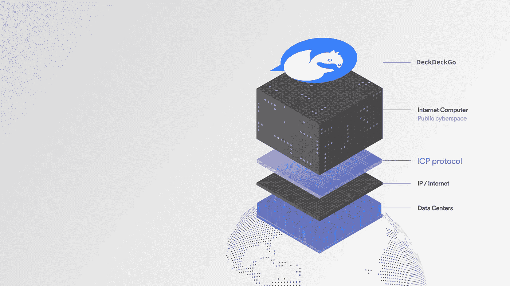

# 我们收到了一笔赠款，将我们的网络应用程序移植到互联网计算机上

> 原文：<https://medium.com/geekculture/we-received-a-grant-to-port-our-web-app-to-the-internet-computer-7be64806565a?source=collection_archive---------27----------------------->

## 我们的幻灯片网络编辑器能在 DFINITY 基金会的未来互联网上工作吗？让我们弄清楚。

Source: DFINITY press kit + DeckDeckGo logo

令人兴奋的消息是，我们收到了来自 [DFINITY](https://dfinity.org/) 基金会的 25000 美元赠款，用于将我们的幻灯片网络编辑器 [DeckDeckGo](https://deckdeckgo.com) 移植到[互联网计算机](https://dfinity.org/faq/what-is-the-internet-computer)。